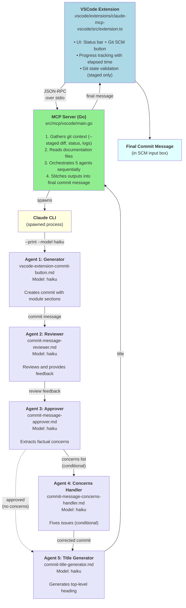

# Commit Agent Pipeline Architecture

Understanding the 5-agent system that generates semantic commit messages.

---

## Overview

The Commit Agent Pipeline is a 5-agent system that generates high-quality, semantic commit messages for a mono-repository with module-based versioning. It provides a one-click experience in VSCode through the robot button (🤖).

**Key Features**:

- Analyzes staged changes only
- Generates module-specific commit sections
- Reviews and self-corrects commit messages
- Creates semantic commit titles
- Validates against module contracts

---

## Architecture Flow



---

## Why Five Agents?

The pipeline uses five specialized agents instead of a single monolithic agent for several reasons:

### 1. Separation of Concerns

**Each agent has one clear responsibility**:

- Generator: Create initial commit from git context
- Reviewer: Evaluate quality and identify issues
- Approver: Distill review into actionable concerns
- Concerns Handler: Fix specific issues
- Title Generator: Create concise top-level heading

**Benefits**:

- Easier to debug individual stages
- Simpler prompts focused on single task
- Can improve one agent without affecting others

### 2. Quality Through Iteration

**Review and correction loop**:

1. Generator creates initial draft
2. Reviewer identifies problems
3. Approver filters to factual issues only
4. Concerns Handler applies fixes
5. Title Generator adds finishing touch

**Result**: Higher quality than single-pass generation

### 3. Conditional Execution

**Agent 4 (Concerns Handler) only runs if needed**:

- Approver outputs "Approved" → Skip to title generator
- Approver outputs "Approved (with concerns)" → Run concerns handler

**Benefits**:

- Saves time when commit is good enough
- Avoids unnecessary corrections

### 4. Prompt Clarity

**Smaller, focused prompts are more reliable**:

- Generator prompt focuses only on creating structure
- Reviewer prompt focuses only on identifying issues
- Each prompt can be optimized independently

**Alternative (single agent)**:

- One massive prompt doing everything
- Harder to debug
- Harder to improve
- Less consistent results

---

## How Agents Interact

### Stage 1: Generation

**Input**: Git context (diff, status, logs, file changes)
**Process**:

1. MCP server gathers git data
2. Loads documentation files
3. Detects modules from changed files
4. Sends everything to Generator agent
5. Generator creates structured commit with module sections

**Output**: Complete commit message with module sections

### Stage 2: Review

**Input**: Generated commit message
**Process**:

1. Reviewer analyzes commit message
2. Identifies issues (format, clarity, completeness)
3. Provides specific feedback with suggestions

**Output**: Review section with issues and recommendations

**Critical Rule**: Strip all positive affirmations ("Good job!", "Excellent!")

### Stage 3: Approval

**Input**: Original commit + Review
**Process**:

1. Approver reads both
2. Extracts only factual/actionable concerns
3. Removes all praise and fluff
4. Decides: "Approved" or "Approved (with concerns)"

**Output**: `## Approved` section (with optional concerns list)

### Stage 4: Correction (Conditional)

**Input**: Original commit + Concerns list
**Process**:

1. **Only runs if** approver output contains "with concerns"
2. Concerns Handler applies fixes
3. Maintains structure and formatting
4. Removes `## Approved` section from output

**Output**: Corrected commit message (or original if no concerns)

### Stage 5: Title Generation

**Input**: Final commit message (corrected or original)
**Process**:

1. Title Generator reads entire commit
2. Determines primary type and scope
3. Creates concise conventional commit title
4. Format: `<type>(<scope>): <description>`

**Output**: Single-line title (no `#` prefix)

---

## Model Selection: Why Haiku?

All agents use Claude Haiku (fast, cost-efficient model).

### Reasons

**1. Speed**:

- Haiku: 10-30s per agent
- Sonnet: 30-90s per agent
- 5 agents with Sonnet = 2.5-7.5 minutes (too slow)
- 5 agents with Haiku = 30-90 seconds (acceptable)

**2. Cost**:

- Commit messages generated frequently
- Lower cost per commit with Haiku
- Acceptable quality for structured task

**3. Task Suitability**:

- Commit messages have clear format rules
- Structured output doesn't require deep reasoning
- Haiku sufficient for following templates

**4. Model Enforcement**:

- Each agent specifies `model:` in YAML frontmatter
- MCP server extracts and enforces model
- Errors if model field missing

**When Sonnet Might Be Better**:

- Complex reasoning about code changes
- Ambiguous commit intent
- Novel situations requiring creativity

**Trade-off**: We prioritize speed and cost over marginal quality gains.

---

## Git State Validation

The extension validates git state before execution:

### Required Conditions

**1. Staged Changes Present**:

```typescript
if (indexChanges.length === 0) {
    error("No staged changes found. Stage your changes before generating.")
}
```

**2. No Unstaged Changes**:

```typescript
if (workingTreeChanges.length > 0) {
    error("You have unstaged changes. Please stage or stash them.")
}
```

### Why These Rules?

**Staged-only analysis**:

- Clear boundary: only staged = what will be committed
- Prevents confusion from work-in-progress changes
- Ensures commit message matches actual commit

**No mixed state**:

- Avoids ambiguity about what to describe
- Forces user to make explicit staging decision
- Prevents accidental omission of changes

---

## Module Detection

The MCP server detects modules from file paths:

### Detection Patterns

```text
src/mcp/<name>          → src-mcp-<name>
.vscode/extensions/<name> → vscode-ext-<name>
automation/<name>       → automation-<name>
docs/                   → docs
contracts/              → contracts
```

### Why Path-Based Detection?

**Benefits**:

- No configuration needed
- Automatic for new modules
- Consistent across repository

**Alternative (explicit config)**:

- Requires maintaining module list
- Can get out of sync
- More setup overhead

**Trade-off**: Convention over configuration

---

## Documentation Loading

The MCP server loads documentation files to provide context:

### Loaded Files

```text
docs/explanation/continuous-delivery/trunk-based-development.md
docs/reference/continuous-delivery/repository-layout.md
docs/reference/continuous-delivery/versioning.md
docs/reference/continuous-delivery/semantic-commits.md
contracts/repository/0.1.0/definitions.yml
contracts/deployable-units/0.1.0/*.yml
```

### Why Provide Documentation?

**Context for agents**:

- Understand repository structure
- Follow versioning conventions
- Use correct semantic types
- Reference module contracts

**Result**: More accurate, consistent commit messages

---

## Commit Message Validation

After stitching, the MCP server validates the final message:

### Validation Checks

1. **Unique Top-Level Heading**: Exactly one `#` heading (MD041)
2. **Semantic Format**: `<module>: <type>: <description>` per section
3. **Valid Semantic Type**: Must be feat/fix/refactor/docs/chore/test/perf/style
4. **Module Name Match**: Subject line module matches section header
5. **Module Exists**: Module defined in contracts/deployable-units/
6. **Subject Length**: ≤50 characters
7. **Non-Empty Description**: Cannot be empty

### Why Validate?

**Catches agent errors**:

- Ensures consistent format
- Enforces conventions
- Prevents broken commits

**Early failure**:

- Better to fail with clear error than commit bad message
- User can see specific validation issues
- Can fix and retry

---

## Performance Characteristics

### Typical Execution Time

**Total**: 30-90 seconds

**Breakdown**:

- Git context gathering: 1-2s
- Documentation loading: 1-2s
- Generator agent (Haiku): 10-30s
- Reviewer agent (Haiku): 5-15s
- Approver agent (Haiku): 3-8s
- Concerns handler (Haiku, conditional): 10-30s
- Title generator (Haiku): 3-8s
- Stitching: <1s

### Performance Optimizations

**1. Sequential Execution**:

- Agents depend on previous outputs
- Cannot parallelize agent chain
- Could parallelize git + docs loading

**2. Conditional Agent**:

- Concerns handler only runs if needed
- Saves 10-30s when commit is good

**3. Model Choice**:

- Haiku is 3x faster than Sonnet
- Acceptable quality trade-off for speed

**4. Caching Opportunities (future)**:

- Cache git context for retries
- Cache documentation files

---

## Security Considerations

### 1. No API Keys

Uses Claude Code CLI with user's subscription:

- No API key storage
- No credential management
- Uses existing Claude auth

### 2. Settings Bypass

Flags: `--setting-sources ""` and `{"includeCoAuthoredBy":false}`

**Why**:

- Bypasses hooks and CLAUDE.md to prevent unintended prompts
- Removes Co-Authored-By footer
- Clean, predictable output

### 3. Git Safety

**Read-only operations**:

- Never modifies repository
- Only reads staged changes
- No git commands that alter state

### 4. File Access

**Workspace-scoped**:

- Only reads files in workspace
- No arbitrary file access
- Documentation files from known locations

---

## Design Trade-offs

### Multi-Agent vs Single Agent

**Chosen**: 5 separate agents
**Alternative**: 1 comprehensive agent

**Pros of multi-agent**:

- ✅ Separation of concerns
- ✅ Easier to debug
- ✅ Can optimize individual stages
- ✅ Conditional execution

**Cons of multi-agent**:

- ❌ Slower (5 API calls vs 1)
- ❌ More complex orchestration
- ❌ More agent files to maintain

### Staged-Only vs All Changes

**Chosen**: Staged changes only
**Alternative**: Include unstaged changes

**Pros of staged-only**:

- ✅ Clear commit boundary
- ✅ Forces explicit staging decision
- ✅ Matches git commit behavior

**Cons of staged-only**:

- ❌ Extra step to stage everything
- ❌ Can't generate message while working

### Haiku vs Sonnet

**Chosen**: Haiku for all agents
**Alternative**: Sonnet for better quality

**Pros of Haiku**:

- ✅ 3x faster execution
- ✅ Lower cost per commit
- ✅ Sufficient for structured task

**Cons of Haiku**:

- ❌ Less sophisticated reasoning
- ❌ May miss subtle context

---

## Related Documentation

- [VS Code Extension Architecture](vscode-extension-architecture.md) - How MCP integration works
- [Commit Agent Pipeline Reference](../reference/commit-agent-pipeline.md) - Detailed specifications
- [Customize Commit Agents](../how-to-guides/vscode-extension/customize-commit-agents.md) - Modify agents
- [DR-004: Model Context Protocol](../reference/design/decision-records/dr004.md) - MCP decision rationale
