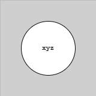
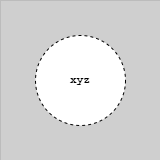
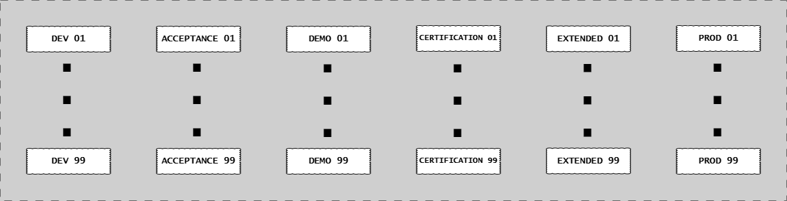
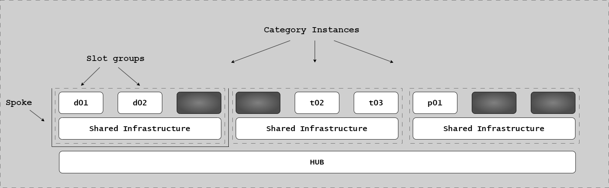
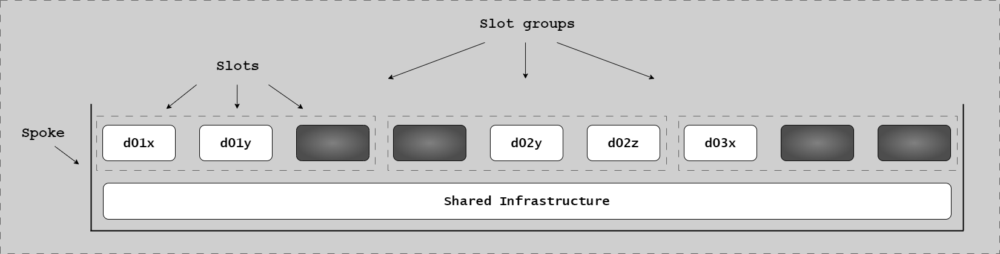
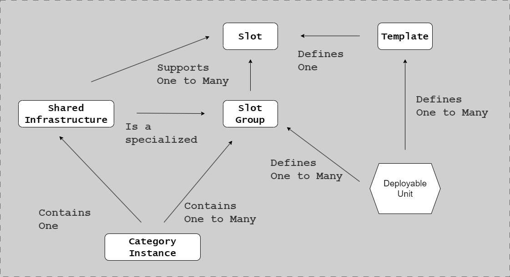

# Environments Architecture

## Introduction

Environments are the foundation of the Continuous Delivery Model. Each environment serves a specific purpose in the software delivery pipeline, from local development through production deployment. Understanding environment types, their characteristics, and their relationships is essential for implementing an effective CD Model.

Traditional approaches often rely on long-lived, shared environments that create bottlenecks and inconsistencies. The CD Model reimagines environments as purpose-built, often ephemeral resources that enable parallel execution, rapid feedback, and consistent infrastructure.

### Traditional vs Modern Approach

**Traditional Environment Model:**

Traditional software delivery relies on a linear progression through fixed, long-lived environments:

- **Development** → **Test** → **Validation** → **Production**
- Shared environments create resource contention
- Configuration drift between environments
- Manual environment setup and maintenance
- Bottlenecks when multiple teams share resources
- Environment-specific bugs discovered late

**CD Model Environment Approach:**

The CD Model uses purpose-built environments that match specific validation needs:

- **DevBox** for local development
- **Build Agents** for CI/CD automation
- **PLTE** (Production-Like Test Environments) for realistic validation
- **Demo** environments for stakeholder feedback
- **Deploy Agents** with segregated production access
- **Production** with phased rollout capabilities

Key improvements:

- Infrastructure as Code ensures consistency
- Ephemeral environments eliminate drift
- Parallel execution without conflicts
- Purpose-built for specific validation
- Production-like characteristics from early stages

---

## Environment Types Explained

### DevBox

The DevBox is the developer's local development environment where all changes begin.

**Characteristics:**

- Full control and isolation
- Fast iteration without network dependencies
- Immediate feedback loops
- No impact on other developers

**Tools and Resources:**

- IDE or code editor
- Local build tools and compilers
- Unit testing frameworks
- Local security scanners (Trivy)
- Version control (Git)
- Container runtime (Docker)

**Purpose in CD Model:**

- Stage 1 (Authoring): Create and develop changes
- Stage 2 (Pre-commit): Fast local validation

**Best Practices:**

- Mirror production configuration where possible
- Run pre-commit checks locally
- Use containerization for consistency
- Maintain clean, reproducible setup

### Build Agents

Build Agents are dedicated CI/CD pipeline runners that provide consistent, reproducible build environments.

**Characteristics:**

- Isolated execution for each build
- Consistent configuration across runs
- Access to artifact repositories
- Network access to test infrastructure
- No production credentials

**Purpose in CD Model:**

- Stage 2 (Pre-commit): CI/CD validation
- Stage 3 (Merge Request): Peer review automation
- Stage 4 (Commit): Integration testing
- Stage 8 (Start Release): Release candidate creation

**Security Considerations:**

- Isolated from production networks
- Limited credentials (read artifact repos, write test results)
- No direct deployment capabilities
- Audit logging for all actions

**Infrastructure:**

- Containerized runners (Docker, Kubernetes)
- Ephemeral execution environments
- Infrastructure as Code for consistency

### Production-Like Test Environments (PLTE)

PLTEs are ephemeral, isolated environments that emulate production characteristics for realistic testing.

**Legend for PLTE notation:** Shows the symbol used in CD Model diagrams to represent Production-Like Test Environments - ephemeral, isolated environments for vertical testing (L3) with test doubles for all external dependencies.

**Characteristics:**

- Production-like infrastructure (OS, database versions, network topology)
- Production-like configuration (without production credentials)
- Realistic test data (anonymized if necessary)
- Isolated per feature branch or release candidate
- Ephemeral - created on-demand, destroyed after testing

**Purpose in CD Model:**

- Stage 5 (Acceptance Testing): Functional validation (IV, OV, PV)
- Stage 6 (Extended Testing): Performance, security, compliance

**Benefits:**

- Realistic testing without production risk
- No resource contention between features
- Catch environment-specific issues early
- Parallel testing for multiple branches
- Infrastructure as Code validation

**Implementation:**

- Infrastructure as Code (Terraform, CloudFormation)
- Automated provisioning and teardown
- Database snapshots or seed data
- Network isolation for security

**Cost Management:**

- Short-lived (hours, not days)
- Automated cleanup after testing
- Resource limits to prevent overprovisioning
- Cloud-native auto-scaling

### Demo Environment

The Demo (or "Trunk Demo") environment provides a stable, production-like environment for stakeholder validation and exploratory testing.

**Characteristics:**

- Reflects current state of main branch
- Longer-lived than PLTEs (days to weeks)
- Accessible to non-technical stakeholders
- Production-like without production data
- May represent "next release" features

**Purpose in CD Model:**

- Stage 7 (Exploration): Stakeholder validation, UAT, exploratory testing

**Use Cases:**

- Feature demonstrations to product owners
- User acceptance testing
- Documentation and training preparation
- Exploratory testing by QA teams
- Stakeholder feedback collection

**Access:**

- Product owners and stakeholders
- QA teams
- Documentation teams
- Support and training teams

**Update Cadence:**

- Typically updated from main branch after successful Stage 6
- May be updated daily or weekly
- Represents validated, release-ready features

### Deploy Agents

Deploy Agents are specialized CI/CD runners with segregated access to production networks and deployment credentials.

**Legend for agent types:** Shows the symbols for Build Agents (no production access, run Stages 2-4) and Deploy Agents (segregated production access, run Stage 10). The diagram illustrates network boundaries and credential segregation between agent types.

**Characteristics:**

- Network access to production environments
- Production deployment credentials (stored securely in vaults)
- Strict access controls and audit logging
- Principle of least privilege
- Separate from Build Agents

**Purpose in CD Model:**

- Stage 10 (Production Deployment): Execute production deployments
- Stage 11 (Live): Health check validation
- Rollback execution if needed

**Security Measures:**

- Network segmentation from Build Agents
- Multi-factor authentication for credentials
- Comprehensive audit logging
- Time-limited sessions
- Change approval integration

**Approval Integration:**

- Manual approval gate (RA pattern)
- Automated approval gate (CDE pattern)
- Emergency break-glass procedures
- Rollback triggers

**Why Separate from Build Agents:**

- Principle of least privilege
- Reduce attack surface
- Prevent unauthorized production access
- Clear audit trail

### Production Environment

The Production environment is where software serves end users and delivers business value.

**Characteristics:**

- Live user traffic
- Real business data
- High availability requirements
- Performance monitoring
- Incident response procedures

**Purpose in CD Model:**

- Stage 10 (Production Deployment): Receive new releases
- Stage 11 (Live): Operational monitoring
- Stage 12 (Release Toggling): Feature flag management

**Deployment Strategies:**

- Hot deploy (in-place updates)
- Staged deploy (rolling updates)
- Blue-green deployment
- Canary deployment

**Monitoring:**

- Application performance metrics
- Business metrics (conversion, revenue)
- Error rates and types
- Resource utilization
- User behavior

**Rollback Capabilities:**

- Automated rollback on threshold breaches
- Manual rollback procedures
- Database rollback considerations
- Feature flag kill switches

---

## Architecture Visuals Explained

### Complete Environment Landscape

**This diagram shows the complete environment landscape:** The flow progresses from left to right showing DevBox (local development) → Build Agents (CI/CD automation in network zone A) → PLTE instances (isolated ephemeral testing in zone B) → Demo (stakeholder validation in zone B) → Deploy Agents (segregated zone C with production credentials) → Production (zone D with live traffic). Network boundaries show clear isolation between zones, with Deploy Agents as the only automated path to production. Data flows show artifact progression through stages, and access controls enforce principle of least privilege at each boundary.

### Architectural Layers

**This diagram shows the three architectural layers:** From top to bottom: **Application Layer** (services, APIs, business logic), **Data Layer** (databases, caches, message queues), and **Infrastructure Layer** (compute, networking, storage). Each environment (DevBox, PLTE, Production) contains all three layers with consistent structure. Arrows show dependencies flowing downward - applications depend on data layer, which depends on infrastructure. This layered approach enables separation of concerns, independent scaling per layer, and clear failure boundaries for troubleshooting.

### Deployment Slots

**This diagram shows blue-green deployment slots:** The **Blue Slot** (left) receives 100% of production traffic with the current stable release. The **Green Slot** (right) receives the new deployment for validation with test traffic (0%). After validation, the load balancer switches traffic from Blue to Green (arrows show traffic routing). The former Green becomes the new Blue (100% traffic), and the former Blue becomes idle, ready for the next deployment. This enables zero-downtime deployments with instant rollback capability - just switch the load balancer back if issues arise.

### Deployable Units Relationship

**This diagram shows single vs multiple deployable unit architectures:** The left side shows a **single deployable unit** (monolithic application) where all components deploy together atomically in one environment. The right side shows **multiple deployable units** (microservices) where Unit A, Unit B, and Unit C each have independent deployment cycles and environments. Arrows between units on the right indicate API dependencies requiring backward compatibility, contract testing, and versioning. The diagram illustrates the trade-off: single units have simpler coordination but less flexibility; multiple units enable independent deployment but require coordination strategies (API versioning, feature flags, contract testing).

---

## Traditional vs CD Model Comparison

### Traditional Model: Dev → Test → Val → Prod

**Development Environment:**

- Shared by multiple developers
- Frequent conflicts and contention
- Configuration often differs from production
- Manual setup and maintenance

**Test Environment:**

- Shared by QA team
- Test results affected by concurrent testing
- Environment state inconsistent
- Configuration drift from production

**Validation Environment:**

- Pre-production validation
- Limited capacity creates bottleneck
- Often differs from production
- Manual approvals delay releases

**Production Environment:**

- Live user traffic
- Issues discovered late
- Risky deployments due to environment differences

**Problems with Traditional Approach:**

- Environment drift causes late discovery of bugs
- Shared resources create bottlenecks
- Manual environment management is error-prone
- Configuration differences hide issues until production
- Long feedback loops (days to weeks)

### CD Model Approach

**DevBox (Local):**

- Isolated, developer-controlled
- Consistent through containerization
- Fast feedback (seconds to minutes)
- No resource contention

**Build Agents (Ephemeral):**

- Consistent, reproducible
- Parallel execution
- Isolated per build
- Infrastructure as Code

**PLTE (On-Demand):**

- Production-like from Stage 5
- Isolated per feature/release
- Catch issues early
- Ephemeral, no drift

**Production (Controlled):**

- Phased rollout (canary, rings)
- Feature flags for control
- Automated monitoring and rollback
- High confidence from earlier validation

**Benefits of CD Model Approach:**

- Consistency eliminates environment-specific bugs
- Parallel execution removes bottlenecks
- Infrastructure as Code prevents drift
- Early production-like validation reduces risk
- Fast feedback loops (minutes to hours)
- High confidence in production deployments

### Migration Path

**Moving from Traditional to CD Model:**

1. **Infrastructure as Code**: Define environments as code for consistency
2. **Ephemeral PLTEs**: Implement on-demand PLTE creation and automated testing
3. **Agent Segregation**: Separate Build and Deploy Agents with network isolation
4. **Production Readiness**: Add deployment strategies, monitoring, and automated rollback

---

## Infrastructure as Code Integration

Infrastructure as Code (IaC) ensures all environments are created from the same definitions, providing consistency, version control, and automated provisioning. Use Terraform/CloudFormation for cloud infrastructure, Docker for packaging, and Kubernetes for orchestration.

**Ephemeral PLTE Lifecycle:**

1. **Trigger**: Merge to main or release candidate creation
2. **Provision**: Create from IaC (5-10 min)
3. **Deploy**: Install application and seed test data
4. **Test**: Run acceptance/extended tests (1-4 hours)
5. **Destroy**: Tear down infrastructure

Benefits: No configuration drift, parallel testing without conflicts, cost-effective (pay only when used).

---

## Summary

Environments in the CD Model are purpose-built, often ephemeral resources that enable rapid, parallel validation with production-like characteristics:

- **DevBox**: Local development with fast feedback
- **Build Agents**: Consistent CI/CD automation
- **PLTE**: Ephemeral, production-like testing
- **Demo**: Stakeholder validation and exploration
- **Deploy Agents**: Segregated production access
- **Production**: Monitored, controlled deployment

The CD Model eliminates traditional environment bottlenecks through:

- Infrastructure as Code for consistency
- Ephemeral environments to prevent drift
- Network segregation for security
- Purpose-built environments for specific validation

This architecture enables fast feedback, high quality, and confident production deployments.

## Next Steps

- [CD Model Overview](../cd-model/cd-model-overview.md) - Understand the 12 stages
- [Stages 1-6](../cd-model/cd-model-stages-1-6.md) - See how environments support development stages
- [Stages 7-12](../cd-model/cd-model-stages-7-12.md) - See how environments support release stages
- [Repository Patterns](repository-patterns.md) - Understand repository organization
- [Implementation Patterns](../cd-model/implementation-patterns.md) - Choose RA or CDE pattern

## References

- [CD Model Overview](../cd-model/cd-model-overview.md)
- [Stages 1-6](../cd-model/cd-model-stages-1-6.md)
- [Stages 7-12](../cd-model/cd-model-stages-7-12.md)
- [Testing Strategy Overview](../testing/testing-strategy-overview.md)
