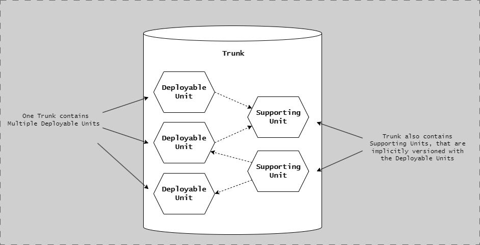
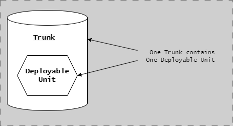
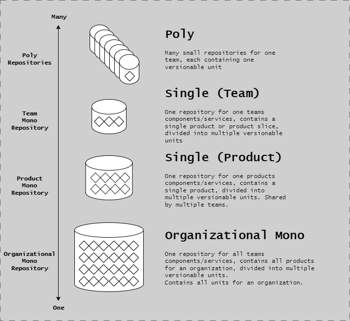
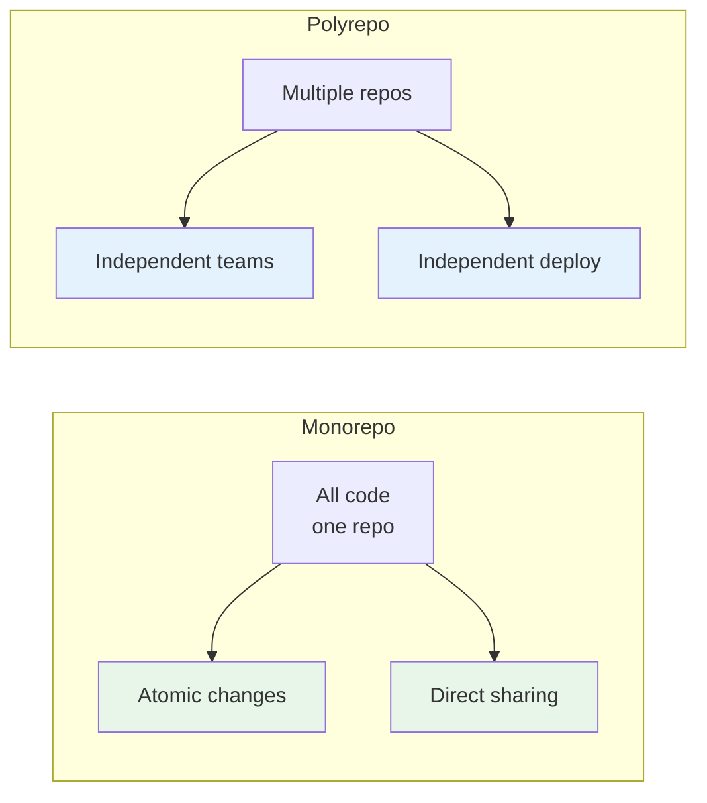
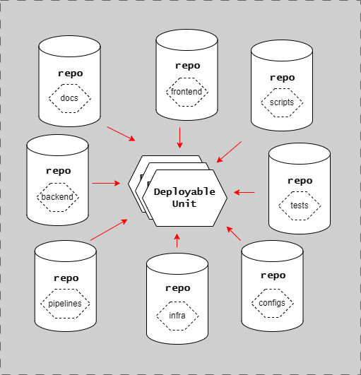

# Repository Patterns

## Introduction

Repository organization is a foundational decision that affects how teams collaborate, how code is versioned, and how the CD Model is implemented.

The way you structure your repositories influences build times, dependency management, deployment coordination, and team autonomy.

This article explains the two primary repository patterns - monorepo and polyrepo - and provides guidance on choosing the right approach for your organization and system architecture.

### Impact on CD Model

Repository structure directly impacts several CD Model stages:

- **Stage 3 (Merge Request)**: Code review scope and automation
- **Stage 4 (Commit)**: Build and test execution strategy
- **Stage 5 (Acceptance Testing)**: PLTE provisioning and test coordination
- **Stage 8 (Start Release)**: Release candidate creation and versioning
- **Stage 10 (Production Deployment)**: Deployment coordination and sequencing

Choosing the right pattern aligns repository organization with your system architecture and team structure.

---

## Monorepo Pattern



**This diagram shows monorepo organization:** A single repository root contains multiple deployable units organized by module type. The structure shows **services/** folder (api, web, worker services), **shared/** folder (models, utils libraries used across services), **infrastructure/** folder (IaC and deployment configs), and **docs/** folder (centralized documentation). All code shares a single version history, unified dependency management at root level, and common tooling configuration. Arrows indicate dependencies between modules, showing how shared libraries are consumed by services.

### Characteristics

**Single Repository:**

- All application code in one repository
- Shared infrastructure and tooling
- Unified version history
- Single source of truth

**Code Organization:**

- Organized by module or service directories
- Shared libraries and utilities
- Common configuration files
- Unified dependency management

**Example Structure:**

```
monorepo/
├── services/
│   ├── api/
│   ├── web/
│   └── worker/
├── shared/
│   ├── models/
│   └── utils/
├── infrastructure/
└── docs/
```

### Benefits

**Atomic Changes Across Boundaries:**

- Refactor multiple services in single commit
- Update shared libraries and consumers together
- No breaking changes across repository boundaries
- Single pull request for cross-cutting changes

**Simplified Dependency Management:**

- Shared dependencies at root level
- No version conflicts between modules
- Easier to ensure consistency
- Single dependency update affects all modules

**Code Sharing:**

- Shared utilities and libraries
- Reusable components
- Common infrastructure code
- Centralized documentation

**Unified Tooling:**

- Single CI/CD pipeline configuration
- Shared code quality tools
- Consistent build process
- Centralized security scanning

**Easier Refactoring:**

- Cross-module refactoring in one PR
- Immediate validation of changes
- No coordination between repositories
- Safe, atomic updates

### Tradeoffs

**Build Times:**

- Potentially longer build times, if not doing incremental builds etc.
- Need for selective builds (build only changed modules) locally and in pipelines
- Caching strategies essential
- Requires sophisticated build tooling

**Access Control:**

- Coarser-grained permissions
- All developers can see all code
- May not suit distributed teams with confidentiality needs
- CODEOWNERS file helps but limited

**Repository Size:**

- Can grow very large over time
- Git operations may slow down
- Requires Git LFS for large assets
- Clone times increase

**Cognitive Overhead:**

- Developers may be overwhelmed by scope
- Harder to navigate large codebase
- IDE performance considerations

### When to Use Monorepo

**Best for:**

- **Team coupled services**: Services that a team maintains together
- **Shared libraries**: Heavy code reuse across projects
- **Small to medium teams**: < 50-100 developers working in same domain, however it can scale to google sized orgs.
- **Rapid iteration**: Fast-moving products requiring frequent cross-cutting changes
- **Unified ownership**: Single team or organization owns all code

**Example Scenarios:**

- Startup with multiple microservices owned by one team
- Platform with shared component library
- Full-stack application with frontend, backend, and infrastructure code
- Internal tools suite with common dependencies

### CD Model Integration

**Stage 4 (Commit):**

- Use change detection to build only affected modules
- Run targeted test suites based on changed files
- Generate individual build artifacts pr. module

**Stage 5 (Acceptance Testing):**

- Single PLTE instance with a service vertical deployed
- Simplified service coordination
- Integrated end-to-end testing in extended testing stage 6

**Stage 8 (Start Release):**

- Create independent release tags for all modules
- Independent release notes

**Stage 10 (Production Deployment):**

- Multiple deployment pipelines are affecting production
- Deployment orchestration when multiple services changed in same change.
- Should use feature flags to decouple deployment from release

---

## Polyrepo Pattern



**This diagram shows polyrepo organization:** Each deployable unit lives in its own independent repository with separate version control. The structure shows **organization/** containing separate repositories: **api-service/**, **web-service/**, **worker-service/**, **shared-models/**, **shared-utils/**, and **infrastructure/**. Each has independent version history, separate CI/CD pipelines, and isolated dependency management. Arrows between repositories indicate published dependencies - shared-models and shared-utils are versioned libraries consumed by services through package managers. Each service pins specific versions of shared libraries in its dependency manifest.

### Characteristics

**Multiple Repositories:**

- One repository per service or versioned component (one repository pr. deployable unit)
- Independent version history
- Separate access controls
- Isolated tooling and configuration

**Code Organization:**

- Each repository is self-contained
- Dependencies managed per repository
- Independent documentation
- Service-specific configuration

**Example Structure:**

```text
organization/
├── api-service/
├── web-service/
├── worker-service/
├── shared-models/
├── shared-utils/
└── infrastructure/
```

### Benefits

**Team Autonomy:**

- Teams own and control their repositories
- Independent decision-making
- Different tech stacks possible
- Reduced coordination overhead

**Clear Boundaries:**

- Enforces service boundaries
- Prevents unintended coupling
- Clear ownership and responsibility
- API-first integration

**Independent Deployment:**

- Services deploy on separate schedules
- Faster deployment cycles per service
- Lower blast radius for changes
- Easier rollback of individual services

**Granular Access Control:**

- Fine-grained permissions per repository
- Suitable for distributed teams
- Supports confidential projects
- Compliance with data access requirements

**Smaller, Focused Repositories:**

- Faster clone times
- Simpler navigation
- Better IDE performance
- Focused code reviews

### Tradeoffs

**Cross-Repository Changes:**

- Changes spanning multiple repos require coordination
- Multiple pull requests needed
- Potential for breaking changes
- Version compatibility challenges
- Contract testing required
- Each repository must have standardized (versioned, named etc.) artifacts produced
- Repository to Repository bindings are NOT allowed ever. Instead formal version dependency menagement must be used

**Dependency Management Complexity:**

- Shared libraries versioned separately
- Version conflicts between repositories
- Need for dependency update coordination
- Breaking changes require careful management

**Tooling Duplication:**

- CI/CD configuration duplicated across repos
- Inconsistent tooling possible
- More maintenance overhead
- Potential for drift

**Discoverability:**

- Harder to find related code
- No unified search across repositories
- Documentation spread across repos
- Learning curve for new developers

### When to Use Polyrepo

**Best for:**

- **Loosely coupled services**: Microservices with independent lifecycles
- **Large organizations**: Multiple teams with separate ownership
- **Distributed teams**: Teams in different locations or with confidentiality needs
- **Independent deployment cadences**: Services that release on different schedules
- **Clear service boundaries**: Well-defined APIs between services (Contracts)

**Example Scenarios:**

- Large enterprise with independent product teams
- Microservices with separate deployment schedules
- Organization with confidential or regulated modules
- Platform with third-party integrations requiring isolation

### CD Model Integration

**Stage 4 (Commit):**

- Independent build pipelines per repository
- Parallel builds across repositories
- Repository-specific testing

**Stage 5 (Acceptance Testing):**

- PLTE must coordinate multiple repositories
- Version pinning for service dependencies
- Contract testing between services
- More complex environment setup

**Stage 8 (Start Release):**

- Independent release tags per repository
- Service-specific versioning
- Separate release notes per service

**Stage 10 (Production Deployment):**

- Deploy services independently
- Backward compatibility requirements
- Rolling deployment strategies
- API versioning for compatibility

---

## Comparison



**This diagram compares monorepo vs polyrepo characteristics:** Side-by-side comparison showing **Monorepo** (left) with single repository containing all services, unified versioning, shared tooling, and atomic cross-cutting changes vs **Polyrepo** (right) with independent repositories per service, separate versioning, independent pipelines, and team autonomy. Visual indicators show trade-offs: monorepo enables simpler dependency management and easier refactoring but has longer build times; polyrepo enables independent deployment and team autonomy but requires coordination for cross-repository changes. Arrows show the different dependency patterns - direct imports in monorepo vs versioned packages in polyrepo.

### Side-by-Side Analysis



| Factor                     | Monorepo                      | Polyrepo                    |
| -------------------------- | ----------------------------- | --------------------------- |
| **Atomic Changes**         | ✅ Excellent - single commit  | ❌ Difficult - multiple PRs |
| **Team Autonomy**          | ⚠️ Limited - shared decisions | ✅ Excellent - independent  |
| **Build Times**            | ⚠️ Potentially long           | ✅ Fast per repository      |
| **Dependency Management**  | ✅ Simple - unified           | ⚠️ Complex - versioned      |
| **Code Reuse**             | ✅ Easy - shared directly     | ⚠️ Requires versioning      |
| **Access Control**         | ⚠️ Coarse-grained             | ✅ Fine-grained             |
| **Discoverability**        | ✅ All code in one place      | ⚠️ Spread across repos      |
| **Independent Deployment** | ⚠️ Coordinated releases       | ✅ Independent cycles       |
| **Tooling**                | ✅ Unified                    | ⚠️ Duplicated               |

### Decision Factors

**Choose Monorepo if:**

- Services frequently change together
- Heavy code sharing between modules
- Small to medium team size
- Unified ownership and responsibility
- Need atomic cross-cutting changes

**Choose Polyrepo if:**

- Services have independent lifecycles
- Multiple teams with separate ownership
- Need fine-grained access control
- Services deploy on different schedules
- Clear service boundaries exist

---

## Anti-Patterns



**This diagram shows four common anti-patterns to avoid:** **1. Modular Monolith in Polyrepo** (top-left) shows tightly coupled services split into separate repositories, creating coordination nightmares with every change requiring multiple PRs. **2. Mega-Monorepo Without Tooling** (top-right) shows everything in one repo without selective build tools, forcing all tests to run for every change. **3. Scattered Shared Libraries** (bottom-left) shows duplicated shared code across multiple repos, causing inconsistency and difficult updates. **4. No Module Boundaries in Monorepo** (bottom-right) shows monorepo with spaghetti dependencies and no clear structure, making it impossible to understand or extract services. Red X marks indicate these are problematic patterns.

### How to Avoid These Anti-Patterns

1. **Modular Monolith in Polyrepo**: Use monorepo for tightly coupled services, or refactor to reduce coupling
2. **Mega-Monorepo Without Tooling**: Implement change detection, selective builds, and distributed caching
3. **Scattered Shared Libraries**: Extract to separate versioned repositories
4. **No Module Boundaries**: Define clear boundaries, enforce dependency rules with tooling

---

## Best Practices

**Module Boundaries**: Define explicit boundaries, document dependencies, enforce with tooling (linters, dependency checks)

**Versioning**:

- Monorepo: Unified or independent module versioning
- Polyrepo: Semantic versioning per repository, dependency manifests specify compatible versions

**Dependency Management**:

- Monorepo: Root-level with lock file for consistency
- Polyrepo: Per repository with published versioned libraries and contract testing

**Automation Tools**:

- Monorepo: Change detection, selective builds, distributed caching (Nx, Bazel, Turborepo)
- Polyrepo: Repository templates, shared pipeline definitions, automated updates (Dependabot)

---

## Impact on CD Model Stages

| Stage        | Monorepo                                | Polyrepo                                   |
| ------------ | --------------------------------------- | ------------------------------------------ |
| **Stage 3**  | Larger PRs, single review               | Smaller focused PRs, may need coordination |
| **Stage 4**  | Change detection for selective builds   | Independent builds in parallel             |
| **Stage 5**  | Single PLTE with all services           | Version pinning, contract testing          |
| **Stage 8**  | Single orchestrated release event possible for RA                      | Multiple independent release tags          |
| **Stage 10** | Coordinated deployment or feature flags | Independent deployment schedules           |

**Polyrepo Coordination Requirements**: Contract testing for API compatibility, version pinning in PLTE, deployment sequencing for backward compatibility, API versioning for gradual rollout.

---

## Summary

Repository patterns significantly impact CD Model implementation:

**Monorepo:**

- Best for tightly coupled services and small teams
- Simplifies atomic changes and dependency management
- Requires tooling for selective builds
- Unified CI/CD pipeline

**Polyrepo:**

- Best for loosely coupled services and large organizations
- Enables team autonomy and independent deployment
- Requires coordination for cross-repository changes
- Multiple CI/CD pipelines

Choose based on:

- Service coupling and boundaries
- Team structure and size
- Access control requirements
- Deployment cadence needs

Both patterns can work with the CD Model - the key is aligning repository structure with your system architecture and organizational needs.

## Next Steps

- [CD Model Overview](../cd-model/cd-model-overview.md) - Understand how repos integrate with stages
- [Stages 1-6](../cd-model/cd-model-stages-1-6.md) - See repository impact on development
- [Environments](environments.md) - Understand PLTE provisioning strategies
- [Implementation Patterns](../cd-model/implementation-patterns.md) - Choose RA or CDE pattern
- [Testing Strategy Integration](../testing/testing-strategy-integration.md) - Test coordination approaches

## References

- [CD Model Overview](../cd-model/cd-model-overview.md)
- [Trunk-Based Development](../workflow/trunk-based-development.md)
- [Repository Layout](../../reference/continuous-delivery/repository-layout.md)
