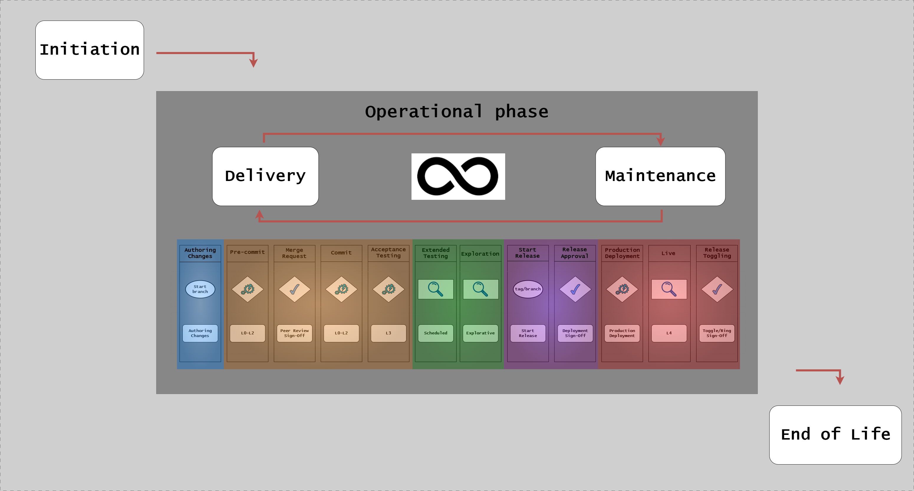
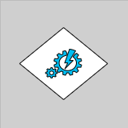
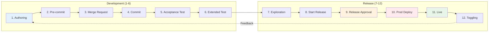

# Continuous Delivery Model: Overview

## Introduction

The Continuous Delivery (CD) Model provides a comprehensive framework for delivering software from initial development through production deployment and ongoing maintenance. This model ensures quality, traceability, and compliance throughout the entire software delivery lifecycle.

Unlike traditional linear Software Development Lifecycle (SDLC) approaches that rely on manual handoffs and stage-gate approvals, the CD Model integrates automation, quality gates, and continuous validation at every step. This approach reduces lead time, increases deployment frequency, and improves software quality through rapid feedback loops.

## The 12-Stage Model

The CD Model consists of 12 distinct stages that guide software from code authoring to production operation:

This visualization shows the complete flow through all stages, including quality gates, environment transitions, and approval points. Each stage has specific purposes, quality gates, and validation criteria that must be met before proceeding to the next stage.

## Traditional vs CD Model Approach

**Traditional SDLC (Waterfall/Stage-Gate):**

Traditional approaches follow a linear progression through fixed phases:

- **Development** → **Testing** → **Validation** → **Production**
- Manual handoffs between teams
- Testing happens late in the cycle
- Long feedback loops (weeks to months)
- Environment-specific configurations that drift over time
- Bottlenecks when multiple teams share environments

**CD Model Approach:**

The CD Model reimagines software delivery with:

- **Purpose-built stages** for specific validation activities
- **Automated progression** based on quality gates
- **Testing integrated** throughout the pipeline
- **Rapid feedback** loops (minutes to hours)
- **Infrastructure as Code** ensures environment consistency
- **Parallel execution** without environment conflicts
- **Continuous validation** at every stage

---

## Understanding the Visual Notation

The CD Model uses specific visual elements to represent different concepts. Understanding these symbols is essential for reading the model diagrams.

### Start Elements

Start elements indicate entry points into the CD Model workflow. These represent where work begins, typically when a developer starts authoring changes on a local branch.

### Quality Gates

Quality gates are automated or manual checkpoints that validate specific criteria before allowing progression to the next stage. Examples include:

- Code quality standards (linting, formatting)
- Test coverage thresholds
- Security scan results
- Performance benchmarks
- Peer approval

If quality gates fail, the pipeline stops, preventing defects from progressing further.

### Signoff Points

Signoff points represent formal approvals required at critical stages. These may be:

- Automated approvals based on quality metrics
- Manual approvals from stakeholders or release managers
- Compliance artifact sign-offs
- Security review approvals

### Exploration Activities

Exploration activities represent human-driven validation that complements automated testing. These include:

- Exploratory testing by QA teams
- User acceptance testing (UAT)
- Stakeholder demos and feedback
- Manual verification of edge cases

### Environment Agents

Environment agents represent different types of execution environments:

- **DevBox**: Local development environments
- **Build Agents**: CI/CD pipeline runners
- **Deploy Agents**: Specialized agents with production access

### Production-Like Test Environments (PLTE)

PLTEs are ephemeral, isolated environments that emulate production characteristics. They enable:

- Realistic testing without production risk
- Parallel testing for multiple feature branches
- Infrastructure as Code validation
- Performance and security testing in production-like conditions

## The 12 Stages Overview

Here's a high-level overview of each stage. For detailed explanations, see the stage-specific articles.

**Stages 1-6: Development Through Testing**:

1. **Authoring Changes**: Create code, config, requirements on local topic branches
2. **Pre-commit**: Validate changes locally before committing (5-10 min time-box)
3. **Merge Request**: Peer review and automated validation
4. **Commit**: Integrate validated changes into the main branch
5. **Acceptance Testing**: Validate functional requirements in PLTE
6. **Extended Testing**: Performance, security, and compliance validation

**Stages 7-12: Release Through Production**:

7. **Exploration**: Stakeholder validation and exploratory testing
8. **Start Release**: Create release candidate and documentation
9. **Release Approval**: Obtain formal approval for production deployment
10. **Production Deployment**: Deploy to production environment
11. **Live**: Monitor and validate production behavior
12. **Release Toggling**: Control feature exposure with feature flags (optional)

For detailed explanations of each stage:

- [Stages 1-6: Development to Testing](cd-model-stages-1-6.md)
- [Stages 7-12: Release to Production](cd-model-stages-7-12.md)

---

## Key Principles

### Shift-Left Everything

The CD Model emphasizes "shift-left" practices - moving validation activities as early as possible in the development process:

- **Testing**: Unit tests run in Stage 2 (Pre-commit), not Stage 6
- **Security**: Vulnerability scanning starts in Stage 2, not Stage 11
- **Compliance**: Requirements defined in Stage 1, not discovered in Stage 9

Early validation finds defects when they're cheapest to fix and fastest to remediate.

### Fail Fast

Quality gates at every stage ensure rapid feedback. If something fails:

- The pipeline stops immediately
- The team is notified within minutes
- The issue is fixed before proceeding

This prevents defects from progressing through the pipeline and accumulating.

### Automation Over Documentation

While documentation remains important, the CD Model prioritizes:

- **Automated tests** over test plans
- **Infrastructure as Code** over environment documentation
- **Pipeline configuration** over deployment procedures
- **Automated compliance checks** over manual reviews

This ensures consistency and reduces manual error.

### Continuous Integration

All developers integrate their changes to the main branch frequently (multiple times per day). This:

- Reduces merge conflicts
- Enables rapid feedback
- Maintains a releasable main branch
- Supports trunk-based development

See [Trunk-Based Development](../workflow/trunk-based-development.md) for more details.

### Traceability

Every change is traceable through the entire pipeline:

- Commits linked to requirements and user stories
- Test results linked to specific changes
- Deployment history tracked
- Compliance evidence automatically generated

---

## Patterns and Variations

The CD Model can be implemented in different patterns based on regulatory requirements and risk profile:

**Release Approval (RA) Pattern:**

- Suitable for regulated, high-risk environments
- Manual approval gates at Stage 9
- Comprehensive audit trail
- Extended validation phases

**Continuous Deployment (CDE) Pattern:**

- Suitable for non-regulated, fast-iteration environments
- Automated approval at Stage 9
- Feature flags control exposure
- Rapid delivery cycles

See [Implementation Patterns](implementation-patterns.md) for detailed guidance on choosing and implementing patterns.

---

## Benefits of the CD Model

**Faster Time to Market:**

- Automated pipeline reduces manual delays
- Parallel testing accelerates validation
- Continuous integration prevents integration debt

**Higher Quality:**

- Early defect detection through shift-left practices
- Automated testing at every stage
- Quality gates prevent defects from progressing

**Reduced Risk:**

- Small, frequent changes are easier to validate and rollback
- Automated compliance checks ensure consistency
- Production-like testing catches issues before deployment

**Better Compliance:**

- Automated evidence generation
- Traceability from requirements to deployment
- Audit trail built into the pipeline

**Improved Developer Experience:**

- Fast feedback loops (minutes, not days)
- Clear quality expectations
- Automated repetitive tasks

---

## How to Use This Documentation

**If you're new to the CD Model:**

1. Read this overview to understand the concept
2. Review [Stages 1-6](cd-model-stages-1-6.md) to understand the development flow
3. Review [Stages 7-12](cd-model-stages-7-12.md) to understand the release flow
4. Explore [Implementation Patterns](implementation-patterns.md) to choose an approach

**If you're implementing the CD Model:**

1. Choose your implementation pattern (RA or CDE)
2. Review [Environments](../architecture/environments.md) to understand infrastructure needs
3. Review [Testing Strategy](../testing/testing-strategy-overview.md) to plan test coverage
4. Review [Security](../security/security.md) to integrate security scanning

**If you're optimizing an existing pipeline:**

1. Map your current process to the 12 stages
2. Identify missing quality gates or validation
3. Review [Repository Patterns](../architecture/repository-patterns.md) if using monorepo/polyrepo
4. Implement shift-left practices incrementally

---

## References

**Related Documentation:**

- [Stages 1-6: Development to Testing](cd-model-stages-1-6.md)
- [Stages 7-12: Release to Production](cd-model-stages-7-12.md)
- [Implementation Patterns](implementation-patterns.md)
- [Environments Architecture](../architecture/environments.md)
- [Testing Strategy Overview](../testing/testing-strategy-overview.md)
- [Security](../security/security.md)
- [Trunk-Based Development](../workflow/trunk-based-development.md)

**Additional Resources:**

- [Repository Layout](../../reference/continuous-delivery/repository-layout.md)
- [Semantic Commits](../../reference/continuous-delivery/semantic-commits.md)
- [Versioning](../../reference/continuous-delivery/versioning.md)
