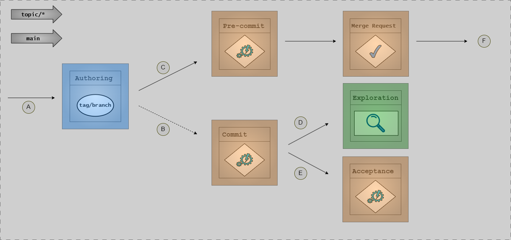
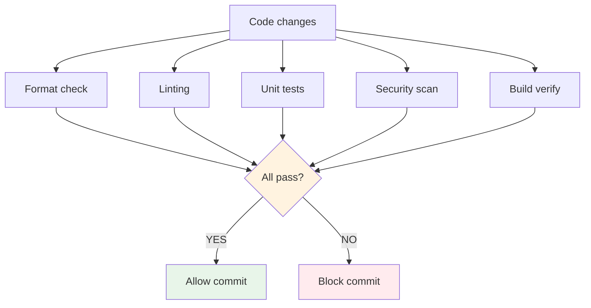
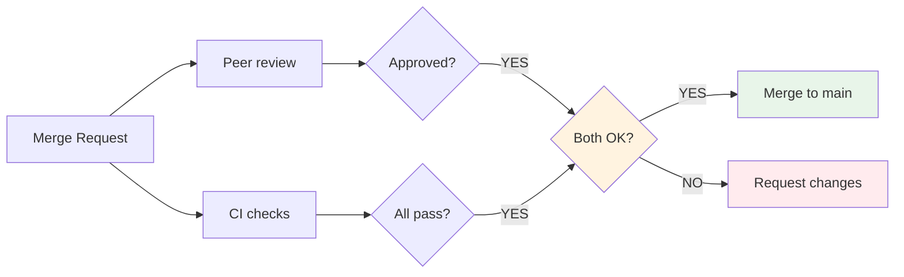
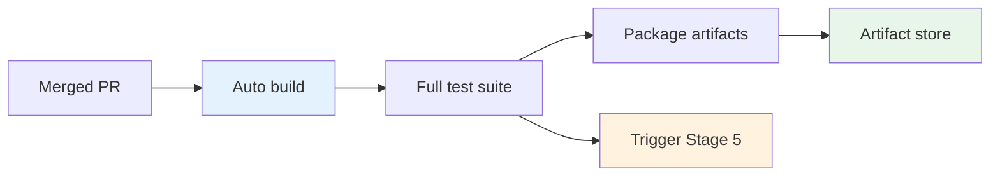
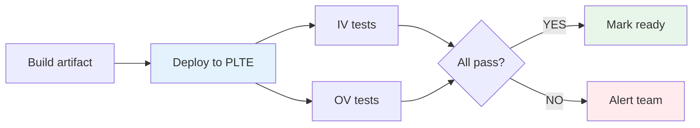
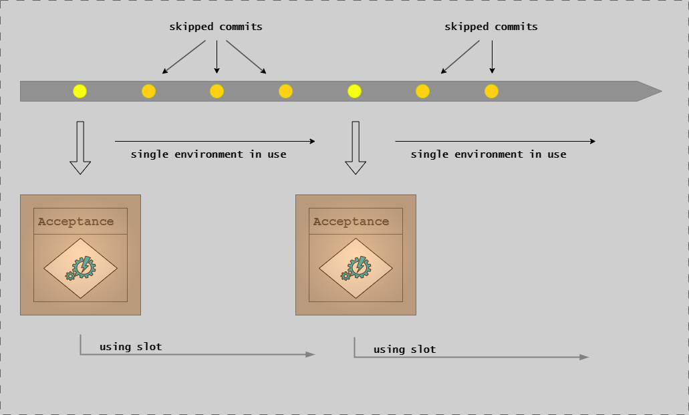
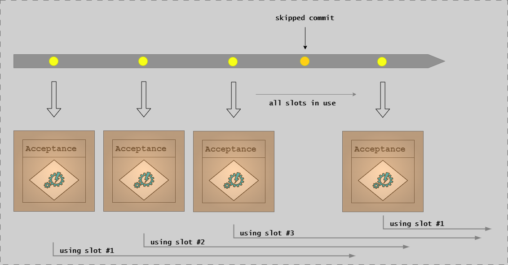
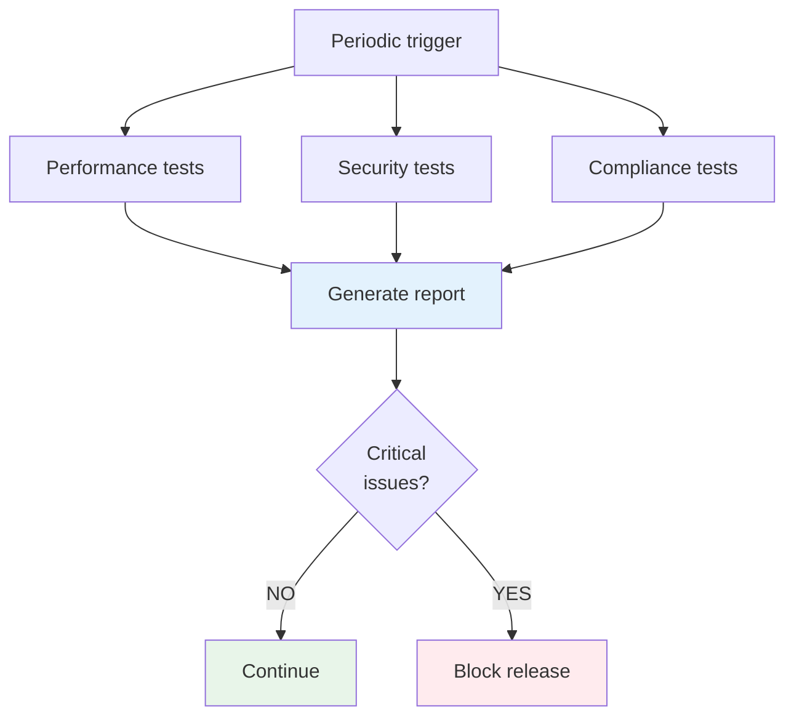

# CD Model: Stages 1-6 (Development to Testing)

## Introduction

Stages 1-6 of the Continuous Delivery Model cover the development and testing phases, from initial code authoring through comprehensive validation in production-like environments. These stages emphasize shift-left practices, rapid feedback, and automated quality gates to ensure high-quality software before release.

This article provides detailed explanations of each stage, including their purpose, key activities, quality gates, and best practices.

## Stage 1: Authoring Changes

**Purpose**: Create and develop code, configuration, requirements, and documentation on local topic branches.

### What Happens in This Stage

Stage 1 is where all changes begin. Developers work in their local development environment (DevBox) to create new features, fix bugs, update documentation, or modify configurations. This stage emphasizes collaboration and clarity through Requirements as Code.



**This diagram shows the topic branch stage flow through CD Model stages:**

- **A**: Developer pushes initial topic commit to central repository
- **B**: Optional pipeline execution flow (can run pre-integration experiments)
- **C**: Merge request flow - the pull request is processed by the automatic Pre-commit stage (Stage 2) and signed off in the Merge Request stage (Stage 3)
- **D** and **E**: Optional destinations for pre-integration testing (Exploration or Acceptance Testing stages)
- **F**: Merge request finalized - commit lands on main branch, ending the topic branch flow

Topic branches are created from HEAD of main (called "topic branches") or HEAD of a release branch (called "release topic branches").

### Environment: DevBox

The DevBox is the local development environment where engineers have full control. It typically includes:

- IDE or code editor
- Local build tools and compilers
- Unit testing frameworks
- Local security scanners
- Version control (Git)

Developers can experiment, iterate rapidly, and validate changes locally before sharing them with the team.

### Requirements as Code

Stage 1 embraces collaborative requirement definition through the "Three Amigos" approach:

- **Quality Assurance (QA)**: Ensures requirements are testable, measurable, and aligned with quality standards
- **Subject Matter Experts**: Provides domain knowledge and business context
- **Development Team**: Contributes technical feasibility and implementation details
- **Product Owners**: Provide clarity on business goals and expected outcomes

This collaboration produces clear, concise, and actionable specifications that serve as the single source of truth. Requirements are expressed as [executable specifications (Gherkin scenarios, acceptance criteria)](../../specifications/index.md) rather than static documents.

### Best Practices

- **Small, focused changes**: Keep topic branches focused on a single feature or fix
- **Commit frequently**: Make small, logical commits with descriptive messages
- **Test locally**: Run unit tests before committing
- **Document as you go**: Update documentation alongside code changes
- **Follow coding standards**: Use linters and formatters

---

## Stage 2: Pre-commit

**Purpose**: Validate changes locally before committing to ensure code quality and standards compliance.



### What Gets Validated

Pre-commit checks serve as the first quality gate, catching issues before they enter the shared codebase:

- **Code formatting**: Ensure consistent style (e.g., gofmt, prettier)
- **Linting**: Detect code quality issues and potential bugs
- **Unit tests**: Verify functionality at the function/method level
- **Security scans**: Detect secrets, vulnerable dependencies, code vulnerabilities
- **Build verification**: Ensure code compiles without errors

### Time-Boxing Strategy

Pre-commit checks are time-boxed to **5-10 minutes** to maintain development velocity. This requires:

- **Fast unit tests**: Milliseconds per test, run in parallel
- **Incremental scanning**: Only scan changed files
- **Local caching**: Reuse results from previous runs
- **Fail fast**: Stop on first critical failure

If pre-commit checks take longer than 10 minutes, they create friction and developers may skip them.

### Quality Gates

Pre-commit quality gates typically include:

| Check | Pass Criteria | Failure Action |
|-------|---------------|----------------|
| Code formatting | All files formatted per standards | Auto-fix or block commit |
| Linting | No high-severity issues | Block commit |
| Unit tests | 100% passing, minimum coverage | Block commit |
| Security - secrets | No hardcoded secrets detected | Block commit |
| Security - dependencies | No critical vulnerabilities | Block commit |
| Build | Successful compilation | Block commit |

### Example Checks

```bash
# Pre-commit hook example
#!/bin/sh

# Format check
go fmt ./...

# Lint
golangci-lint run --fast

# Unit tests
go test -short ./...

# Security scan
trivy fs --severity HIGH,CRITICAL .

# Exit on any failure
if [ $? -ne 0 ]; then
    echo "Pre-commit checks failed"
    exit 1
fi
```

### Environment

Pre-commit runs in two environments:

- **DevBox**: Local developer machine for interactive feedback
- **Build Agents**: CI/CD pipeline for PR validation

---

## Stage 3: Merge Request

**Purpose**: Submit changes for peer review and automated validation before integration.



### Peer Review Process

The merge request (also called pull request) is where code quality improves through collaboration:

- **Code review**: At least one peer examines the code for:
  - Correctness and logic
  - Readability and maintainability
  - Test coverage
  - Security implications
  - Alignment with architecture

- **Discussion**: Reviewers and authors discuss design decisions, alternatives, and improvements

- **Iteration**: Authors address feedback, make revisions, and update the PR

### Automated Validation

While peer review happens, automated checks run in parallel:

- All pre-commit checks (repeated in CI/CD)
- Integration tests
- Additional security scans (SAST, dependency scanning)
- Container image scanning (if applicable)
- Documentation builds
- Preview deployments (optional)

### Quality Gates

A merge request cannot be merged until:

| Gate | Requirement |
|------|-------------|
| Peer approval | At least one approver (configurable) |
| Automated tests | All tests passing |
| Code coverage | Meets minimum threshold (e.g., 80%) |
| No merge conflicts | Branch is up-to-date with target |
| Security scans | No critical vulnerabilities |
| Required reviewers | Domain experts have approved (if required) |

### Compliance Artifact Handling

In regulated environments, Stage 3 may include approval of compliance artifacts such as:

- Change control documentation
- Risk assessments
- Test plans and evidence
- Security reviews

These artifacts are managed in appropriate systems and linked to the merge request for traceability.

### Environment

Stage 3 executes on **Build Agents** - dedicated CI/CD pipeline runners that provide consistent, reproducible build environments.

---

## Stage 4: Commit

**Purpose**: Integrate validated changes into the target branch (main or release).



### Integration to Main Branch

Once a merge request passes all quality gates and receives approval, the changes are merged into the main branch. This integration triggers the full build and test pipeline.


**This CD Model diagram shows how main branch commits progress through validation stages:**

- **A**: Any change to main triggers automatic Stage 4 (Commit) and (for runtime systems) subsequent Stage 5 (Acceptance Testing)
- **B**: After successful Acceptance Testing, software (for runtime systems) automatically deploys to DEMO environment
- **C**: At this point, Start Release (Stage 8) can be initiated - this commit will become the first commit on the newly created release branch
- **D**: Extended Testing (Stage 6) periodically picks up current HEAD to further verify its suitability for release

Main receives commits from squash-merged topic branches or cherry-picked commits from release branches.

### Automated Testing Triggered

The commit stage executes a comprehensive test suite:

- **Unit tests** (L0): Test individual functions and methods
- **Component integration tests** (L1): Test interactions within a component
- **Integration tests** (L2): Test interactions between components
- **System tests** (E2E, L3): Validate complete user workflows (if fast enough)

See [Testing Strategy](../testing/testing-strategy-overview.md) for details on test levels.

### Traceability Requirements

Every commit must maintain traceability:

- **Linked to requirements**: Commit messages reference user stories, tasks, or issues
- **Semantic commit format**: Structured messages (type, scope, description)
- **Test evidence**: Automated test results linked to the commit
- **Review history**: PR discussion and approval trail preserved

Example commit message:

```text
feat(api): add user authentication endpoint

Implements user login with JWT tokens.
Related to #123

- Add /auth/login POST endpoint
- Generate and return JWT tokens
- Add unit tests for auth service
```

### Build Artifact Generation

The commit stage produces versioned build artifacts:

- Compiled binaries
- Container images
- Deployment packages
- Documentation bundles

These artifacts are tagged with version numbers and commit SHAs for traceability.

### Environment

Commit stage runs on **Build Agents** with access to artifact repositories and test infrastructure.

---

## Stage 5: Acceptance Testing

**Purpose**: Validate that changes meet functional requirements and acceptance criteria.



### PLTE Environment Explained

Acceptance testing runs in a **Production-Like Test Environment (PLTE)** - an ephemeral, isolated environment that emulates production characteristics:

- **Infrastructure**: Same OS, database versions, network topology as production
- **Configuration**: Production-like settings (without prod credentials)
- **Data**: Realistic test data (anonymized if necessary)
- **Isolation**: Each feature branch gets its own PLTE instance
- **Ephemeral**: Created on-demand, destroyed after testing

PLTEs enable realistic testing without production risk or resource contention.

### Single vs Multiple Deployable Units

The acceptance testing approach differs based on the number of deployable units:

**Single Deployable Unit:**



**This diagram shows single-entry acceptance testing:** Only one change can be in Stage 5 at a time. The pipeline runs continuously on HEAD commits whenever the slot is ready and a commit exists that hasn't been acceptance tested yet. This prevents environment conflicts and ensures orderly progression through the stage.

When the system consists of a single deployable unit (monolith, single service), this single-entry approach is typically sufficient.

**Multiple Deployable Units:**



**This diagram shows multi-entry acceptance testing:** The pipeline scales up to execute multiple commit verifications in parallel, up to a defined slot limit. Each commit gets its own isolated PLTE environment, enabling parallel progression through Stage 5 without waiting for other changes to complete.

When the system consists of multiple deployable units (microservices, distributed system), this multi-entry approach helps maintain throughput by:

- Coordinating deployments across units in parallel
- Managing interdependencies within isolated environments
- Testing integration points without contention
- Verifying backward compatibility independently

### Verification Types

Acceptance testing validates three types of verification:

**Installation Verification (IV)**:

- Confirms the solution can be installed and configured correctly
- Validates deployment scripts and procedures
- Ensures dependencies are satisfied
- Checks configuration management

**Operational Verification (OV)**:

- Ensures the solution operates as intended
- Validates functional requirements
- Confirms user workflows work end-to-end
- Verifies system behavior under normal conditions

**Performance Verification (PV)**:

- Validates performance benchmarks are met
- Tests response times under expected load
- Measures resource utilization (CPU, memory, disk)
- Verifies scalability characteristics

### Test Automation Strategies

Acceptance tests should be:

- **Automated**: Run without manual intervention
- **Fast**: Complete within reasonable time (1-2 hours maximum)
- **Reliable**: Produce consistent results
- **Comprehensive**: Cover all critical user workflows
- **Maintainable**: Easy to update as requirements evolve

Use BDD frameworks (Godog, Cucumber, SpecFlow) to express tests in business-readable language that traces back to requirements.

### Evidence Generation

Acceptance testing automatically generates compliance evidence:

- Test execution reports
- Screenshots and videos (for UI tests)
- API request/response logs
- Performance metrics
- Coverage reports

This evidence is stored in artifact repositories and linked to the specific build for audit purposes.

### Environment

Acceptance testing runs in **PLTE** environments, provisioned on-demand using Infrastructure as Code.

---

## Stage 6: Extended Testing

**Purpose**: Perform comprehensive testing including performance, security, and compliance validation.



### Performance Testing

Extended performance testing goes beyond Stage 5's basic validation:

- **Load testing**: Validate behavior under expected peak load
- **Stress testing**: Find breaking points and failure modes
- **Endurance testing**: Verify stability over extended periods
- **Spike testing**: Validate behavior during sudden load increases

Tools like Apache JMeter, Gatling, or k6 generate realistic load patterns and measure:

- Response times (p50, p95, p99)
- Throughput (requests/second)
- Error rates
- Resource utilization

### Security Testing Integration

Stage 6 executes comprehensive security testing:

- **DAST (Dynamic Application Security Testing)**: Full OWASP ZAP scans
- **Penetration testing**: Manual or automated exploit attempts
- **API security testing**: Authentication, authorization, input validation
- **Infrastructure scanning**: Network segmentation, firewall rules

See [Security](../security/security.md) for detailed security testing practices.

### Compliance Validation

For regulated systems, Stage 6 validates compliance requirements:

- **Regulatory controls**: Ensure required controls are implemented and effective
- **Audit logging**: Verify all required events are logged
- **Data protection**: Validate encryption, access controls, data retention
- **Traceability**: Confirm requirements are linked to tests and code

### Cross-System Integration Testing

If the system integrates with external services, Stage 6 validates:

- **Integration points**: APIs, message queues, databases
- **Error handling**: Graceful degradation when dependencies fail
- **Retry logic**: Appropriate backoff and retry strategies
- **Data consistency**: Eventual consistency across systems

### Environment

Extended testing runs in **PLTE** environments, often with longer-lived instances to support manual exploration and complex test scenarios.

---

## Summary

Stages 1-6 establish a foundation of quality through:

- **Stage 1**: Collaborative authoring with Requirements as Code
- **Stage 2**: Fast local validation (5-10 min)
- **Stage 3**: Peer review and automated checks
- **Stage 4**: Integration with comprehensive testing
- **Stage 5**: Acceptance testing in PLTE (IV, OV, PV)
- **Stage 6**: Extended performance, security, and compliance validation

Each stage builds confidence incrementally, with quality gates preventing defects from progressing. This shift-left approach catches issues early when they're cheapest to fix.

## Next Steps

- [Stages 7-12: Release to Production](cd-model-stages-7-12.md) - Continue to the release and deployment stages
- [Implementation Patterns](implementation-patterns.md) - Choose between RA and CDE patterns
- [Testing Strategy](../testing/testing-strategy-overview.md) - Understand test levels and integration

## References

- [CD Model Overview](cd-model-overview.md)
- [Environments Architecture](../architecture/environments.md)
- [Security](../security/security.md)
- [Repository Layout](../../../reference/repository-layout.md)
