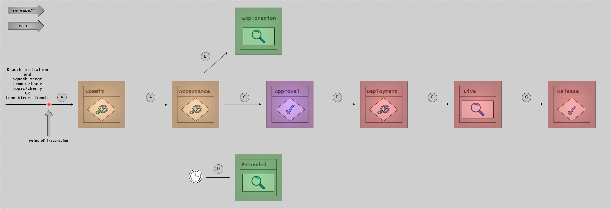

# CD Model: Stages 7-12 (Release to Production)

## Introduction

Stages 7-12 of the Continuous Delivery Model cover the release, deployment, and operational phases. These stages transition validated software from testing environments into production, where it serves end users. The focus shifts from development and testing to stakeholder validation, controlled deployment, and operational excellence.

This article provides detailed explanations of each stage, including deployment strategies, approval processes, monitoring practices, and feature management.

## Stage 7: Exploration

**Purpose**: Enable stakeholder validation and exploratory testing in a production-like environment.

### Demo Environment Purpose

The exploration stage uses a dedicated demo or "trunk demo" environment that serves as a bridge between automated testing and production deployment. This environment allows:

- **Stakeholders** to see and interact with new features
- **Product owners** to validate business requirements
- **QA teams** to perform exploratory testing
- **Documentation teams** to verify user guides
- **Training teams** to prepare materials

Unlike PLTE environments used in Stage 5-6, the demo environment is typically longer-lived and may represent the current state of the main branch.

### Stakeholder Validation

Exploration provides opportunities for stakeholders to validate software before production:

- **Feature demos**: Product teams showcase new capabilities
- **Business validation**: Confirm features align with business goals
- **Usability feedback**: Identify user experience issues
- **Documentation review**: Ensure help text and guides are accurate

This human validation complements automated testing by catching issues that automated tests miss:

- Confusing user workflows
- Missing features or edge cases
- Visual/aesthetic concerns
- Business rule misinterpretations

### Exploratory Testing Approach

Exploratory testing is structured, yet flexible, investigation of software behavior:

**Session-Based Testing**:

- Time-boxed sessions (60-90 minutes)
- Defined charter or mission
- Notes on findings and observations
- Debrief and knowledge sharing

**Test Tours**:

- Feature tour: Exercise all features
- Complexity tour: Focus on complex scenarios
- Data tour: Vary input data types and sizes
- User tour: Follow realistic user workflows

Exploratory testing finds unexpected behaviors and edge cases that scripted tests may overlook.

### UAT Coordination

User Acceptance Testing (UAT) in Stage 7 involves:

- **Test case execution**: Users validate specific scenarios
- **Feedback collection**: Document issues, suggestions, improvements
- **Sign-off process**: Formal acceptance before release approval
- **Defect tracking**: Log bugs found during UAT

UAT ensures the software meets user needs and expectations before production deployment.

### Environment

Exploration uses a **Demo Environment** or **Trunk Demo Environment** - a stable, production-like environment updated from the main branch.

---

## Stage 8: Start Release

**Purpose**: Initiate the formal release process and prepare for production deployment.

### Release Candidate Creation

Starting a release involves creating a release candidate - a specific version of software proposed for production deployment:



**This diagram shows the release branch stage flow and progression through final stages:**

- **A**: All commits to release branch trigger automatic Stage 4 (Commit) and Stage 5 (Acceptance Testing)
- **B**: After successful Acceptance Testing, software automatically deploys to approval environment
- **C**: Head of release branch is ready for Stage 9 (Release Approval)
- **D**: Stage 6 (Extended Testing) periodically picks up current HEAD to inform approval decision
- **E**: After release approval, enters Stage 10 (Production Deployment)
- **F**: After deployment to production, software enters Stage 11 (Live)
- **G**: If using decoupled deployments, can be toggle released in Stage 12 (Release Toggling)

The first commit on a release branch is the same main branch commit it was branched from. Further changes come from release topic branches or cherry-picks from main.

**Release Branch Strategy**:

- Create a release branch from main (e.g., `release/v1.2.0`)
- No new features added to release branch
- Only critical bug fixes allowed
- All changes cherry-picked back to main

**Tagged Release Strategy**:

- Tag a specific commit on main (e.g., `v1.2.0`)
- No branch created
- Simpler, but requires discipline

### Release Notes Generation

Comprehensive release notes document what's changing:

**What to Include**:

- **New features**: User-facing capabilities added
- **Enhancements**: Improvements to existing features
- **Bug fixes**: Issues resolved
- **Breaking changes**: Incompatibilities requiring user action
- **Security fixes**: Vulnerabilities addressed
- **Deprecations**: Features being phased out
- **Known issues**: Documented limitations

**Format**:

```markdown
# Release v1.2.0

## New Features
- User authentication with OAuth2 providers
- Export data to CSV format

## Enhancements
- Improved search performance (50% faster)
- Better error messages for validation failures

## Bug Fixes
- Fixed crash when uploading large files (#234)
- Corrected timezone handling in reports (#245)

## Breaking Changes
- API endpoint `/old-api` removed, use `/v2/api` instead

## Security
- Updated dependencies to address CVE-2024-1234
```

Release notes can be auto-generated from commit messages (using semantic commits) or curated manually.

### Version Tagging

Version numbers follow semantic versioning (MAJOR.MINOR.PATCH):

- **MAJOR**: Incompatible API changes
- **MINOR**: New functionality, backward-compatible
- **PATCH**: Bug fixes, backward-compatible

Example: `v1.2.3`

- 1 = Major version
- 2 = Minor version
- 3 = Patch version

Pre-release versions may include labels: `v1.2.3-rc.1` (release candidate 1)

### Environment

Release preparation happens on **Build Agents**, producing tagged artifacts ready for deployment.

---

## Stage 9: Release Approval

**Purpose**: Obtain formal approval for production deployment based on quality and compliance criteria.

### Approval Criteria

Before deploying to production, the release must meet defined criteria:

**Quality Metrics**:

- All automated tests passing (100%)
- Code coverage meets threshold (e.g., 80%+)
- No critical or high-severity bugs open
- Performance benchmarks met
- Security scans pass

**Compliance Requirements**:

- All required documentation complete
- Risk assessments approved
- Security reviews completed
- Regulatory requirements satisfied
- Stakeholder sign-offs obtained

**Business Readiness**:

- Release notes finalized
- User documentation updated
- Support team trained
- Rollback plan documented
- Communication plan ready

### Manual vs Automated Approval

**Manual Approval (Release Approval Pattern)**:

- Release manager or approval board reviews criteria
- Formal sign-off documented
- Approval recorded in tracking system
- Required for regulated environments

**Automated Approval (Continuous Deployment Pattern)**:

- Quality gates automatically evaluate criteria
- Pipeline proceeds if all gates pass
- Approval implied by passing quality gates
- Suitable for non-regulated environments

### Quality Thresholds

Automated quality thresholds might include:

| Metric | Threshold |
|--------|-----------|
| Test pass rate | 100% |
| Code coverage | ≥ 80% |
| Critical bugs | 0 |
| High bugs | 0 |
| Performance regression | < 5% |
| Security vulnerabilities (Critical/High) | 0 |

### Documentation Requirements

Required documentation for release approval:

- Release notes
- Deployment runbook
- Rollback procedure
- Test evidence
- Security scan reports
- Performance test results
- Stakeholder sign-offs
- Risk assessment

### Environment

Release approval validation occurs in **PLTE (automated)** and **Demo (exploratively)** environments where evidence has been collected throughout Stages 5-7.

---

## Stage 10: Production Deployment

**Purpose**: Deploy the approved release to the production environment with appropriate controls.

### Deployment Strategies

Different deployment strategies balance risk and deployment speed:

**Hot Deploy (In-Place)**:

- Deploy directly to running production servers
- Brief downtime during deployment
- Fast rollback (redeploy previous version)
- Simplest strategy

**Staged Deploy (Rolling)**:

- Deploy to servers incrementally (e.g., 25% at a time)
- Monitor each batch before proceeding
- Minimal blast radius if issues occur
- Zero downtime

**Blue-Green Deploy**:

- Maintain two production environments (Blue and Green)
- Deploy to inactive environment (e.g., Green)
- Test Green environment with production traffic (small percentage)
- Switch traffic from Blue to Green
- Zero downtime, instant rollback

**Canary Deploy**:

- Deploy to small subset of production servers and users (1-5%)
- Monitor key metrics (errors, latency, resource usage)
- Gradually increase traffic if healthy
- Roll back if issues detected

**Ring Deployment**:

- Deploy to consecutive rings
- Monitor key metrics (errors, latency, resource usage)
- Gradually rollout to new rings
- Roll back if issues detected

### Deploy Agents and Segregated Access

Some Production deployments use **Deploy Agents** - specialized CI/CD runners with:

- **Network segregation**: Access to production networks
- **Credentials**: Production deployment credentials (stored securely)
- **Audit logging**: All deployment actions logged
- **Principle of least privilege**: Only necessary permissions

Deploy agents are typically the only automated systems allowed to deploy to production.

### Rollback Planning

Every deployment must have a rollback plan:

**Automated Rollback Triggers**:

- Error rate exceeds threshold
- Latency exceeds acceptable limits
- Health checks fail
- Key metrics regress

**Rollback Procedures**:

- Revert to previous version
- Restore database if schema changed
- Clear caches if necessary
- Verify rollback success

**Rollback Time Objective**:

- Define target time to roll back (e.g., < 5 minutes)
- Practice rollback procedures regularly
- Automate rollback where possible

### Monitoring During Deployment

Closely monitor during and immediately after deployment:

- **Error rates**: Watch for increased errors
- **Latency**: Monitor response times
- **Resource utilization**: Check CPU, memory, disk
- **Business metrics**: Verify key workflows working
- **User reports**: Monitor support channels

Use dashboards that highlight deployment events to correlate changes with metric shifts.

### Environment

Deployments target the **Production Environment** using **Deploy Agents** with segregated network access.

---

## Stage 11: Live

**Purpose**: Monitor and validate the release in the production environment.

### Production Monitoring

Once deployed, continuous monitoring ensures the release behaves correctly:

**Infrastructure Monitoring**:

- Server health (CPU, memory, disk, network)
- Container health (if using containers)
- Database performance (query times, connection pools)
- Network latency and packet loss

**Application Monitoring**:

- Request rates and response times
- Error rates and types
- Active users and sessions
- Feature usage

**Business Monitoring**:

- Conversion rates
- Transaction volumes
- User engagement
- Revenue metrics

### Metrics and Thresholds

Define acceptable ranges for key metrics:

| Metric | Threshold | Action |
|--------|-----------|--------|
| Error rate | < 0.1% | Alert if exceeded |
| P95 latency | < 200ms | Alert if exceeded |
| CPU utilization | < 70% | Alert if sustained |
| Memory usage | < 80% | Alert if sustained |
| Active users | Monitor | Trend analysis |

Alerts should be actionable - every alert should require a response.

### Phased Rollout (Rings)

Instead of deploying to all users simultaneously, use rings:

**Ring 0 - Canary** (1-5% of users):

- Internal users or beta testers
- Early warning of issues
- 1-4 hours monitoring

**Ring 1 - Early Adopters** (10-25%):

- Users who opted into early access
- Broader validation
- 24 hours monitoring

**Ring 2 - General Availability** (100%):

- All users
- Full production rollout

Each ring provides validation before expanding to more users.

### Incident Response

<!-- TODO: this needs to be an article on its own -->

When issues occur in production:

1. **Detect**: Monitoring alerts or user reports
2. **Triage**: Assess severity and impact
3. **Respond**:
   - Roll back if critical
   - Apply hot fix if minor
   - Mitigate impact (disable feature, redirect traffic)
4. **Communicate**: Update status page, notify users
5. **Resolve**: Fix root cause
6. **Post-mortem**: Learn and prevent recurrence

### Environment

Live monitoring tracks the **Production Environment** where end users interact with the software.

---

## Stage 12: Release Toggling

**Purpose**: Control feature availability using feature flags (optional).

### Feature Flags Explained

Feature flags (or toggles) allow runtime control of feature availability without redeployment:

```go
if featureFlags.IsEnabled("new-checkout-flow", user) {
    // New checkout implementation
} else {
    // Old checkout implementation
}
```

Flags provide granular control:

- Enable/disable features instantly
- Gradual rollout to percentage of users
- A/B testing different implementations
- Emergency kill switch

### When to Use Feature Flags

**Use feature flags for**:

- **Large features**: Break into smaller, independently deployable pieces
- **Experimental features**: Test with subset of users
- **Risky changes**: Quick rollback without redeployment
- **Phased rollouts**: Gradual exposure (10% → 50% → 100%)
- **Business events**: Activate features at specific times

**Avoid feature flags for**:

- Small, low-risk changes
- Bug fixes (use proper fixes instead)
- Technical debt (create time-boxed flags only)

### Implementation Patterns

**Simple Boolean Flag**:

```yaml
features:
  new-search: true
  beta-dashboard: false
```

**Percentage Rollout**:

```yaml
features:
  new-checkout:
    enabled: true
    rollout_percentage: 25
```

**User-Targeted Flag**:

```yaml
features:
  admin-panel:
    enabled_for_users: ["admin@example.com"]
    enabled_for_groups: ["administrators"]
```

**Time-Based Flag**:

```yaml
features:
  black-friday-sale:
    enabled_after: "2024-11-29T00:00:00Z"
    enabled_before: "2024-12-02T00:00:00Z"
```

### Risk Mitigation

Feature flags mitigate deployment risk:

- **Decouple deployment from release**: Deploy code OFF, enable later
- **Instant disable**: Turn off problematic features immediately
- **Gradual validation**: Expose to small audience first
- **A/B testing**: Compare feature variations

### Flag Lifecycle Management

Avoid flag accumulation:

1. **Create**: Add flag when deploying unfinished/risky feature
2. **Enable**: Gradually roll out to users
3. **Stabilize**: Monitor and iterate
4. **Remove**: Delete flag after feature proven stable (30-90 days)

Treat feature flags as technical debt - clean them up regularly.

### Environment

Feature flags operate in the **Production Environment**, providing runtime control without redeployment.

---

## Summary

Stages 7-12 bring software to production and manage it operationally:

- **Stage 7**: Stakeholder validation and exploratory testing
- **Stage 8**: Release candidate creation and documentation
- **Stage 9**: Formal approval (manual or automated)
- **Stage 10**: Production deployment with chosen strategy
- **Stage 11**: Monitoring and validation in production
- **Stage 12**: Feature flag management (optional)

These stages emphasize controlled release, comprehensive monitoring, and risk mitigation through techniques like staged deployment, feature flags, and automated monitoring.

## Next Steps

- [CD Model Overview](cd-model-overview.md) - Return to the overview
- [Stages 1-6: Development to Testing](cd-model-stages-1-6.md) - Review earlier stages
- [Implementation Patterns](implementation-patterns.md) - Choose RA or CDE pattern
- [Environments](../architecture/environments.md) - Understand environment architecture

## References

- [CD Model Overview](cd-model-overview.md)
- [Stages 1-6](cd-model-stages-1-6.md)
- [Trunk-Based Development](../workflow/trunk-based-development.md)
- [Versioning](../../reference/continuous-delivery/versioning.md)
