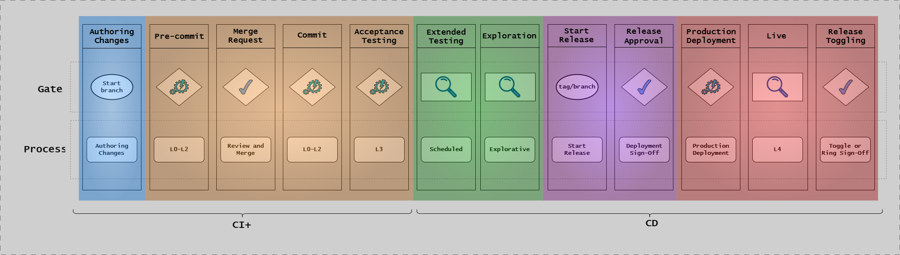
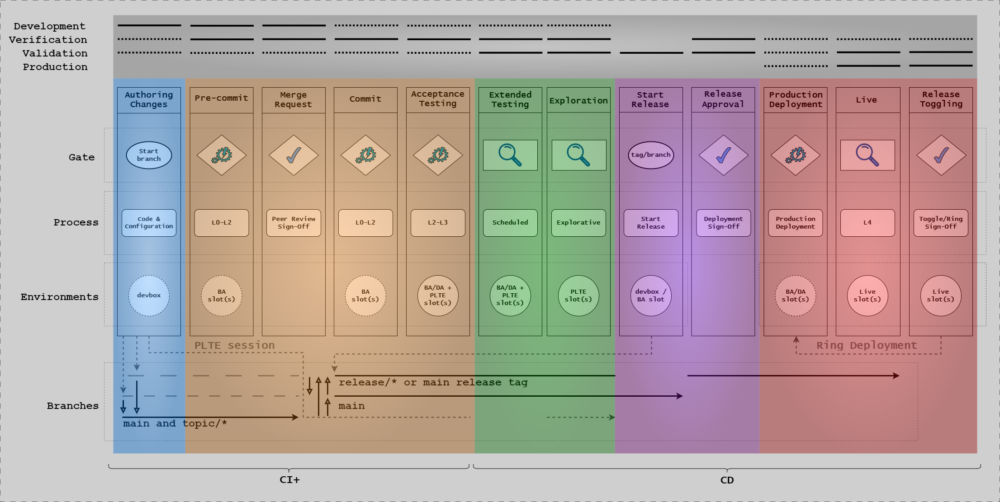
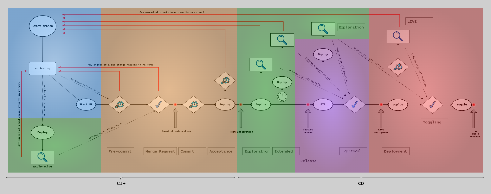
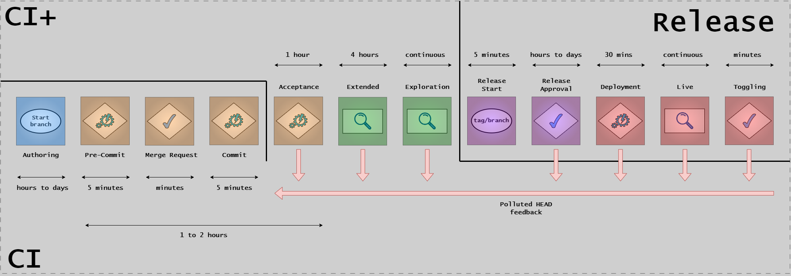
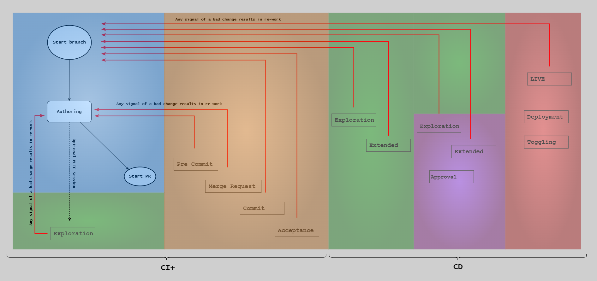
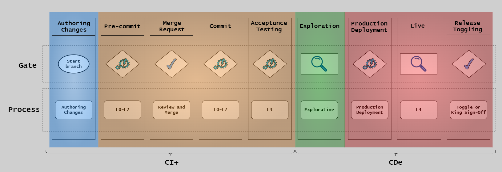
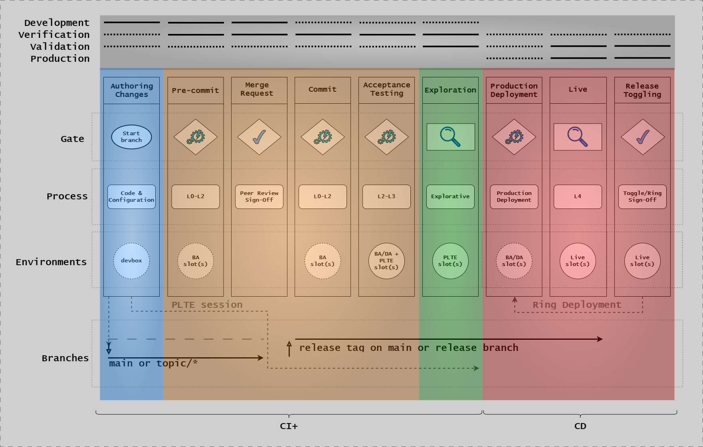
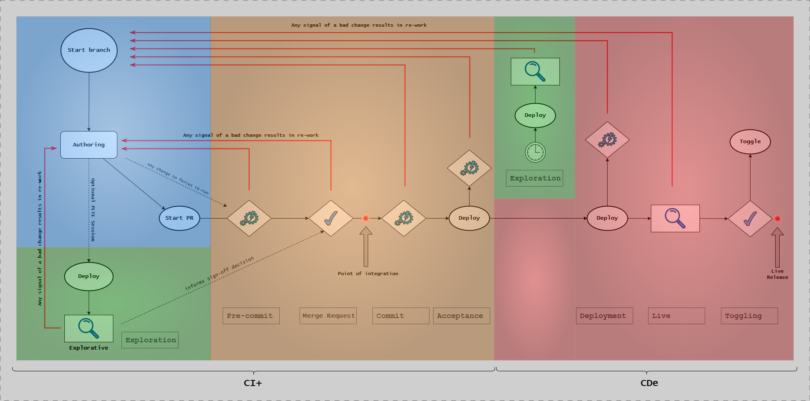
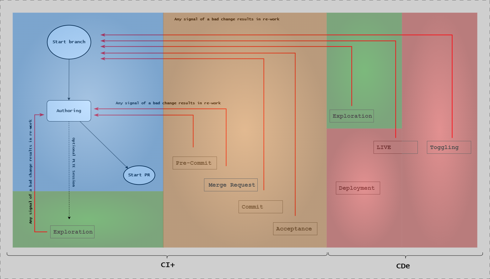
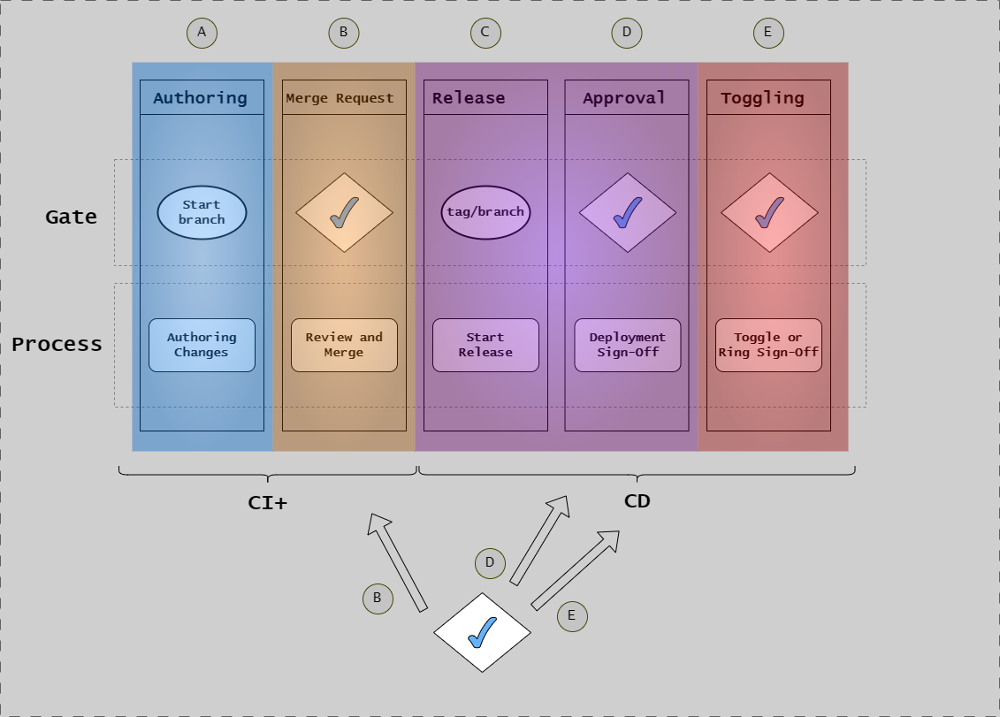

# Implementation Patterns

## Introduction

The Continuous Delivery Model can be implemented in different patterns based on your system's regulatory requirements, risk profile, and organizational maturity. Understanding these patterns helps you choose the right approach for your context and implement the CD Model effectively.

This article explains the two primary patterns - Release Approval (RA) and Continuous Deployment (CDE) - and provides guidance on selecting between them.

### Why Different Patterns Exist

Not all software systems have the same risk profile or regulatory requirements:

- **Regulated systems** (healthcare, finance, critical infrastructure) require extensive validation, audit trails, and formal approvals
- **Internal tools** benefit from rapid iteration and minimal overhead
- **Consumer applications** may fall somewhere in between

The CD Model accommodates these differences through implementation patterns that adjust the level of automation and manual oversight while maintaining the same underlying 12-stage structure.

### How to Choose the Right Pattern

Your choice depends on several factors:

- **Regulatory environment**: Are you subject to regulatory inspections?
- **Risk tolerance**: What's the impact of a production defect?
- **Organizational maturity**: Do you have robust automated testing?
- **Team capabilities**: Can you support continuous deployment?
- **Compliance requirements**: What evidence and approvals are required?

## Release Approval (RA) Pattern

**Best for**: Regulated environments, high-risk applications, systems requiring audit trails

The Release Approval pattern is the default for regulated systems. It emphasizes comprehensive validation, documented approvals, and clear separation of duties between development and release.

### When to Use RA

Use the Release Approval pattern when your system meets any of these criteria:

- **Regulatory oversight**: Subject to regulatory inspections (FDA, financial regulations, etc.)
- **Critical systems**: Errors could impact safety, health, or critical business operations
- **Compliance requirements**: Requires documented evidence and formal approvals
- **Audit trails**: Need comprehensive traceability for audits
- **Risk profile**: High consequence of failure

### Full Workflow Visualization



**This diagram highlights critical decision points in the RA pattern:** The simplified view focuses on the key gates where human decisions occur. Note the two primary approval gates: (1) peer review at Stage 3 before merging to trunk, and (2) release manager approval at Stage 9 before production deployment. The diagram omits detailed testing steps to emphasize the approval workflow and stage progression.



**This diagram shows the complete RA workflow with all 12 stages:** The full canvas displays every stage from Stage 1 (Authoring) through Stage 12 (Release Toggling). Look for manual approval gates at Stage 3 (Merge Request) and Stage 9 (Release Approval), shown as decision diamonds or approval icons. The diagram also shows environment transitions (DevBox → Build Agents → PLTE → Demo → Production) and test levels (L0-L4) executing at each stage.



**This diagram shows the flow of changes through stages with decision branches:** Follow the arrows showing how code progresses from authoring through production. Look for conditional paths where quality gates can block progression (e.g., "tests pass" vs "tests fail"). The diagram illustrates feedback loops where failures return to earlier stages for remediation.



**This diagram shows the technical CI/CD pipeline implementation:** The pipeline view maps stages to specific pipeline jobs and automated processes. Look for parallel execution paths (tests running simultaneously), sequential dependencies (build before test), and the integration between automated tools (GitHub Actions, Jenkins) and manual approval steps. Artifacts flow through the pipeline as immutable packages.



**This diagram shows where quality checks emit signals throughout the pipeline:** Each stage generates quality signals (pass/fail indicators) that inform decisions. Green signals indicate progression to the next stage; red signals trigger alerts and block advancement. The diagram shows which team (Delivery vs Discovery track) is responsible for emitting and responding to each signal.

### Manual Approval Gates

The RA pattern includes formal approval gates at critical stages:

**Stage 3 (Merge Request)**:

- Peer code review required
- At least one approver (configurable)
- Automated checks must pass

**Stage 9 (Release Approval)**:

- Release manager or approval board reviews
- Quality metrics verified
- Compliance documentation reviewed
- Formal sign-off documented

These manual gates provide human oversight and create documented decision points for audit purposes.

### Traceability and Audit Evidence

The RA pattern maintains comprehensive traceability:

**Requirements Traceability**:

- User stories → Acceptance criteria → Test cases → Code
- Every commit linked to requirement ID
- Test results linked to requirements

**Change Traceability**:

- Who made the change (developer)
- Who reviewed the change (approvers)
- When the change was made (timestamps)
- Why the change was made (linked requirement)

**Evidence Artifacts**:

- Test execution reports
- Security scan results
- Performance test results
- Code review approvals
- Release approval documentation

All evidence is automatically collected and stored in artifact repositories, providing a complete audit trail.

### Stage-by-Stage Breakdown for RA

| Stage | Automation Level | Approval Required | Duration |
|-------|-----------------|-------------------|----------|
| 1. Authoring | Manual | No | Hours-Days |
| 2. Pre-commit | Automated | No | 5-10 min |
| 3. Merge Request | Automated + Manual Review | Yes (Peer) | Hours |
| 4. Commit | Automated | No | 15-30 min |
| 5. Acceptance Testing | Automated | No | 1-2 hours |
| 6. Extended Testing | Automated + Manual | No | 2-8 hours |
| 7. Exploration | Manual | No | Days |
| 8. Start Release | Automated | No | Minutes |
| 9. Release Approval | Manual Review | Yes (Release Manager) | Hours-Days |
| 10. Production Deployment | Automated | No | 10-30 min |
| 11. Live | Automated Monitoring | No | Ongoing |
| 12. Release Toggling | Manual Control | No | As needed |

**Total cycle time**: Typically 1-2 weeks from commit to production for a new feature.

---

## Continuous Deployment (CDE) Pattern

**Best for**: Non-regulated systems, internal tools, teams with mature DevOps practices

The Continuous Deployment pattern emphasizes automation and rapid iteration. Changes flow automatically from commit to production based on automated quality gates, with feature flags providing runtime control.

### When to Use CDE

Use the Continuous Deployment pattern when:

- **Non-regulated**: No regulatory oversight or compliance requirements
- **Internal tools**: Used by internal teams who can tolerate occasional issues
- **Low risk**: Errors don't impact critical operations
- **Mature testing**: Comprehensive automated test coverage
- **Feature flags**: Can control feature exposure at runtime
- **Fast iteration**: Business value from rapid deployment

### Full Workflow Visualization



**This diagram highlights automated quality gates that replace manual approvals:** The simplified view shows how automated checks at critical points replace human decisions. Look for automated quality gates showing conditions like "all tests pass," "coverage > 80%," and "no critical vulnerabilities." Unlike RA, there's no manual approval gate at Stage 9 - the pipeline auto-approves based on passing these automated checks.



**This diagram shows the complete CDE workflow with all 12 stages and automated gates:** The full canvas displays every stage from Stage 1 (Authoring) through Stage 12 (Release Toggling) with emphasis on automation. Notice Stage 9 (Release Approval) has no manual gate - it automatically proceeds if quality gates pass. The diagram shows rapid progression through stages (hours instead of weeks) and highlights where feature flags provide runtime control instead of manual approvals.



**This diagram shows continuous automated progression from commit to production:** Follow the straight-through arrows indicating rapid flow without approval delays. Note the automated decision points that can block deployment (failed tests, security issues) versus the RA pattern's manual gates. The diagram emphasizes the speed advantage: changes can reach production in hours instead of days.



**This diagram shows automated responses to quality signals:** Quality signals in CDE trigger immediate automated actions rather than human review. Green signals advance the deployment automatically; red signals trigger automated rollback or block deployment. The diagram shows feedback loops where production monitoring (Stage 11) can automatically disable features via flags (Stage 12) without human intervention.

### Automated Approval

Instead of manual approval at Stage 9, the CDE pattern uses automated approval based on quality gates:

**Automated Checks**:

- All tests passing (100%)
- Code coverage meets threshold
- No critical/high security vulnerabilities
- Performance within acceptable range
- No open critical bugs

**Automated Decision**:

- If all checks pass → Approve and deploy
- If any check fails → Block and notify team

This removes human bottlenecks while maintaining quality standards.

### Feature Flag Importance

Feature flags become critical in the CDE pattern because they provide the control that manual approvals provide in RA:

**Decouple Deployment from Release**:

- Deploy code to production (flag OFF)
- Enable features progressively (flag ON for percentage of users)
- Disable instantly if issues arise (flag OFF)

**Risk Mitigation**:

- Large features deployed incrementally
- A/B testing different implementations
- Kill switch for problematic features
- Gradual rollout (1% → 10% → 50% → 100%)

Without feature flags, the CDE pattern has limited control over feature exposure.

### Stage-by-Stage Breakdown for CDE

| Stage | Automation Level | Approval Required | Duration |
|-------|-----------------|-------------------|----------|
| 1. Authoring | Manual | No | Hours |
| 2. Pre-commit | Automated | No | 5-10 min |
| 3. Merge Request | Automated + Manual Review | Yes (Peer) | Minutes-Hours |
| 4. Commit | Automated | No | 15-30 min |
| 5. Acceptance Testing | Automated | No | 1-2 hours |
| 6. Extended Testing | Automated | No | 1-2 hours |
| 7. Exploration | Automated (or skipped) | No | Minutes |
| 8. Start Release | Automated | No | Seconds |
| 9. Release Approval | Automated | No (Auto-approved) | Seconds |
| 10. Production Deployment | Automated | No | 10-30 min |
| 11. Live | Automated Monitoring | No | Ongoing |
| 12. Release Toggling | Automated Control | No | Real-time |

**Total cycle time**: Typically 2-4 hours from commit to production for a small change.

---

## Compliance and Signoffs



**This diagram shows where compliance artifacts and signoffs occur across both patterns:** The diagram maps stages to specific compliance touchpoints, showing where documentation is generated, evidence is collected, and approvals are obtained. Look for Stage 3 (peer review signoff), Stage 5 (evidence collection for IV/OV/PV), and Stage 9 (release approval signoff). The diagram indicates which signoffs are required for both patterns (peer review) versus RA-only (release approval), and where automated evidence collection supports compliance regardless of pattern.

### Where Signoffs Occur in Both Patterns

**Stage 3 (Merge Request)**:

- Peer code review (both patterns)
- Compliance artifact approval (RA pattern)

**Stage 5 (Acceptance Testing)**:

- Verification evidence (IV, OV, PV) collected
- Automated quality gates validate test results

**Stage 9 (Release Approval)**:

- Manual approval and sign-off (RA pattern)
- Automated approval based on quality gates (CDE pattern)

**Stage 11 (Live)**:

- Ongoing operational reviews
- Periodic compliance validation

### Compliance Artifact Management

Both patterns generate compliance artifacts, but manage them differently:

**RA Pattern**:

- Artifacts reviewed and approved manually
- Stored in designated compliance systems
- Formal approval documented
- Audit trail emphasized

**CDE Pattern**:

- Artifacts generated automatically
- Stored in artifact repositories
- Compliance validation automated where possible
- Evidence available for retrospective audit

### Verification Evidence Tracking

Both patterns collect verification evidence in Stage 5:

**Installation Verification (IV)**:

- Deployment logs
- Configuration validation
- Dependency checks

**Operational Verification (OV)**:

- Functional test results
- User workflow validation
- Integration test results

**Performance Verification (PV)**:

- Load test results
- Response time measurements
- Resource utilization metrics

Evidence is automatically linked to the specific build/release for traceability.

---

## Pattern Selection Decision Tree

Use this decision tree to select the appropriate pattern:

```text
START
  ↓
Is your system subject to regulatory oversight? (FDA, financial regulations, etc.)
  ├─ YES → Use RA Pattern
  └─ NO → Continue
      ↓
  Could a defect impact safety, health, or critical business operations?
    ├─ YES → Use RA Pattern
    └─ NO → Continue
        ↓
    Do you require formal audit trails and documented approvals?
      ├─ YES → Use RA Pattern
      └─ NO → Continue
          ↓
      Do you have comprehensive automated test coverage (>80%)?
        ├─ NO → Use RA Pattern (until test coverage improves)
        └─ YES → Continue
            ↓
        Can you implement feature flags for runtime control?
          ├─ NO → Use RA Pattern
          └─ YES → Use CDE Pattern
```

### Factors to Consider

**Risk Assessment**:

- What's the worst-case impact of a production defect?
- How quickly can you detect and respond to issues?
- What's the cost of downtime or rollback?

**Organizational Maturity**:

- Test automation coverage and reliability
- Monitoring and observability capabilities
- Incident response processes
- Team skill level

**Regulatory Requirements**:

- Required evidence and documentation
- Approval and sign-off requirements
- Audit frequency and scope

**Business Factors**:

- Time-to-market importance
- Competitive landscape
- User tolerance for issues
- Support capabilities

### Hybrid Approaches

Some organizations use different patterns for different systems:

- **Production (RA)**: Customer-facing, critical systems
- **Staging (CDE)**: Internal preview environments
- **Internal Tools (CDE)**: Developer tools and dashboards

Or transition between patterns as systems mature:

1. **Start with RA**: Ensure quality with manual oversight
2. **Build automation**: Increase test coverage, improve monitoring
3. **Transition to CDE**: Gradually remove manual gates as confidence grows

---

## Summary

**Release Approval (RA)**:

- Manual approval gates at Stages 3 and 9
- Comprehensive audit trail and traceability
- Suitable for regulated, high-risk systems
- Cycle time: 1-2 weeks

**Continuous Deployment (CDE)**:

- Automated approval based on quality gates
- Feature flags for runtime control
- Suitable for non-regulated, low-risk systems
- Cycle time: 2-4 hours

Choose based on regulatory requirements, risk profile, and organizational maturity. Both patterns use the same 12-stage model but differ in automation level and approval mechanisms.

## Next Steps

- [CD Model Overview](cd-model-overview.md) - Return to the model overview
- [Stages 1-6](cd-model-stages-1-6.md) - Understand development stages
- [Stages 7-12](cd-model-stages-7-12.md) - Understand release stages
- [Environments](../architecture/environments.md) - Learn about environment architecture
- [Security](../security/security.md) - Integrate security throughout the pipeline

## References

- [CD Model Overview](cd-model-overview.md)
- [Trunk-Based Development](../workflow/trunk-based-development.md)
- [Repository Layout](../../reference/continuous-delivery/repository-layout.md)
