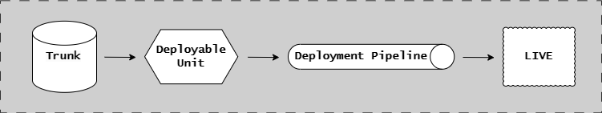
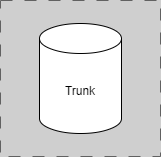
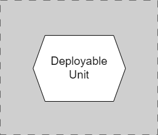
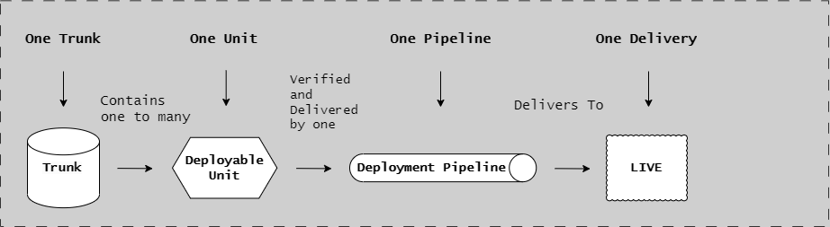

# Unit of Flow

## Introduction

The Unit of Flow is a conceptual framework that divides Continuous Delivery into four discrete, interconnected components. Understanding these components and their relationships is essential for implementing an effective CD Model.



These four components work together to enable the continuous flow of software from development through production:

- **[Trunk](#trunk)**: The version-controlled timeline where code lives
- **[Deployable Unit](#deployable-unit)**: The discrete body of work that is built, tested, and delivered
- **[Deployment Pipeline](#deployment-pipeline)**: The automated process that validates and delivers changes
- **[Live](#live)**: The runtime environment where software serves users

## The Four Components

### Trunk



**Definition:** The conceptual container of Deployable Units, representing the versioned timeline in which they exist.

**Key Characteristics:**

- Implemented as a Git code repository
- Follows Trunk-Based Development practices
- Contains "everything as code" (application code, infrastructure, configuration, documentation)
- The HEAD of trunk represents the only meaningful version of the code
- All changes integrate to trunk frequently (at least daily)

**Purpose:**

- Single source of truth for all code
- Enables Continuous Integration
- Provides version history and traceability
- Supports parallel development without long-lived branches

**Implementation:**

- Can be a single repository (polyrepo) containing one deployable unit
- Can be a monorepo containing multiple deployable units
- Always uses trunk-based development branching topology

See [Trunk-Based Development](../workflow/trunk-based-development.md) for detailed practices.

### Deployable Unit



**Definition:** The discrete body of work that is built, tested, and delivered as a single unit.

**Key Characteristics:**

- Composed of one or more immutable artifacts
- Has its own version number
- Can progress through all CD Model stages independently
- Lowest level of granularity for repository decomposition

**Types:**

**Runtime Systems:**

- Microservices
- Modular monoliths
- Data pipelines
- Web applications
- Store apps
- Shared infrastructure

**Versioned Components:**

- Container images
- npm/NuGet/pip packages
- CLI tools and executables
- Automation modules
- Shared libraries

**Purpose:**

- Defines the scope of what gets built and deployed together
- Determines versioning granularity
- Establishes deployment boundaries
- Enables independent testing and deployment

See [Deployable Units](deployable-units.md) for detailed explanation.

### Deployment Pipeline


**Definition:** The automated, repeatable process that takes code from commit to production.

**Key Characteristics:**

- Triggered by changes to trunk
- Implements the 12 stages of the CD Model
- Provides automated quality gates
- Generates immutable artifacts
- Collects evidence and metrics

**Purpose:**

- Automate build, test, and deployment
- Provide fast, consistent feedback
- Enforce quality standards
- Enable continuous delivery
- Maintain audit trail

**The 12 Stages:**

1. Authoring Changes
2. Pre-commit
3. Merge Request
4. Commit
5. Acceptance Testing
6. Extended Testing
7. Exploration
8. Start Release
9. Release Approval
10. Production Deployment
11. Live
12. Release Toggling

See [CD Model Overview](../cd-model/cd-model-overview.md) for the complete 12-stage framework.

### Live


**Definition:** The runtime environment where deployed software serves end users.

**Key Characteristics:**

- Production environment with real user traffic
- Continuous monitoring and observability
- Feature flags for runtime control
- Incident response procedures
- Performance and business metrics

**Purpose:**

- Deliver business value to users
- Monitor software behavior in production
- Enable gradual rollouts
- Support fast rollback if needed
- Collect production metrics

**Stages:**

- Stage 11 (Live): Monitoring and validation
- Stage 12 (Release Toggling): Feature flag management

---

## Relationships



This diagram illustrates how the four components relate to each other:

### Trunk Contains Deployable Units

A single trunk can contain:

- **One deployable unit** (polyrepo pattern)
- **Multiple deployable units** (monorepo pattern)

**Polyrepo Example:**

```text
api-service/              # Trunk (repo)
├── src/                  # Deployable Unit: API Service
├── infrastructure/
└── .github/workflows/    # Deployment Pipeline
```

**Monorepo Example:**

```text
platform/                 # Trunk (repo)
├── services/
│   ├── api/             # Deployable Unit 1
│   ├── web/             # Deployable Unit 2
│   └── worker/          # Deployable Unit 3
└── shared/              # Supporting code (not a deployable unit)
```

### Each Deployable Unit Has a Deployment Pipeline

Every deployable unit has its own automated pipeline:

- **Polyrepo**: One pipeline per repository
- **Monorepo**: Multiple pipelines in one repository (one per deployable unit)

The pipeline is triggered when changes affect its deployable unit.

### Deployment Pipeline Delivers to Live

The pipeline validates changes and delivers immutable artifacts to the Live environment:

```text
Trunk (Code)
    ↓
Deployable Unit (Scope)
    ↓
Deployment Pipeline (Process)
    ↓
Live (Runtime)
```

### Live Feedback Influences Trunk

Production metrics and incidents create feedback loops:

- Monitoring alerts trigger investigations
- Performance issues drive optimization
- Feature flag data informs product decisions
- Incidents result in fixes committed to trunk

---

## Integration with CD Model

The Unit of Flow maps directly to CD Model stages:

**Trunk-Focused Stages:**

- Stage 1 (Authoring): Work happens on topic branches in trunk
- Stage 3 (Merge Request): Changes integrated to trunk via PR
- Stage 4 (Commit): Trunk commits trigger pipelines

**Deployable Unit-Focused Stages:**

- Stage 4 (Commit): Build artifacts for the deployable unit
- Stage 5 (Acceptance Testing): Validate the deployable unit
- Stage 8 (Start Release): Create release candidate for the deployable unit

**Deployment Pipeline-Focused Stages:**

- All 12 stages are implemented by the deployment pipeline
- Pipeline orchestrates progression through stages
- Pipeline collects evidence at each stage

**Live-Focused Stages:**

- Stage 10 (Production Deployment): Deploy to live environment
- Stage 11 (Live): Monitor live environment
- Stage 12 (Release Toggling): Control features in live environment

---

## Benefits of the Unit of Flow Model

**Clear Boundaries:**

- Each component has a specific purpose
- Responsibilities are well-defined
- Easier to understand and implement

**Flexibility:**

- Polyrepo or monorepo
- Different versioning strategies
- Multiple deployment patterns
- Adaptable to organization size

**Traceability:**

- Code → Trunk commits
- Commits → Deployable units
- Units → Pipeline executions
- Pipelines → Live deployments

**Independence:**

- Deployable units can evolve independently
- Pipelines validate in isolation
- Deployments don't block each other

**Scalability:**

- Add deployable units without disrupting existing ones
- Parallel pipeline execution
- Independent release cadences

---

## Common Patterns

### Single Service Pattern (Polyrepo)

```text
Trunk (one repo) → One Deployable Unit → One Pipeline → One Live Service
```

**Use when:**

- Service is independent
- Team owns entire service
- Clear service boundaries

### Multi-Service Platform (Monorepo)

```text
Trunk (one repo) → Multiple Deployable Units → Multiple Pipelines → Multiple Live Services
```

**Use when:**

- Services share code heavily
- Need atomic cross-service changes
- Small to medium team size

### Microservices Architecture (Polyrepo)

```text
Multiple Trunks → Multiple Deployable Units → Multiple Pipelines → Multiple Live Services
```

**Use when:**

- Services are loosely coupled
- Multiple teams with separate ownership
- Independent deployment cadences

---

## Summary

The Unit of Flow provides a mental model for Continuous Delivery:

**The Four Components:**

1. **Trunk**: Where code lives (Git repository)
2. **Deployable Unit**: What gets built and deployed
3. **Deployment Pipeline**: How code reaches production (12 stages)
4. **Live**: Where software runs in production

**Key Relationships:**

- Trunk contains one or more deployable units
- Each deployable unit has its own deployment pipeline
- Pipelines deliver artifacts to live environments
- Live environments provide feedback to trunk

**Integration:**

- Maps to CD Model stages 1-12
- Supports both polyrepo and monorepo patterns
- Enables independent and coordinated releases
- Provides clear traceability and boundaries

## Next Steps

- [Trunk-Based Development](../workflow/trunk-based-development.md) - Detailed branching practices
- [Deployable Units](deployable-units.md) - Types, versioning, and management
- [Branching Strategies](../workflow/branching-strategies.md) - Flows for RA and CDE patterns
- [CD Model Overview](../cd-model/cd-model-overview.md) - Complete 12-stage framework
- [Repository Patterns](../architecture/repository-patterns.md) - Monorepo vs polyrepo

## References

- [CD Model Overview](../cd-model/cd-model-overview.md)
- [Stages 1-6](../cd-model/cd-model-stages-1-6.md)
- [Stages 7-12](../cd-model/cd-model-stages-7-12.md)
- [Implementation Patterns](../cd-model/implementation-patterns.md)
