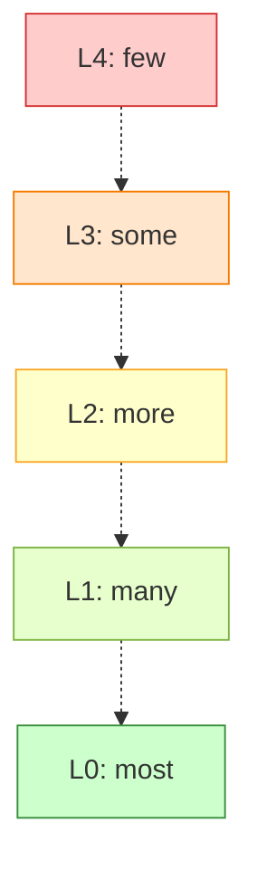

# Testing Strategy

Comprehensive testing strategy integrated throughout all stages of the Continuous Delivery Model. These articles explain the test taxonomy, how test levels map to stages, and the shift-left approach that enables fast, reliable delivery.

---

## [Testing Strategy Overview](testing-strategy-overview.md)

Understanding test taxonomy and the shift-left testing approach.

Testing is integrated throughout every stage of the CD Model, not treated as a separate phase after development. This article establishes the complete test taxonomy and explains why multiple test levels are necessary.

**The Test Taxonomy:**

**L0-L1: Unit Tests (Shift LEFT)**:

- **Execution environment**: Devbox or agent
- **Test scope**: Source and binary
- **External dependencies**: All replaced with test doubles
- **Trade-off**: Highest determinism, lowest domain coherency
- **Stages**: 2, 3, 4
- **Purpose**: Fast, reliable validation of logic in isolation

**L2: Emulated System Tests (Shift LEFT)**:

- **Execution environment**: Devbox or agent
- **Test scope**: Deployable artifacts
- **External dependencies**: All replaced with test doubles
- **Trade-off**: High determinism, high domain coherency
- **Stages**: 3, 4
- **Purpose**: Validate deployable artifacts in emulated environment

**L3: In-Situ Vertical Tests (Shift LEFT)**:

- **Execution environment**: PLTE (cloud/production-like environment)
- **Test scope**: Deployed system (single deployable unit boundaries - vertical)
- **External dependencies**: All replaced with test doubles
- **Trade-off**: Moderate determinism, high domain coherency
- **Stages**: 5, 6
- **Purpose**: Validate deployed system behavior in-situ in production-like infrastructure

**L4: Testing in Production (Shift RIGHT)**:

- **Execution environment**: Production
- **Test scope**: Deployed system (cross-service interactions - horizontal)
- **External dependencies**: All production, may use live test doubles
- **Trade-off**: High determinism, highest domain coherency
- **Stages**: 11, 12
- **Purpose**: Validate real-world cross-service behavior in production

**Topics covered:**

- Test taxonomy based on execution environment and scope
- Detailed explanation of each category (L0-L1, L2, L3, L4)
- Determinism vs domain coherency trade-off
- Out-of-category anti-pattern (Horizontal End-to-End)
- Shift-left and shift-right strategy
- Tools and frameworks for each level

**Read this article to understand**: The test taxonomy based on execution constraints and how to avoid the anti-pattern of fragile Horizontal End-to-End environments.

---

## [Testing Integration with CD Model](testing-strategy-integration.md)

How test levels integrate with CD Model stages.

This article maps test levels to specific stages, explains process isolation strategies, and shows how testing integrates with ATDD/BDD/TDD methodologies.

**Test Level Environment Mapping:**

**L0-L1: Unit Tests**:

- Execute in DevBox (Stage 2) and Build Agents (Stages 3-4)
- Source and binary scope with test doubles for all external dependencies
- Fast, deterministic feedback (milliseconds to seconds)
- Highest determinism, lowest domain coherency

**L2: Emulated System Tests**:

- Execute in DevBox and Build Agents (Stages 3-4)
- Deployable artifacts scope with test doubles for all external dependencies
- Fast, deterministic feedback (seconds)
- High determinism, high domain coherency

**L3: In-Situ Vertical Tests**:

- Execute in PLTE (Stages 5-6)
- Deployed system scope (single deployable unit boundaries - vertical testing)
- Test doubles for all external services
- Validates infrastructure and deployment in-situ
- Moderate determinism, high domain coherency

**L4: Testing in Production**:

- Execute in Production (Stages 11-12)
- Deployed system scope (cross-service interactions - horizontal testing)
- All production dependencies, may use live test doubles
- Synthetic monitoring and exploratory testing
- High determinism, highest domain coherency

**Topics covered:**

- Test level environment mapping
- Process isolation explained (in-process vs cross-process vs full system)
- Test levels by CD Model stage (detailed mapping)
- Time-boxing per stage
- Integration with ATDD/BDD/TDD methodologies
- Test pyramid in practice
- Anti-patterns to avoid (ice cream cone, hourglass)

**Read this article to understand**: Where and when to execute each test level, and how to structure your testing strategy.

---

## The Shift-Left and Shift-Right Strategy

**Traditional Approach (Anti-Pattern):**

- **Horizontal End-to-End (Horizontal E2E)**: Shared testing environments
- Multiple teams' pre-prod services linked together in non-shifted environments
- Tied up to non-production "test" deployments
- Highly fragile and non-deterministic (lowest determinism)
- Slow feedback, difficult debugging

**Shift-Left and Shift-Right Approach:**

- **Shift LEFT (L0-L3)**: Fast, deterministic tests with test doubles on devbox/agent/PLTE
  - L0-L1: Unit tests (highest determinism)
  - L2: Emulated system tests (high determinism)
  - L3: In-situ vertical tests (moderate determinism)
- **Shift RIGHT (L4)**: Testing in production with real services (high determinism, highest domain coherency)
- **Avoid the non-shifted middle**: Skip Horizontal E2E environments
- Fast feedback (L0-L3) + real validation (L4)

**Cost of Finding Defects by Stage:**

| Stage | Find Defect | Relative Cost |
|-------|-------------|---------------|
| Stage 2 (Pre-commit) | Minutes | 1x |
| Stage 4 (Commit) | 30 min | 5x |
| Stage 6 (Extended) | Hours | 10x |
| Stage 11 (Live) | Days | 100x |

**Key Principle**: Test as early as possible, as fast as possible, as much as possible at each level.

---

## Test Pyramid

The test pyramid guides the quantity of tests at each level:

**Recommended Distribution:**

- **L0-L1**: 70-80% of tests (hundreds to thousands) - Unit tests, highest determinism
- **L2**: 15-20% of tests (dozens to hundreds) - Emulated system tests, high determinism
- **L3**: 5% of tests (5-20 critical scenarios) - In-situ vertical tests in PLTE, moderate determinism
- **L4**: Continuous (synthetic monitoring + exploratory) - Testing in production, high determinism with highest domain coherency

**Why This Shape:**

✅ **Fast Feedback**: Most tests (L0-L1) run fastest (milliseconds)
✅ **Reliability**: Lower levels are more stable (fewer flaky tests)
✅ **Cost Efficiency**: Cheaper to write and maintain unit tests
✅ **Comprehensive Coverage**: Each level serves a different purpose

---

## Integration with ATDD/BDD/TDD

The testing strategy integrates three methodologies:

**TDD (Test-Driven Development) → L0-L2:**

- Focus: Unit tests and emulated system tests with test doubles
- **L0-L1**: Unit tests (source and binary scope)
- **L2**: Emulated system tests (deployable artifacts scope)
- Purpose: Drive design and validate logic in isolation
- Process: Red → Green → Refactor
- Tools: Go test, Jest, pytest

**BDD (Behavior-Driven Development) → L3:**

- Focus: In-situ vertical tests in PLTE
- **L3**: In-situ vertical tests (deployed system scope - vertical)
- Purpose: Validate deployed system behavior in-situ in cloud infrastructure
- Process: Gherkin scenarios → Step implementations with test doubles
- Tools: Godog, Cucumber, SpecFlow

**ATDD (Acceptance Test-Driven Development) → L4:**

- Focus: Testing in production
- **L4**: Testing in production (deployed system scope - horizontal)
- Purpose: Validate acceptance criteria in production
- Process: Define criteria → Implement → Validate in production
- Tools: Synthetic monitoring, exploratory testing, production observability

See **[Three-Layer Testing Approach](../../../specifications/three-layer-approach.md)** for detailed integration.

---

## Testing by Stage

| Stage | Test Levels | Time Budget | Quality Gates |
|-------|-------------|-------------|---------------|
| **1. Authoring** | Manual validation | N/A | Developer judgment |
| **2. Pre-commit** | L0-L2 | 5-10 min | 100% pass, coverage ≥ threshold |
| **3. Merge Request** | L0-L2 | 15-30 min | 100% pass, peer approval |
| **4. Commit** | L0-L2 | 15-30 min | 100% pass, artifacts built |
| **5. Acceptance** | L3 (vertical) | 1-2 hours | IV, OV, PV validated |
| **6. Extended** | L3 + perf/sec | 2-8 hours | Comprehensive validation |
| **7. Exploration** | Manual prep for L4 | Days | Scenarios defined |
| **8-10. Release** | Regression subset | Minutes | No critical failures |
| **11-12. Live** | L4 (horizontal) | Continuous | Synthetic monitoring, SLA adherence |

---

## Integration with Other Sections

**[Core Concepts](../core-concepts/index.md)**:

- Deployable Units are validated through all test levels
- Unit of Flow includes testing at each stage

**[CD Model](../cd-model/index.md)**:

- Test levels execute at specific stages (1-12)
- Quality gates prevent progression until tests pass
- Evidence collection (IV, OV, PV) in Stage 5

**[Workflow](../workflow/index.md)**:

- Pre-commit runs L0/L1 before push (Stage 2)
- Merge requests require L0-L2 passing (Stage 3)
- Trunk commits trigger comprehensive suite (Stage 4)

**[Architecture](../architecture/index.md)**:

- Environments determine which test levels can execute
- PLTE required for L3 tests
- Demo environment for L4 tests

**[Security](../security/index.md)**:

- Security testing integrated at multiple levels
- SAST in L0/L1, DAST in L3
- Dependency scanning throughout

---

## Best Practices

**For All Test Levels:**

✅ **DO:**

- Follow the test pyramid distribution
- Time-box stages to enforce pyramid
- Write tests before or alongside code
- Keep tests independent and deterministic
- Run lower levels in parallel
- Fail fast (stop on first failure for rapid feedback)

❌ **DON'T:**

- Create ice cream cone (too many E2E tests)
- Skip levels (creates gaps in coverage)
- Let tests become flaky (fix or remove)
- Test implementation details (test behavior)
- Duplicate coverage across levels

**Specific Practices:**

**L0-L1 (Unit Tests)**: Mock all external dependencies, run on devbox/agent in milliseconds to seconds
**L2 (Emulated System Tests)**: Test doubles for all external dependencies, run on devbox/agent in seconds
**L3 (In-Situ Vertical Tests)**: Limit to 5-20 critical vertical scenarios, test doubles for external services, validate deployed system infrastructure in-situ
**L4 (Testing in Production)**: Continuous synthetic monitoring, exploratory testing in production, use feature flags for control

---

## Next Steps

- **New to testing strategy?** Start with [Testing Strategy Overview](testing-strategy-overview.md)
- **Need stage mapping?** Read [Testing Integration with CD Model](testing-strategy-integration.md)
- **Want to understand stages?** See [CD Model](../cd-model/index.md)
- **Need environments?** Explore [Architecture](../architecture/index.md)

Return to **[Continuous Delivery Overview](../index.md)** for complete navigation.
