# Testing Strategy: Integration with CD Model

## Introduction

This article explains how test levels integrate with CD Model stages, the process isolation strategies for each level, and how testing aligns with the ATDD/BDD/TDD approach. Understanding this integration ensures you execute the right tests at the right stages with appropriate quality gates.

---

## Test Level Environment Mapping

### L0-L1: Unit Tests (DevBox and Build Agents)

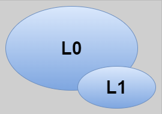

**L0-L1 Execution:**

- **Name**: Unit Tests
- **Shift Direction**: LEFT
- **Environment**: Devbox or agent (Stage 2, Stages 3-4)
- **Scope**: Source and binary
- **Test doubles**: ALL external dependencies replaced
- **Process**: In-process
- **Determinism**: Highest
- **Domain Coherency**: Lowest

### L2: Emulated System Tests (DevBox and Build Agents)

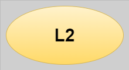

**L2 Execution:**

- **Name**: Emulated System Tests
- **Shift Direction**: LEFT
- **Environment**: Devbox or agent (Stages 3-4)
- **Scope**: Deployable artifacts
- **Test doubles**: ALL external dependencies replaced
- **Process**: Cross-process with test doubles
- **Determinism**: High
- **Domain Coherency**: High

### L3: In-Situ Vertical Tests (PLTE)

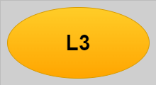

**L3 Execution:**

- **Name**: In-Situ Vertical Tests
- **Shift Direction**: LEFT
- **Environment**: PLTE only (Stages 5-6)
- **Scope**: Deployed system (single deployable unit boundaries - vertical)
- **Test doubles**: ALL external services replaced with test doubles
- **Purpose**: Validate infrastructure, deployment, and configuration
- **Determinism**: Moderate
- **Domain Coherency**: High

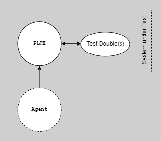

**This diagram shows L3 in-situ vertical testing in PLTE:** The deployed system is tested in-situ in a production-like cloud environment (PLTE) in Stages 5-6. Key distinction: tests validate the system's behavior in cloud infrastructure (networking, load balancing, deployment) with test doubles for ALL external services. NOT testing cross-service interactions.

### L4: Testing in Production

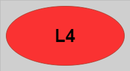

**L4 Execution:**

- **Name**: Testing in Production
- **Shift Direction**: RIGHT
- **Environment**: Production (Stages 11-12)
- **Scope**: Deployed system (cross-service interactions - horizontal)
- **Test doubles**: All production, may use live test doubles
- **Purpose**: Validate real production behavior with actual services
- **Determinism**: High
- **Domain Coherency**: Highest

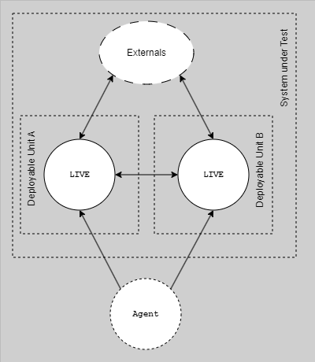

**This diagram shows L4 testing in production:** Tests run in the live production environment (Stages 11-12) to validate real cross-service interactions. May use live test doubles for specific cases like test payment processors. Includes synthetic monitoring and exploratory testing.

### Out-of-Category: Horizontal End-to-End (Anti-Pattern)

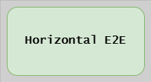

**Horizontal E2E Execution (Anti-Pattern):**

- **Name**: Horizontal End-to-End
- **Shift Direction**: non-shifted
- **Environment**: Shared testing environment
- **Scope**: Deployed system
- **Test doubles**: Tied up to non-production "test" deployments
- **Determinism**: Lowest
- **Domain Coherency**: High


**This diagram shows the anti-pattern:** Horizontal end-to-end tests in pre-production environments where multiple teams' services are linked. This is highly fragile and non-deterministic. The taxonomy explicitly advocates shifting LEFT (L0-L3) and RIGHT (L4) to avoid this pattern.

---

## Process Isolation Explained

### L0/L1 Isolation: In-Process Testing

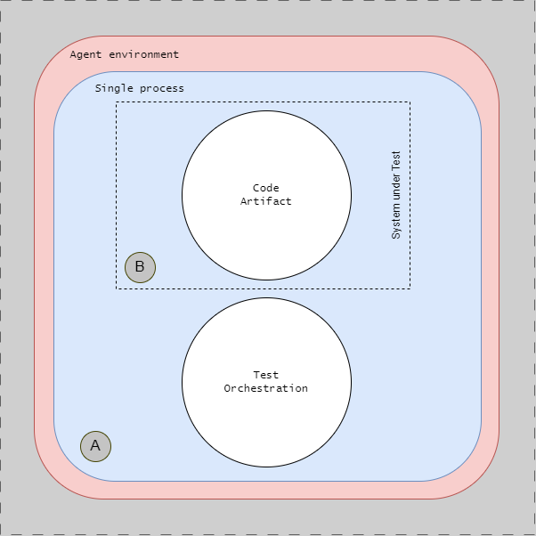

The test orchestration **(A)** and system under test (SUT) **(B)** run in the same process. All external dependencies are replaced with in-process mocks or stubs. No network calls, no separate processes - everything executes as function calls within a single OS process.

**In-Process Execution:**

L0 and L1 tests run within the same process as the code under test:

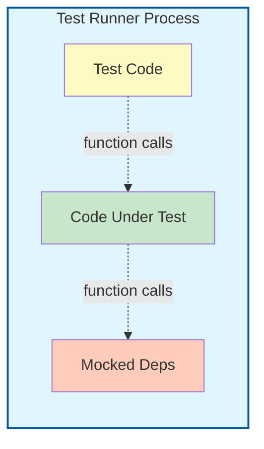

**No Network Calls:**

- No TCP/UDP connections
- No HTTP requests
- No database connections
- All interactions via function calls

**Fast Execution:**

- Function call overhead only
- No serialization/deserialization
- No network latency
- No process startup time

**Isolation Strategy:**

- Mock external dependencies at interface boundaries
- Use dependency injection
- Stub out I/O operations
- Keep tests independent

**Example:**

```go
// L0: In-process test with mock
func TestUserService_CreateUser(t *testing.T) {
    // Mock repository - no database, in-process
    mockRepo := &MockUserRepository{}

    // Service under test - same process
    service := NewUserService(mockRepo)

    // Test execution - all in-process, no network
    err := service.CreateUser(&User{Name: "John"})

    assert.NoError(t, err)
}
```

### L2 Isolation: Cross-Process with Test Doubles

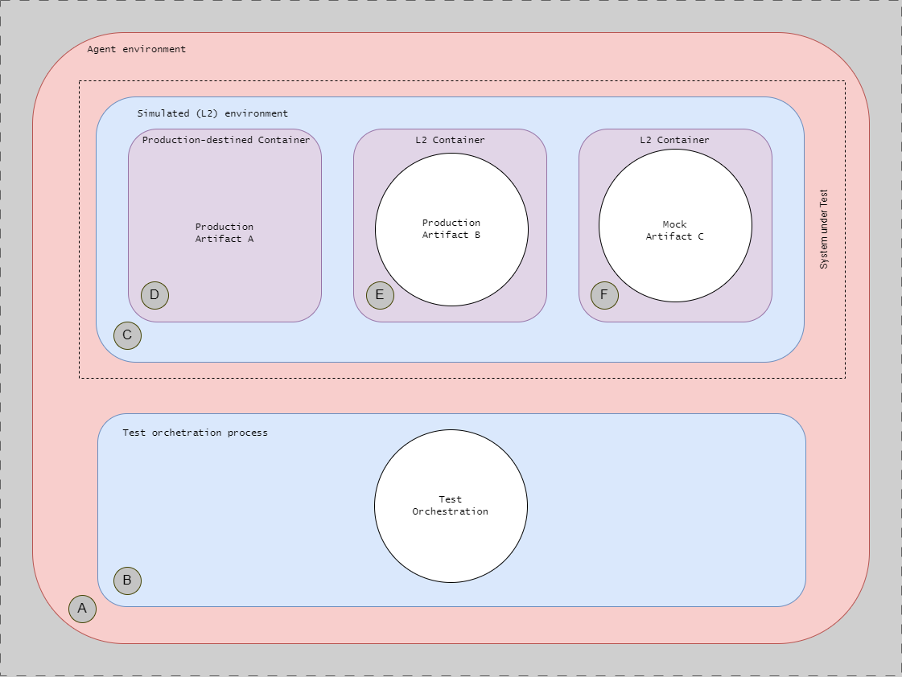

Tests run in an emulated environment on a single OS **(A)**. Test orchestration **(B)** is separate from the SUT **(C)**. Production artifacts **(D)** and **(E)** are deployed (some in test containers), but all external dependencies use mock artifacts **(F)** like test double services. Network calls occur, but only to test doubles, not real external services.

**Cross-Process Execution:**

L2 tests involve multiple processes communicating over network:

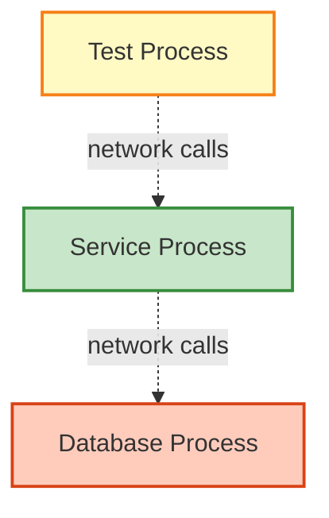

**Network Call Handling:**

- HTTP requests between processes
- Database connections over network
- Message queue interactions
- gRPC or other RPC protocols

**Test Double Strategies:**

**Option 1: Real Internal Dependencies**:

```go
// L2: Real database, cross-process
func TestUserRepository_Save(t *testing.T) {
    db := setupTestDatabase(t) // Real database process
    repo := NewUserRepository(db)

    user := &User{Name: "Jane"}
    err := repo.Save(user) // Network call to database

    assert.NoError(t, err)
}
```

**Option 2: Mock External Services**:

```go
// L2: Real database, mocked external API
func TestOrderService_CreateOrder(t *testing.T) {
    db := setupTestDatabase(t) // Real
    mockPayment := startMockPaymentAPI(t) // Test double

    service := NewOrderService(db, mockPayment.URL())

    order := &Order{Total: 100}
    err := service.CreateOrder(order)

    assert.NoError(t, err)
}
```

**Isolation Considerations:**

- Use test databases with unique names or schemas
- Reset database state between tests
- Use containerized dependencies (Docker)
- Parallel execution requires careful isolation

### L3 Isolation: In-Situ Vertical in PLTE with Test Doubles


The deployed system **(C)** is tested in production-like cloud infrastructure (no longer emulated). Test orchestration **(B)** runs on test agents **(A)**. Production artifacts **(D)** and **(E)** are deployed to their actual PaaS hosts. Critical: mock artifacts **(F)** and **(G)** replace ALL external services and dependencies. Tests validate the deployed system in cloud infrastructure, not cross-service interactions.

**In-Situ Vertical Testing in PLTE:**

L3 validates the deployed system in-situ in production-like infrastructure:

- Deployed system running on actual cloud PaaS hosts
- Test doubles for ALL external services (databases, queues, external APIs)
- Validates infrastructure (networking, load balancing, DNS, deployment)
- Does NOT test cross-service interactions (that's L4 in production)

**Example (Godog):**

```gherkin
# L3: In-situ vertical test in PLTE with test doubles
Feature: API Service Deployment

  @L3 @iv
  Scenario: Service deploys correctly to PLTE
    Given the API service is deployed to PLTE
    And external services are test doubles
    When I check the health endpoint
    Then the service should respond successfully
    And infrastructure should be correctly configured
```

---

## Tag Usage and Test Suites

The testing strategy uses tags to select tests for execution at specific CD Model stages. See **[Tag Reference](../../specifications/tag-reference.md)** for complete tag documentation.

**Test Level to Stage Mapping**:

- **Stages 2-4**: `@L0`, `@L1`, `@L2` tests (pre-commit suite)
- **Stages 5-6**: `@L3` tests (acceptance suite with `@iv`, `@ov`, `@pv`)
- **Stages 11-12**: `@L4` tests (production-verification suite with `@piv`, `@ppv`)

**Tag Requirements**:

- All Gherkin scenarios MUST have verification tag (`@ov`, `@iv`, `@pv`, `@piv`, `@ppv`)
- System dependencies declared with `@dep:*` tags
- Tags inherit from Feature → Rule → Scenario

---

## Test Levels by CD Model Stage

### Detailed Stage Mapping

| Stage                | Test Levels       | Time Budget | Environment    | Quality Gates                   |
| -------------------- | ----------------- | ----------- | -------------- | ------------------------------- |
| **1. Authoring**     | Manual validation | N/A         | DevBox         | Developer judgment              |
| **2. Pre-commit**    | L0-L2             | 5-10 min    | DevBox         | 100% pass, coverage ≥ threshold |
| **3. Merge Request** | L0-L2             | 15-30 min   | Build Agents   | 100% pass, peer approval        |
| **4. Commit**        | L0-L2             | 15-30 min   | Build Agents   | 100% pass, artifacts built      |
| **5. Acceptance**    | L3 (vertical)     | 1-2 hours   | PLTE           | @iv, @ov, @pv validated         |
| **6. Extended**      | L3 + perf/sec     | 2-8 hours   | PLTE           | Comprehensive validation        |
| **7. Exploration**   | Manual prep       | Days        | Demo           | Scenarios defined               |
| **8-10. Release**    | Regression subset | Minutes     | As appropriate | No critical failures            |
| **11-12. Live**      | L4 (horizontal)   | Continuous  | Production     | Synthetic monitoring, SLA       |

### Key Stage Transitions

**Stages 2-4**: L0-L2 tests with test doubles on local/CI agents (5-30 min total) - fast, deterministic validation

**Stages 5-6**: L3 vertical tests in PLTE with test doubles (1-8 hours) - infrastructure and deployment validation

**Stages 11-12**: L4 horizontal tests in production (continuous) - real cross-service validation

---

## Integration with ATDD/BDD/TDD

The CD Model integrates three testing methodologies:

**TDD (Test-Driven Development) → L0-L2:**

- **L0-L1**: Unit tests with test doubles (source and binary scope)
- **L2**: Emulated system tests with test doubles (deployable artifacts scope)
- Drive design and validate logic with test doubles
- Process: Red → Green → Refactor
- All external dependencies mocked

**BDD (Behavior-Driven Development) → L3:**

- **L3**: In-situ vertical tests in PLTE with test doubles (deployed system scope)
- Validate deployed system behavior in-situ in PLTE
- Process: Gherkin scenarios → Step implementations
- Vertical testing boundaries only

**ATDD (Acceptance Test-Driven Development) → L4:**

- **L4**: Testing in production (deployed system scope, horizontal)
- Validate acceptance criteria in production
- Process: Define criteria → Validate in production
- Horizontal testing with real services

See **[Three-Layer Testing Approach](../../specifications/three-layer-approach.md)** for detailed integration.

---

## Test Distribution

**Recommended Distribution:**

- **L0-L2**: 95% of tests (hundreds to thousands) - Fast, deterministic, test doubles
- **L3**: 5% of tests (5-20 critical vertical scenarios) - Infrastructure validation in PLTE
- **L4**: Continuous (synthetic monitoring + exploratory) - Production horizontal validation

**Shift-Left and Shift-Right Strategy:**

Maximize testing at L0-L3 (left) and L4 (right) to avoid horizontal pre-production environments. This provides fast deterministic feedback (L0-L3) and real production validation (L4) without the fragility of pre-production integration environments.

---

## Next Steps

- [Testing Strategy Overview](testing-strategy-overview.md) - Learn about test levels
- [Stages 1-6](../cd-model/cd-model-stages-1-6.md) - See testing in development stages
- [Environments](../architecture/environments.md) - Understand PLTE architecture
- [Security](../security/security.md) - Integrate security testing

## References

- [CD Model Overview](../cd-model/cd-model-overview.md)
- [Three-Layer Testing Approach](../../specifications/three-layer-approach.md)
