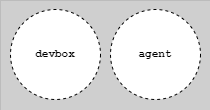

# Testing Strategy: Integration with CD Model

## Introduction

This article explains how test levels integrate with CD Model stages, the process isolation strategies for each level, and how testing aligns with the ATDD/BDD/TDD approach. Understanding this integration ensures you execute the right tests at the right stages with appropriate quality gates.

---

## Test Level Environment Mapping

### L0-L2 Tests: DevBox and Build Agents



**This diagram shows where L0-L2 tests execute:** All three levels run on developer workstations (DevBox) or CI agents (Build Agents). The diagram illustrates the execution flow through Stages 2 (Pre-commit), 3 (Merge Request), and 4 (Commit). Key constraint: all external dependencies are replaced with test doubles, keeping tests fast and deterministic.


**Legend for L0-L1 unit tests:** Shows the symbol notation used in CD Model diagrams to indicate unit-level tests (L0) and component integration tests (L1).


**Legend for L2 integration tests:** Shows the symbol notation used to indicate integration tests running on agents with test doubles for all external dependencies.

**L0-L2 Execution:**

- **Environment**: DevBox (Stage 2) and Build Agents (Stages 3-4)
- **Test doubles**: ALL external dependencies replaced
- **Process**: In-process (L0-L1) or cross-process with test doubles (L2)
- **Speed**: Milliseconds to seconds, highly deterministic

### L3 Tests: PLTE (Vertical Testing)


**This diagram shows L3 vertical testing in PLTE:** The single deployable unit is deployed to a production-like cloud environment (PLTE) in Stages 5-6. Key distinction: tests validate the unit's behavior in cloud infrastructure (networking, load balancing, deployment) with test doubles for ALL external services. NOT testing cross-service interactions.


**Legend for L3 vertical tests:** Shows the symbol notation indicating vertical end-to-end tests that validate a single deployable unit in PLTE.

**L3 Execution:**

- **Environment**: PLTE only (Stages 5-6)
- **Scope**: Single deployable unit boundaries (vertical)
- **Test doubles**: ALL external services replaced with test doubles
- **Purpose**: Validate infrastructure, deployment, and configuration

### L4 Tests: Production (Horizontal Testing)


**This diagram shows L4 horizontal testing in production:** Tests run in the live production environment (Stages 11-12) to validate real cross-service interactions. May use test doubles for specific cases like test payment processors. Includes synthetic monitoring and exploratory testing.


**Legend for L4 production tests:** Shows the symbol notation indicating horizontal end-to-end tests in production that validate cross-service interactions.

**L4 Execution:**

- **Environment**: Production (Stages 11-12)
- **Scope**: Cross-service interactions (horizontal)
- **Test doubles**: Optional for specific cases (e.g., test payment service)
- **Purpose**: Validate real production behavior with actual services

### Out-of-Category: Horizontal Pre-Production (Anti-Pattern)


**This diagram shows the anti-pattern:** Horizontal end-to-end tests in pre-production environments where multiple teams' services are linked. This is highly fragile and non-deterministic. The taxonomy explicitly advocates shifting LEFT (L0-L3) and RIGHT (L4) to avoid this pattern.


**Legend for out-of-category tests:** Shows notation for horizontal pre-production tests that cross team boundaries - avoid this pattern.

---

## Process Isolation Explained

### L0/L1 Isolation: In-Process Testing


**This diagram illustrates in-process isolation:** The test orchestration **(A)** and system under test (SUT) **(B)** run in the same process. All external dependencies are replaced with in-process mocks or stubs. No network calls, no separate processes - everything executes as function calls within a single OS process.

**In-Process Execution:**

L0 and L1 tests run within the same process as the code under test:

```text
┌─────────────────────────┐
│   Test Runner Process   │
│  ┌──────────────────┐   │
│  │  Test Code       │   │
│  └──────────────────┘   │
│  ┌──────────────────┐   │
│  │  Code Under Test │   │
│  └──────────────────┘   │
│  ┌──────────────────┐   │
│  │  Mocked Deps     │   │
│  └──────────────────┘   │
└─────────────────────────┘
```

**No Network Calls:**

- No TCP/UDP connections
- No HTTP requests
- No database connections
- All interactions via function calls

**Fast Execution:**

- Function call overhead only
- No serialization/deserialization
- No network latency
- No process startup time

**Isolation Strategy:**

- Mock external dependencies at interface boundaries
- Use dependency injection
- Stub out I/O operations
- Keep tests independent

**Example:**

```go
// L0: In-process test with mock
func TestUserService_CreateUser(t *testing.T) {
    // Mock repository - no database, in-process
    mockRepo := &MockUserRepository{}

    // Service under test - same process
    service := NewUserService(mockRepo)

    // Test execution - all in-process, no network
    err := service.CreateUser(&User{Name: "John"})

    assert.NoError(t, err)
}
```

### L2 Isolation: Cross-Process with Test Doubles


**This diagram shows cross-process isolation with test doubles:** Tests run in an emulated environment on a single OS **(A)**. Test orchestration **(B)** is separate from the SUT **(C)**. Production artifacts **(D)** and **(E)** are deployed (some in test containers), but all external dependencies use mock artifacts **(F)** like test double services. Network calls occur, but only to test doubles, not real external services.

**Cross-Process Execution:**

L2 tests involve multiple processes communicating over network:

```text
┌──────────────────┐       ┌──────────────────┐
│  Test Process    │──────▶│  Service Process │
└──────────────────┘   ▲   └──────────────────┘
                       │
                       ▼
                   ┌──────────────────┐
                   │  Database Process│
                   └──────────────────┘
```

**Network Call Handling:**

- HTTP requests between processes
- Database connections over network
- Message queue interactions
- gRPC or other RPC protocols

**Test Double Strategies:**

**Option 1: Real Internal Dependencies**:

```go
// L2: Real database, cross-process
func TestUserRepository_Save(t *testing.T) {
    db := setupTestDatabase(t) // Real database process
    repo := NewUserRepository(db)

    user := &User{Name: "Jane"}
    err := repo.Save(user) // Network call to database

    assert.NoError(t, err)
}
```

**Option 2: Mock External Services**:

```go
// L2: Real database, mocked external API
func TestOrderService_CreateOrder(t *testing.T) {
    db := setupTestDatabase(t) // Real
    mockPayment := startMockPaymentAPI(t) // Test double

    service := NewOrderService(db, mockPayment.URL())

    order := &Order{Total: 100}
    err := service.CreateOrder(order)

    assert.NoError(t, err)
}
```

**Isolation Considerations:**

- Use test databases with unique names or schemas
- Reset database state between tests
- Use containerized dependencies (Docker)
- Parallel execution requires careful isolation

### L3 Isolation: Vertical in PLTE with Test Doubles


**This diagram shows vertical testing in PLTE:** The SUT **(C)** is deployed to production-like cloud infrastructure (no longer emulated). Test orchestration **(B)** runs on test agents **(A)**. Production artifacts **(D)** and **(E)** are deployed to their actual PaaS hosts. Critical: mock artifacts **(F)** and **(G)** replace ALL external services and dependencies. Tests validate the deployable unit in cloud infrastructure, not cross-service interactions.

**Vertical Testing in PLTE:**

L3 validates the single deployable unit in production-like infrastructure:

- Deployable unit deployed to actual cloud PaaS hosts
- Test doubles for ALL external services (databases, queues, external APIs)
- Validates infrastructure (networking, load balancing, DNS, deployment)
- Does NOT test cross-service interactions (that's L4 in production)

**Example (Godog):**

```gherkin
# L3: Vertical test in PLTE with test doubles
Feature: API Service Deployment

  @L3 @IV
  Scenario: Service deploys correctly to PLTE
    Given the API service is deployed to PLTE
    And external services are test doubles
    When I check the health endpoint
    Then the service should respond successfully
    And infrastructure should be correctly configured
```

---

## Test Levels by CD Model Stage

### Detailed Stage Mapping

| Stage | Test Levels | Time Budget | Environment | Quality Gates |
|-------|-------------|-------------|-------------|---------------|
| **1. Authoring** | Manual validation | N/A | DevBox | Developer judgment |
| **2. Pre-commit** | L0-L2 | 5-10 min | DevBox | 100% pass, coverage ≥ threshold |
| **3. Merge Request** | L0-L2 | 15-30 min | Build Agents | 100% pass, peer approval |
| **4. Commit** | L0-L2 | 15-30 min | Build Agents | 100% pass, artifacts built |
| **5. Acceptance** | L3 (vertical) | 1-2 hours | PLTE | IV, OV, PV validated |
| **6. Extended** | L3 + perf/sec | 2-8 hours | PLTE | Comprehensive validation |
| **7. Exploration** | Manual prep | Days | Demo | Scenarios defined |
| **8-10. Release** | Regression subset | Minutes | As appropriate | No critical failures |
| **11-12. Live** | L4 (horizontal) | Continuous | Production | Synthetic monitoring, SLA |

### Key Stage Transitions

**Stages 2-4**: L0-L2 tests with test doubles on local/CI agents (5-30 min total) - fast, deterministic validation

**Stages 5-6**: L3 vertical tests in PLTE with test doubles (1-8 hours) - infrastructure and deployment validation

**Stages 11-12**: L4 horizontal tests in production (continuous) - real cross-service validation

---

## Integration with ATDD/BDD/TDD

The CD Model integrates three testing methodologies:

**TDD (Test-Driven Development) → L0-L2:**

- Drive design and validate logic with test doubles
- Process: Red → Green → Refactor
- All external dependencies mocked

**BDD (Behavior-Driven Development) → L3:**

- Validate deployable unit behavior in PLTE with test doubles
- Process: Gherkin scenarios → Step implementations
- Vertical testing boundaries only

**ATDD (Acceptance Test-Driven Development) → L4:**

- Validate acceptance criteria in production
- Process: Define criteria → Validate in production
- Horizontal testing with real services

See **[Three-Layer Testing Approach](../../specifications/three-layer-approach.md)** for detailed integration.

---

## Test Distribution

**Recommended Distribution:**

- **L0-L2**: 95% of tests (hundreds to thousands) - Fast, deterministic, test doubles
- **L3**: 5% of tests (5-20 critical vertical scenarios) - Infrastructure validation in PLTE
- **L4**: Continuous (synthetic monitoring + exploratory) - Production horizontal validation

**Shift-Left and Shift-Right Strategy:**

Maximize testing at L0-L3 (left) and L4 (right) to avoid horizontal pre-production environments. This provides fast deterministic feedback (L0-L3) and real production validation (L4) without the fragility of pre-production integration environments.

---

## Summary

Test levels integrate with CD Model stages based on execution environment and scope:

**Environment Mapping:**

- **L0-L2**: DevBox and Build Agents (Stages 2-4) - All external dependencies as test doubles
- **L3**: PLTE (Stages 5-6) - Vertical testing with test doubles for external services
- **L4**: Production (Stages 11-12) - Horizontal testing with real services

**Process Isolation:**

- **L0-L1**: In-process, no network, function calls only
- **L2**: Cross-process with test doubles, emulated environment
- **L3**: Deployed to PLTE, test doubles for externals, vertical boundaries
- **L4**: Production, real cross-service interactions, horizontal testing

**Methodology Integration:**

- **TDD (L0-L2)**: Drive design with test doubles
- **BDD (L3)**: Validate vertical behavior in PLTE
- **ATDD (L4)**: Validate horizontal behavior in production

**Shift-Left and Shift-Right:**

Maximize L0-L3 (deterministic) and L4 (real production) to avoid fragile horizontal pre-production environments.

## Next Steps

- [Testing Strategy Overview](testing-strategy-overview.md) - Learn about test levels
- [Stages 1-6](../cd-model/cd-model-stages-1-6.md) - See testing in development stages
- [Environments](../architecture/environments.md) - Understand PLTE architecture
- [Security](../security/security.md) - Integrate security testing

## References

- [CD Model Overview](../cd-model/cd-model-overview.md)
- [Three-Layer Testing Approach](../specifications/three-layer-approach.md)
- [Gherkin Format](../../reference/specifications/gherkin-format.md)
