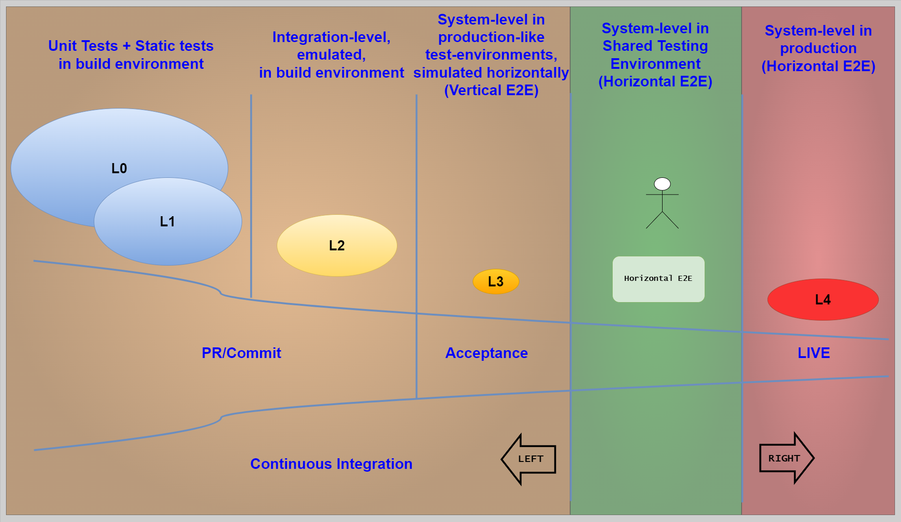
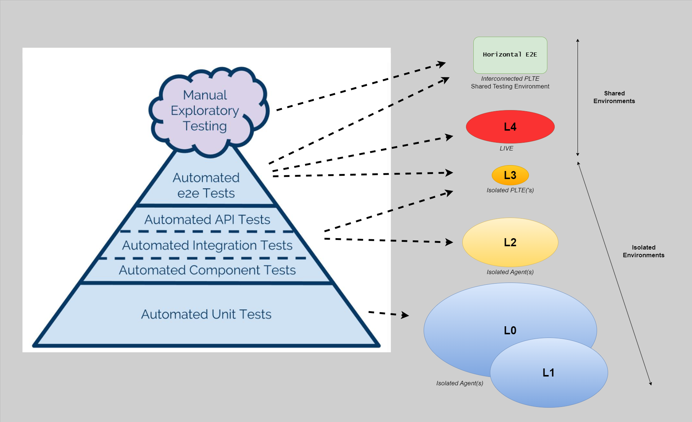
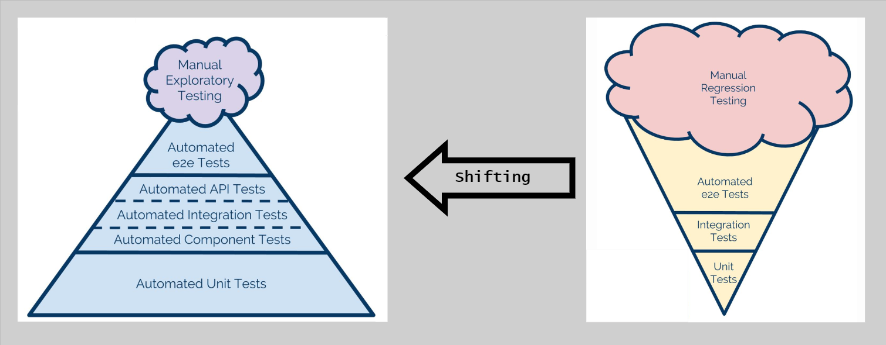

# Testing Strategy: Overview

## Introduction

Testing is integrated throughout every stage of the Continuous Delivery Model. Rather than treating testing as a separate phase that happens after development, the CD Model embraces continuous validation through multiple test levels executed at different stages.

This article explains the test taxonomy used in the CD Model, the purpose of each test level, and how the shift-left strategy improves quality while reducing costs.

### Why Multiple Test Levels

Different test levels serve different purposes:

- **Speed vs Coverage**: Fast unit tests provide rapid feedback, while slower E2E tests validate complete workflows
- **Isolation vs Realism**: Isolated tests are reliable and fast, while integrated tests catch real-world issues
- **Early Detection**: Shift-left testing finds defects when they're cheapest to fix
- **Confidence**: Multiple validation layers build confidence in quality

The CD Model uses a taxonomy of test levels (L0-L4) based on execution environment and scope to balance speed, coverage, and confidence.

---

## Test Taxonomy



**This diagram shows the taxonomy in context of shift-left and shift-right:** The left side shows L0-L3 tests (shift-left) running in local/agent/PLTE environments with increasing scope from unit to vertical testing. The right side shows L4 tests (shift-right) running in production for horizontal validation. The center "out-of-category" area represents the anti-pattern of horizontal pre-production environments to avoid.



**This diagram maps test levels to execution constraints:** Shows how L0-L2 (local/agent), L3 (PLTE vertical), and L4 (production horizontal) are categorized by execution environment, scope, and test double usage. The breakdown illustrates the determinism vs coherency trade-off as you progress from L0 to L4.

### How Tests Are Categorized

The taxonomy defines test categories based on execution environment and scope:

| Level | Name                   | Shift Direction | Execution Environment | Scope                | External Dependencies                     | Determinism | Domain Coherency |
|-------|------------------------|-----------------|-----------------------|----------------------|-------------------------------------------|-------------|------------------|
| L0    | Unit Tests             | LEFT            | devbox or agent       | Source and binary    | All replaced with test doubles            | Highest     | Lowest           |
| L1    | Unit Tests             | LEFT            | devbox or agent       | Source and binary    | All replaced with test doubles            | Highest     | Lowest           |
| L2    | Emulated System Tests  | LEFT            | devbox or agent       | Deployable artifacts | All replaced with test doubles            | High        | High             |
| L3    | In-Situ Vertical Tests | LEFT            | PLTE                  | Deployed system      | All replaced with test doubles            | Moderate    | High             |
| L4    | Testing in Production  | RIGHT           | Production            | Deployed system      | All production, may use live test doubles | High        | Highest          |

**Out-of-Category (Anti-Pattern):**

| Level          | Name                  | Shift Direction | Execution Environment      | Scope           | External Dependencies                        | Determinism | Domain Coherency |
|----------------|-----------------------|-----------------|----------------------------|-----------------|----------------------------------------------|-------------|------------------|
| Horizontal E2E | Horizontal End-to-End | non-shifted     | Shared testing environment | Deployed system | Tied up to non-production "test" deployments | Lowest      | High             |

Old-school horizontal pre-production environments where multiple teams' pre-prod services are linked together are highly fragile and non-deterministic. This taxonomy explicitly advocates shifting LEFT (to L0-L3) and RIGHT (to L4) to avoid this pattern.

### Determinism vs Domain Coherency Trade-off

The taxonomy constrains two key aspects:

- **Execution requirements**: What binaries, tooling, and configuration are needed
- **Test scope**: Vertical vs horizontal boundaries, and test double usage

**Determinism** (Lower Lx values):

- Predictable, repeatable results
- Fast execution
- Reliable failure signals
- Easy to debug
- **Highest in L0-L1** (controlled environments, test doubles)

**Domain Coherency** (Higher Lx values):

- Realistic domain language
- Actual production behavior
- Real cross-service interactions
- Business-meaningful validation
- **Highest in L4** (production environment)

Lower Lx values provide higher determinism but lower domain coherency, while higher Lx values provide lower determinism but higher domain coherency.

**The Shift-Left and Shift-Right Strategy:**

Maximize testing at L0-L3 (left) and L4 (right) to avoid the **out-of-category anti-pattern** (Horizontal E2E): horizontal pre-production environments where multiple teams' pre-prod services are linked together. These tests are highly fragile and non-deterministic.

Each level builds on the confidence provided by lower levels.

---

## L0: Unit Tests

**Purpose**: Validate individual functions, methods, and classes in isolation.

### Characteristics

**Speed:**

- Milliseconds per test
- Hundreds or thousands of tests complete in seconds
- Fastest feedback possible

**Isolation:**

- No external dependencies
- No network calls
- No file system access
- No database queries
- All dependencies mocked or stubbed

**Scope:**

- Single function or method
- Single class or module
- Pure logic validation

**Example:**

```go
// Unit test for validation logic
func TestValidateEmail(t *testing.T) {
    tests := []struct {
        name    string
        email   string
        wantErr bool
    }{
        {"valid email", "user@example.com", false},
        {"missing @", "userexample.com", true},
        {"empty string", "", true},
    }

    for _, tt := range tests {
        t.Run(tt.name, func(t *testing.T) {
            err := ValidateEmail(tt.email)
            if (err != nil) != tt.wantErr {
                t.Errorf("ValidateEmail() error = %v, wantErr %v", err, tt.wantErr)
            }
        })
    }
}
```

### Tools and Frameworks

- **Go**: `testing` package, `testify`
- **JavaScript**: Jest, Mocha, Jasmine
- **Python**: pytest, unittest
- **Java**: JUnit, TestNG

### Best Practices

- Test public APIs, not implementation details
- Use table-driven tests for multiple cases
- Aim for 80%+ code coverage
- Keep tests independent and deterministic
- Mock all external dependencies

### When to Write L0 Tests

- For all business logic
- For utility functions
- For data transformations
- For validation logic
- For calculations and algorithms

### CD Model Integration

**Stages:**

- Stage 2 (Pre-commit): 5-10 minute time-box
- Stage 3 (Merge Request): PR validation
- Stage 4 (Commit): Continuous integration

**Quality Gates:**

- 100% pass rate required
- Minimum coverage thresholds
- No skipped tests

---

## L1: Unit Tests

**Purpose**: Validate interactions within a component or service, using mocks for external dependencies.

**Note**: L1 shares the same taxonomy classification as L0 (both are "Unit Tests" running on devbox or agent with all external dependencies replaced by test doubles). L1 typically involves testing interactions between internal modules within a component, while L0 focuses on individual functions or methods.

### Characteristics

**Speed:**

- Seconds per test
- Faster than full integration tests
- Still suitable for pre-commit

**Isolation:**

- Tests one component at a time
- External dependencies mocked
- Internal component interactions tested
- No network calls to external services

**Scope:**

- Multiple classes/modules within a component
- Internal APIs and interfaces
- Data flow through the component

**Example:**

```go
// Component integration test with mocked repository
func TestUserService_CreateUser(t *testing.T) {
    mockRepo := &MockUserRepository{
        SaveFunc: func(user *User) error {
            return nil
        },
    }

    service := NewUserService(mockRepo)

    user := &User{Name: "John", Email: "john@example.com"}
    err := service.CreateUser(user)

    assert.NoError(t, err)
    assert.True(t, mockRepo.SaveCalled)
}
```

### Mocking Strategies

**Manual Mocks:**

- Implement interfaces manually
- Full control over behavior
- Suitable for simple interfaces

**Generated Mocks:**

- Use tools like `mockgen`, `mockery`
- Generated from interfaces
- Consistent and maintainable

**Test Doubles:**

- Stubs: Return predetermined values
- Fakes: Working implementations (e.g., in-memory database)
- Spies: Record calls for verification

### When to Use vs L0

**Use L1 when:**

- Testing interactions between internal modules
- Validating service orchestration logic
- Testing error handling across layers
- Verifying data transformation pipelines

**Use L0 when:**

- Testing individual functions
- No interactions to validate
- Pure logic without dependencies

### CD Model Integration

**Stages:**

- Stage 2 (Pre-commit): Run alongside L0
- Stage 4 (Commit): Continuous validation

---

## L2: Emulated System Tests

**Purpose**: Validate deployable artifacts in an emulated environment with all external dependencies replaced by test doubles.

### Characteristics

**Speed:**

- Seconds per test
- Runs on CI agent
- Suitable for pre-commit and commit stages

**Execution Environment:**

- Developer workstation OR CI agent (same as L0-L1)
- Does NOT require cloud infrastructure or PLTE
- Runs in local or agent environments only

**Isolation:**

- **All external dependencies replaced with test doubles**
- In-memory databases or test doubles for persistence
- No real external service calls

**Scope:**

- **Deployable artifacts** tested in emulated environment
- Component-to-component communication within the unit-under-test
- API contract validation using test doubles
- Data flow through multiple components
- Message handling with test double queues

**Example:**

```go
// L2 integration test with test double database
func TestUserService_CreateAndRetrieveUser(t *testing.T) {
    // Test double: in-memory repository
    mockRepo := NewInMemoryUserRepository()

    service := NewUserService(mockRepo)
    user := &User{Name: "Jane", Email: "jane@example.com"}

    // Test the integration between service and repository
    err := service.CreateUser(user)
    assert.NoError(t, err)

    // Verify through the service (tests the full flow)
    retrieved, err := service.GetUserByEmail("jane@example.com")
    assert.NoError(t, err)
    assert.Equal(t, user.Name, retrieved.Name)
}
```

### Test Doubles for All External Dependencies

**L2 Taxonomy Constraint**: All external dependencies must be replaced with test doubles.

**Why Test Doubles:**

- **Determinism**: Predictable, repeatable results
- **Speed**: No network latency or external service delays
- **Reliability**: No flaky external service failures
- **Isolation**: Tests only the unit-under-test logic

**Types of Test Doubles:**

- **In-memory databases**: SQLite in-memory, test repositories
- **Mock message queues**: In-memory queue implementations
- **Stubbed external APIs**: Return predetermined responses
- **Fake services**: Lightweight implementations for testing

### CD Model Integration

**Stages:**

- Stage 4 (Commit): Run after L0/L1 pass
- Stage 5 (Acceptance Testing): In PLTE environment

---

## L3: In-Situ Vertical Tests

**Purpose**: Validate a deployed system in-situ in a production-like environment (PLTE) with vertical testing boundaries.

### Characteristics

**Speed:**

- Minutes per test
- Deployed to PLTE (cloud environment)
- Moderate execution time

**Isolation:**

- **Single deployable unit boundaries only** (vertical testing)
- **All external dependencies replaced with test doubles**
- Tests the deployed system in production-like infrastructure
- Validates deployment and configuration

**Scope:**

- **Deployed system** tested in-situ in PLTE
- Single deployable unit behavior in production-like infrastructure
- Infrastructure validation (networking, load balancing, DNS)
- Deployment procedure verification
- Configuration correctness
- **NOT** cross-service integration (that's L4)

**PLTE Requirement:**

L3 tests require a Production-Like Test Environment (PLTE) because they:

- Validate the deployable unit runs correctly in cloud infrastructure
- Test with production-like networking, storage, and compute
- Verify deployment procedures work
- Validate infrastructure configuration (e.g., Kubernetes, load balancers)
- **Do NOT** test cross-service interactions (use test doubles for other services)

**Example (BDD with Godog):**

```gherkin
Feature: API Service Deployment Verification

  @L3 @IV
  Scenario: Service deploys successfully to PLTE
    Given the API service is deployed to PLTE
    When I check the health endpoint
    Then the service should respond with status 200
    And all dependencies should report healthy

  @L3 @OV
  Scenario: API handles requests in PLTE infrastructure
    Given the API service is running in PLTE
    And external dependencies are test doubles
    When I send a user creation request
    Then the API should process the request successfully
    And the response should match the expected format
```

### Vertical Testing Scope

**What L3 Tests Validate:**

- Deployable unit runs in production-like infrastructure
- Deployment procedures work correctly
- Infrastructure configuration is correct (networking, DNS, load balancing)
- Service responds correctly in cloud environment
- **Vertical slice**: Single unit boundaries only

**What L3 Tests Don't Validate:**

- Cross-service interactions (that's L4 in production)
- External service integration (use test doubles)
- Complete end-to-end user workflows (that requires horizontal testing in L4)

### CD Model Integration

**Stages:**

- Stage 5 (Acceptance Testing): In PLTE
- Stage 6 (Extended Testing): Comprehensive E2E suite

**Best Practices:**

- Limit to critical user workflows (5-20 scenarios)
- Keep tests maintainable and reliable
- Run in parallel where possible
- Use BDD frameworks for readability

---

## L4: Testing in Production

**Purpose**: Validate real-world cross-service interactions in production with horizontal testing.

### Characteristics

**Speed:**

- Variable (seconds to minutes per test)
- Runs in production
- May use synthetic traffic

**Isolation:**

- **Production environment**
- **Cross-service interactions** (horizontal testing)
- **All production dependencies**, may use live test doubles for specific cases
- Real production infrastructure and data

**Scope:**

- **Deployed system** tested in production
- Cross-service workflows in production
- Real end-to-end user journeys
- Actual production behavior
- Business-meaningful validation
- Real data and real services interacting

### Horizontal Testing in Production

**What L4 Tests Validate:**

- Real cross-service interactions in production
- Actual end-to-end workflows with production data
- Production infrastructure behavior under real load
- Service mesh / networking in production
- Real user journeys (via synthetic monitoring or shadowing)

**Test Double Usage in Production:**

L4 may use test doubles for specific cases:

- **Test payment processors**: Route test payments through test-double payment service
- **Test notification services**: Capture test emails/SMS without sending to real users
- **Canary users**: Route specific test users through test paths

**Examples:**

```gherkin
Feature: Production Cross-Service Validation

  @L4 @production
  Scenario: Complete order fulfillment workflow
    Given I am a test user in production
    When I place an order through the API
    Then the order service should create the order
    And the payment service should charge the test payment method
    And the inventory service should reserve the items
    And the notification service should send a test confirmation email

  @L4 @production @synthetic
  Scenario: Synthetic monitoring of critical path
    Given synthetic monitoring is running
    When the synthetic transaction executes every 5 minutes
    Then the complete user journey should succeed
    And response times should be within SLA
```

### Exploratory and UAT

L4 also includes human-driven validation:

**Exploratory Testing:**

- Session-based testing in production (read-only or test accounts)
- Discovering unexpected behaviors in real environment

**UAT (User Acceptance Testing):**

- Real users validating in production (feature flags control exposure)
- Business stakeholder sign-off based on production behavior

### CD Model Integration

**Stages:**

- Stage 11 (Live): Primary stage for L4 production testing
- Stage 12 (Release Toggling): Control test user exposure via feature flags
- Production environment with monitoring and observability

---

## Horizontal End-to-End Testing (Out-of-Category Anti-Pattern)

**Taxonomy Classification**: Out-of-Category | Horizontal End-to-End | non-shifted | Shared testing environment | Deployed system | Tied up to non-production "test" deployments | Lowest determinism | High domain coherency

Horizontal End-to-End (Horizontal E2E) testing refers to environments where multiple teams deploy pre-production versions of their services to a shared environment, with services interacting horizontally (service A calls service B calls service C).

### Characteristics

- Multiple teams deploy pre-production versions of their services to shared environment
- Services interact horizontally across team boundaries
- Each team controls deployment timing independently
- Version mismatches are common
- Difficult to reproduce issues locally
- **Lowest determinism** of all test approaches
- Non-shifted (neither left nor right in the shift strategy)

### When It's Acceptable

Horizontal pre-production environments serve valid purposes in specific contexts:

**Exploratory Testing:**

- Manual testing to discover unexpected cross-service behaviors
- Session-based testing by QA teams
- Investigating integration scenarios before production

**Validation and Demonstration:**

- Stakeholder demos of cross-team features
- Pre-production validation of complex integrations
- Manual verification of deployment procedures
- **Recommended**: Call this environment "Demo" for its intended purpose

**Important**: These environments should be used for **manual, exploratory activities** - not as automated quality gates.

### Anti-Pattern: Using as Automated Quality Gates

**Critical**: Horizontal E2E environments should **NOT** be used as automated quality gates in the deployment pipeline.

**Problems when used for automated testing:**

- **Highly fragile**: Any team's broken deployment breaks everyone's tests
- **Non-deterministic** (Lowest determinism): Test results vary based on other teams' deployments
- **Slow feedback**: Can't test until all dependencies are deployed
- **Difficult debugging**: Hard to isolate which service caused failure
- **Blocking**: One team's issues block other teams
- **False signals**: Tests fail due to environmental issues, not code defects

**From the taxonomy**: "If you decide to break this fundamental rule, all you need to do is to connect your L3 PLTE to something not a test double and you have automated tests running in L3 with external dependencies. This is not a technical constraint, its an inherent constraint in the nature of Horizontal E2E: No one can control the variables, so you are not performing verification, you are playing games."

### The Solution: Shift-Left and Shift-Right

Instead of relying on Horizontal E2E environments for automated testing, **shift testing LEFT (L0-L3) and RIGHT (L4)**:

**Shift LEFT (L0-L3):**

- L0-L1: Unit tests with test doubles on devbox/agent
- L2: Emulated system tests with test doubles on devbox/agent
- L3: In-situ vertical tests in PLTE with test doubles for external services
- **Result**: Fast feedback, high determinism, no cross-team dependencies

**Shift RIGHT (L4):**

- L4: Testing in production with real services
- Use feature flags, canary deployments, synthetic monitoring
- **Result**: Real production validation without pre-prod fragility

**Avoid the non-shifted middle ground** (Horizontal E2E as automated quality gates) - it combines the worst of both worlds: slow, fragile, and non-deterministic.

---

## Shift-Left Strategy



**This diagram illustrates shift-left and shift-right strategy:** The traditional center approach (shared testing environments with horizontal integration) is replaced by two strategies. **Shift-left** (left arrow) moves testing to L0-L3 with test doubles in local/agent/PLTE environments for fast, deterministic feedback. **Shift-right** (right arrow) moves horizontal validation to L4 in production with real services. Avoid the fragile middle ground of pre-production integration environments.

### Implementation

**Shift-Left (L0-L3):** Run tests with test doubles on local/CI/PLTE environments (Stages 2-6) for fast, deterministic feedback - catch defects early when cheapest to fix.

**Shift-Right (L4):** Run horizontal tests in production (Stages 11-12) with real services for validation of actual production behavior - synthetic monitoring and exploratory testing.

**Avoid the Middle:** Skip horizontal pre-production integration environments - they're fragile, non-deterministic, and slow.

---

## Summary

The CD Model uses a taxonomy based on execution environment and scope:

**L0-L1: Unit Tests (Shift LEFT)**:

- **Execution**: Devbox or agent
- **Scope**: Source and binary
- **Dependencies**: All replaced with test doubles
- **Trade-off**: Highest determinism, lowest domain coherency

**L2: Emulated System Tests (Shift LEFT)**:

- **Execution**: Devbox or agent
- **Scope**: Deployable artifacts
- **Dependencies**: All replaced with test doubles
- **Trade-off**: High determinism, high domain coherency

**L3: In-Situ Vertical Tests (Shift LEFT)**:

- **Execution**: PLTE
- **Scope**: Deployed system (single deployable unit boundaries)
- **Dependencies**: All replaced with test doubles
- **Trade-off**: Moderate determinism, high domain coherency

**L4: Testing in Production (Shift RIGHT)**:

- **Execution**: Production
- **Scope**: Deployed system (cross-service interactions)
- **Dependencies**: All production, may use live test doubles
- **Trade-off**: High determinism, highest domain coherency

**Out-of-Category: Horizontal End-to-End (Anti-Pattern)**:

- **Execution**: Shared testing environment (non-shifted)
- **Scope**: Deployed system
- **Dependencies**: Tied up to non-production "test" deployments
- **Trade-off**: Lowest determinism, high domain coherency

**The shift-left and shift-right strategy** maximizes testing at L0-L3 (left) and L4 (right) to avoid the out-of-category anti-pattern (Horizontal E2E) of fragile horizontal pre-production environments.

## Next Steps

- [Testing Strategy Integration](testing-strategy-integration.md) - Map test levels to CD Model stages
- [Stages 1-6](../cd-model/cd-model-stages-1-6.md) - See testing in development stages
- [Stages 7-12](../cd-model/cd-model-stages-7-12.md) - See testing in release stages
- [Environments](../architecture/environments.md) - Understand PLTE for L3 tests

## References

- [CD Model Overview](../cd-model/cd-model-overview.md)
- [Stages 1-6](../cd-model/cd-model-stages-1-6.md)
- [Gherkin Format](../../reference/specifications/gherkin-format.md)
- [Three-Layer Testing](../specifications/three-layer-approach.md)
