# Branching Strategies

## Introduction

Branching strategies define how code flows through the CD Model's 12 stages. While [Trunk-Based Development](trunk-based-development.md) establishes the core principles and branch types, this article provides detailed branching flows for the two primary implementation patterns:

- **Release Approval (RA)**: Uses release branches for validation and approval before production
- **Continuous Deployment (CDe)**: Deploys directly from trunk without release branches

Understanding these flows is critical for implementing the CD Model effectively and ensuring changes progress through stages correctly.

### Integration with CD Model

Both branching strategies support the full 12-stage CD Model:

**Stages 1-7**: Identical in both patterns (develop, test, explore)
**Stages 8-12**: Differ significantly based on pattern:

- **RA Pattern**: Release branches isolate releases for validation
- **CDe Pattern**: Direct deployment from trunk with feature flag control

See [Implementation Patterns](../cd-model/implementation-patterns.md) for guidance on choosing between RA and CDe.

---

## Branch Types Recap

Both branching strategies use the same three branch types from trunk-based development: **trunk** (single source of truth), **topic branches** (short-lived, hours to 2 days), and **release branches** (RA pattern only). See [Trunk-Based Development](trunk-based-development.md) for detailed explanation of each branch type.

---

## Release Approval (RA) Pattern Flow

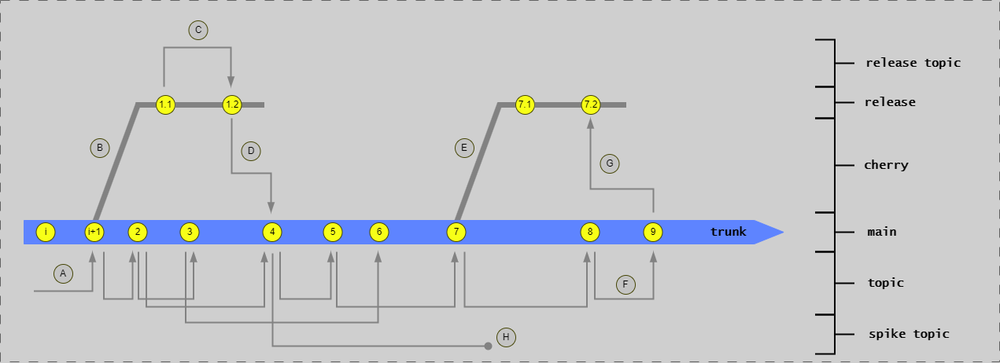

**This diagram shows the complete branching flow for the Release Approval pattern:** Follow the flow showing how code progresses from topic branches through trunk to release branches. Key markers: **A** shows topic branches merging to main (all main commits come from topics); **B** and **E** mark points where release branches are created at Stage 8; commits **1** and **7** on main become the first commits (**1.1**, **7.1**) on their respective release branches; **C** shows release topic branches merging to the release branch; **D** illustrates cherry-picking from release back to main; **F** and **G** show the preferred approach of fixing on main first (F) then cherry-picking to release (G); **H** indicates spike branches that are never merged back.

### Pattern Overview

The RA pattern uses release branches to isolate releases for validation and approval. This approach:

- Enables trunk to continue evolving during release validation
- Allows critical fixes on release branch without trunk changes
- Provides stable release candidate for approval
- Maintains audit trail for regulated environments

**Best for**: Regulated systems, high-risk applications, systems requiring formal approvals

### Stage Flow for RA Pattern

**Stages 1-3: Topic Branch Development**:

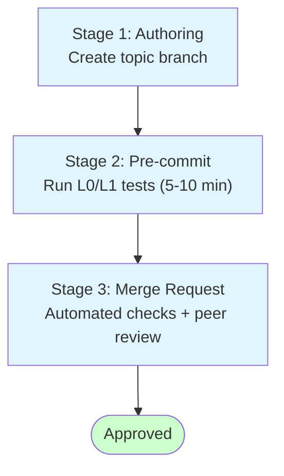

**Example Commands**:

```bash
# Stage 1: Create topic branch
git checkout main
git pull origin main
git checkout -b feature/user-auth

# Stage 2: Run pre-commit checks
go test ./src/...
golangci-lint run
trivy fs .

# Stage 3: Push and create merge request
git push origin feature/user-auth
gh pr create --title "Add user authentication" \
  --body "Implements JWT authentication for API endpoints"
```

**Stages 4-7: Trunk Integration and Testing**:

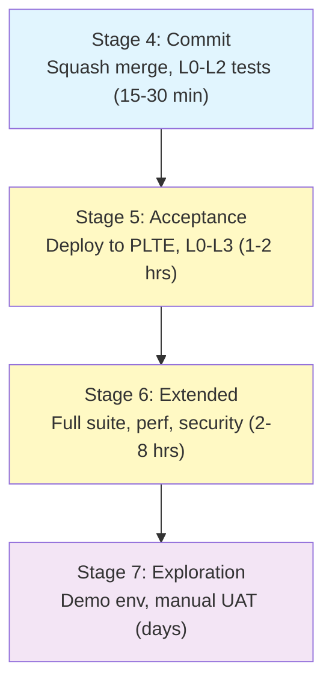

**Key Characteristics**:

- All testing happens on trunk
- Immutable artifacts built once in Stage 4
- Same artifacts deployed to all test environments
- Release branch not yet created

**Stages 8-12: Release Branch Flow**:

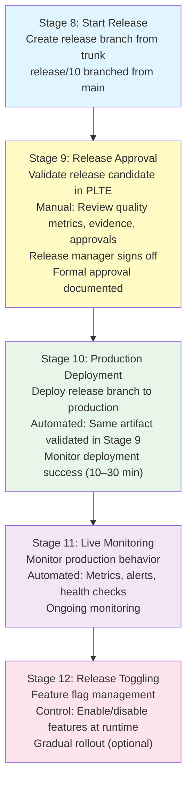

**Example Commands**:

```bash
# Stage 8: Create release branch
git checkout main
git pull origin main
git checkout -b release/10
git push origin release/10

# Stage 10: Tag production deployment
git tag v1.2.0
git push origin v1.2.0

# Deploy to production (via pipeline)
# kubectl apply -f k8s/production/
```

### Release Branch Lifecycle

**Creation** (Stage 8):

```bash
# Create release branch from trunk
git checkout main
git pull origin main
git checkout -b release/10
git push origin release/10
```

**Validation** (Stage 9):

- Deploy release branch to PLTE
- Run regression test suite
- Review quality metrics (test coverage, performance, security)
- Collect evidence (IV, OV, PV)
- Obtain formal approval

**Production Deployment** (Stage 10):

- Deploy same artifacts validated in Stage 9
- No rebuilding (immutable artifacts)
- Monitor deployment progress
- Validate production health

**Maintenance**:

- Release branch stays active until superseded
- Critical fixes applied via cherry-picking
- Eventually archived when release is deprecated

### Fixing Bugs on Release Branches

**Scenario**: Critical bug found in Stage 9 (Release Approval) or Stage 11 (Live)

**Preferred Approach: Fix on Trunk First**:

```bash
# 1. Create topic branch from trunk
git checkout main
git pull origin main
git checkout -b fix/critical-login-bug

# 2. Implement fix
# ... make changes ...

# 3. Merge to trunk via PR (Stages 2-4)
git push origin fix/critical-login-bug
gh pr create --title "Fix critical login bug" --body "Resolves #123"
# ... PR approved and merged ...

# 4. Cherry-pick to release branch
git checkout release/10
git pull origin release/10
git cherry-pick <commit-sha-from-main>
git push origin release/10

# 5. Create PR for release branch
gh pr create --base release/10 \
  --title "Cherry-pick: Fix critical login bug" \
  --body "Cherry-picked from main: <commit-sha>"
```

**Why fix on trunk first?**

- Ensures fix is in next release
- Avoids regressions in future releases
- Maintains trunk as single source of truth
- Follows "fix-forward" principle

**Emergency: Fix Directly on Release Branch**:

Only when trunk has diverged significantly and fix is urgent:

```bash
# 1. Create topic branch from release branch
git checkout release/10
git pull origin release/10
git checkout -b fix/release-critical-bug

# 2. Implement minimal fix
# ... make changes ...

# 3. Merge to release branch via PR
git push origin fix/release-critical-bug
gh pr create --base release/10 \
  --title "Emergency fix for critical bug" \
  --body "Minimal fix for production issue"
# ... PR approved and merged ...

# 4. IMMEDIATELY cherry-pick to trunk
git checkout main
git pull origin main
git cherry-pick <commit-sha-from-release>
git push origin main

# 5. Verify fix works in both branches
```

⚠️ **Warning**: Fixing on release branch first risks forgetting to cherry-pick to trunk, causing regressions.

### RA Pattern Summary

**Branch Flow**:

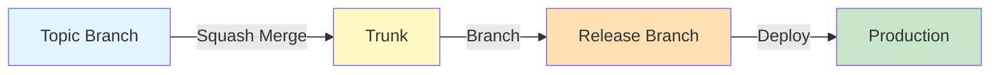

**Key Practices**:

- Topic branches live hours to 2 days
- Trunk always releasable
- Release branches created at Stage 8
- Fixes applied to trunk, cherry-picked to release
- Release branches archived when superseded

**Time Expectations**:

- Topic branch: Hours to 2 days
- Trunk testing (Stages 4-7): 1-2 days
- Release branch validation (Stages 8-9): 1-3 days
- Total cycle time: 1-2 weeks from commit to production

---

## Continuous Deployment (CDe) Pattern Flow

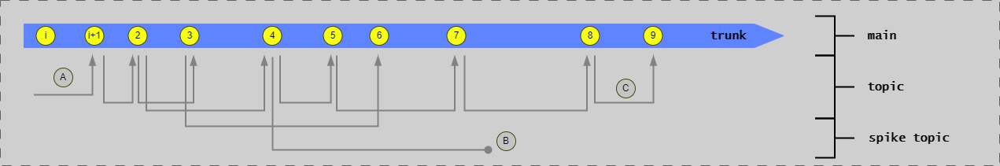

**This diagram shows the simplified branching flow for the Continuous Deployment pattern:** Compare this to the RA pattern diagram above - notice the release branch creation points (**B**, **E**) and release-specific flows (**C**, **D**, **F**, **G**) are completely absent. The flow is much simpler: topic branches (**A**) merge to main, and main is tagged directly for deployment. No release branches exist, so all bug fixes go directly to trunk via topic branches. This streamlined flow enables the rapid 2-4 hour cycle time characteristic of CDe.

### Pattern Overview

The CDe pattern deploys directly from trunk without release branches. This approach:

- Maximizes deployment speed (hours instead of weeks)
- Relies on comprehensive automated testing
- Uses feature flags for runtime control
- Requires mature DevOps practices

**Best for**: Non-regulated systems, internal tools, teams with mature automation

### Stage Flow for CDe Pattern

**Stages 1-3: Topic Branch Development**:


**Identical to RA pattern** - no differences in topic branch workflow.

**Stages 4-7: Trunk Integration and Testing**:

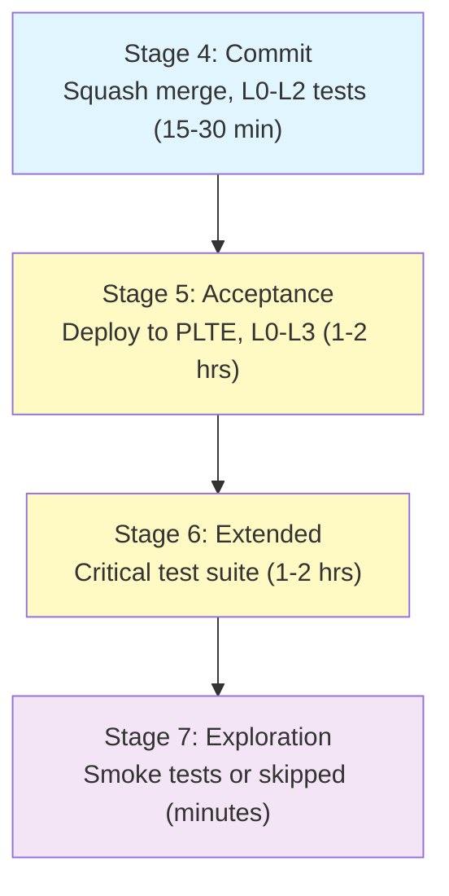

**Key Differences from RA**:

- Stage 6: Faster execution (1-2 hrs vs 2-8 hrs)
- Stage 7: Often automated or skipped
- Higher reliance on automated quality gates

**Stages 8-12: Direct Deployment from Trunk**:

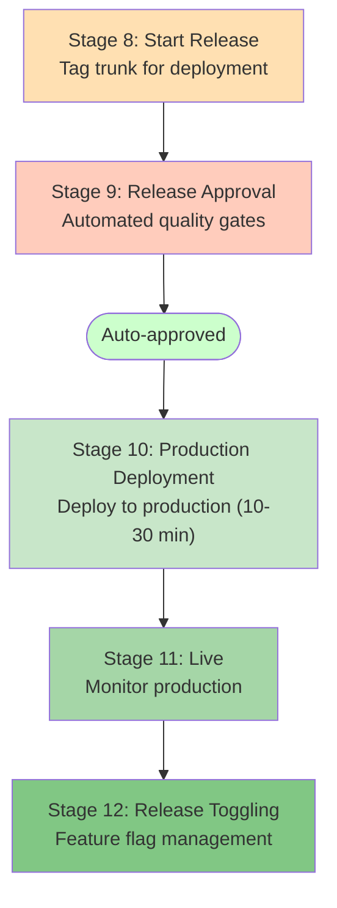

**Example Commands**:

```bash
# Stage 8: Tag trunk for deployment
git checkout main
git pull origin main
git tag v1.2.0
git push origin v1.2.0

# Stage 9: Automated approval (quality gates in pipeline)
# - All tests passing: ✓
# - Coverage > 80%: ✓
# - No critical vulnerabilities: ✓
# → Auto-approve deployment

# Stage 10: Deploy to production (automated via pipeline)
# kubectl apply -f k8s/production/

# Stage 12: Control feature flags
# curl -X POST api/feature-flags/new-dashboard -d '{"enabled": true, "percentage": 10}'
```

### No Release Branches

The CDe pattern eliminates release branches entirely:

**Instead of release branches**:

- Trunk is always production-ready
- Deploy directly from trunk
- Feature flags control feature exposure
- Fix-forward or rollback if issues arise

**Benefits**:

- Faster deployment (no release branch validation)
- Simpler branching model
- Less overhead

**Tradeoffs**:

- Requires higher confidence in trunk
- Requires comprehensive automated testing
- Requires feature flags for incomplete features

### Fixing Bugs in Production

**Scenario**: Critical bug found in production (Stage 11)

**Approach 1: Fix-Forward (Preferred)**:

```bash
# 1. Create topic branch from trunk
git checkout main
git pull origin main
git checkout -b fix/critical-bug

# 2. Implement fix
# ... make changes ...

# 3. Fast-track through stages
git push origin fix/critical-bug
gh pr create --title "[CRITICAL] Fix production bug" \
  --body "Emergency fix for production issue #456"

# 4. Merge and deploy ASAP
# Stages 2-4: Expedited (run critical tests only)
# Stages 5-7: May be skipped or shortened
# Stage 10: Deploy to production immediately

# 5. Verify fix in production
# Monitor metrics in Stage 11
```

**Approach 2: Rollback (If Fix Takes Time)**:

```bash
# 1. Rollback to previous version
kubectl rollout undo deployment/api-service

# 2. Implement fix on trunk (no rush)
git checkout main
git checkout -b fix/critical-bug
# ... take time to implement proper fix ...

# 3. Deploy fix through normal pipeline
# Full validation in Stages 2-10
```

**Approach 3: Feature Flag Kill Switch**:

```bash
# 1. Disable problematic feature via feature flag
curl -X POST api/feature-flags/new-checkout \
  -d '{"enabled": false}'

# 2. Fix on trunk (no rush)
git checkout main
git checkout -b fix/checkout-bug
# ... implement fix ...

# 3. Deploy and re-enable
# Deploy fix, then re-enable feature flag gradually
```

### CDe Pattern Summary

**Branch Flow**:

```text
Topic Branch → (Squash Merge) → Trunk → (Tag) → Production
```

**Key Practices**:

- Topic branches live hours to 1 day
- Trunk always production-ready
- No release branches
- Deploy directly from trunk
- Feature flags for runtime control
- Fix-forward or rollback for issues

**Time Expectations**:

- Topic branch: Hours to 1 day
- Trunk testing (Stages 4-7): 2-4 hours
- Deployment (Stages 8-10): Minutes
- Total cycle time: 2-4 hours from commit to production

---

## Pipeline Integration

Both branching strategies integrate with automated deployment pipelines.

### Pipeline Separation Challenge

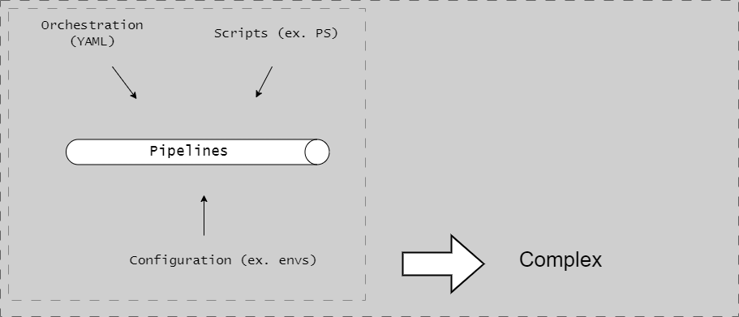

**This diagram illustrates the anti-pattern of monolithic pipeline YAML:** The diagram shows all pipeline logic - orchestration (agent selection, parallelization), scripting (build/test implementation), and configuration (environment-specific settings) - mixed together in a single YAML file. This creates maintenance challenges: changes require editing complex YAML, debugging involves repeatedly running the entire pipeline, and there's no way to test scripts locally. The tangled nature makes it difficult to understand which parts handle what responsibility.

**Problem**: If the same pipeline runs for topic branches, trunk commits, and release branches, it's difficult to:

- Apply different quality gates per branch type
- Track progression through stages accurately
- Manage environment deployments correctly

### Pipeline Separation Solution

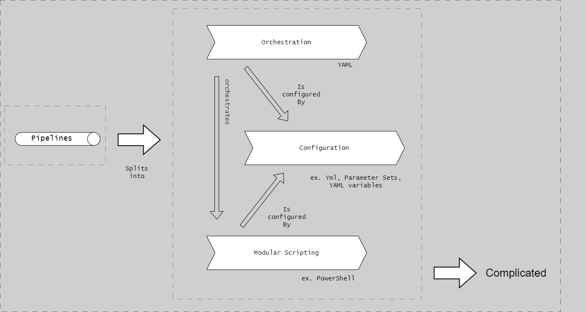

**This diagram shows the separation of concerns solution:** The pipeline is split into three distinct layers. **Orchestration** (YAML) handles pipeline-specific tasks like agent provisioning, parallelization, and artifact management. **Scripting** (executable locally via CLI) contains all build/test/deploy implementation logic that can be run and debugged outside the pipeline. **Configuration** (yml files) stores environment-specific settings separately from code. This separation enables local development, easier testing, and clearer maintenance boundaries.

**Solution**: Use separate pipelines for each branch type:

**Topic Branch Pipeline** (Stages 2-3):

```yaml
# .github/workflows/topic-branch.yml
name: Topic Branch Validation
on:
  pull_request:
    branches: [main]

jobs:
  validate:
    runs-on: ubuntu-latest
    steps:
      - name: Run L0/L1 Tests
        run: go test ./...
      - name: Run L2 Integration Tests
        run: go test -tags=integration ./...
      - name: Security Scan
        run: trivy fs .
```

**Trunk Pipeline** (Stages 4-7):

```yaml
# .github/workflows/trunk.yml
name: Trunk Validation
on:
  push:
    branches: [main]

jobs:
  build-and-test:
    runs-on: ubuntu-latest
    steps:
      - name: Build Artifacts
        run: make build
      - name: Run Full Test Suite
        run: make test-all
      - name: Deploy to PLTE
        run: make deploy-plte
      - name: Run E2E Tests
        run: make test-e2e
```

**Release Branch Pipeline (RA only)** (Stages 8-10):

```yaml
# .github/workflows/release-branch.yml
name: Release Validation
on:
  push:
    branches: [release/*]

jobs:
  release-validation:
    runs-on: ubuntu-latest
    steps:
      - name: Deploy to PLTE
        run: make deploy-plte-release
      - name: Run Regression Tests
        run: make test-regression
      - name: Collect Evidence
        run: make collect-evidence
      - name: Deploy to Production
        if: github.event_name == 'workflow_dispatch'
        run: make deploy-production
```

### Generalized Pipeline Flows

**RA Pattern Pipeline**:

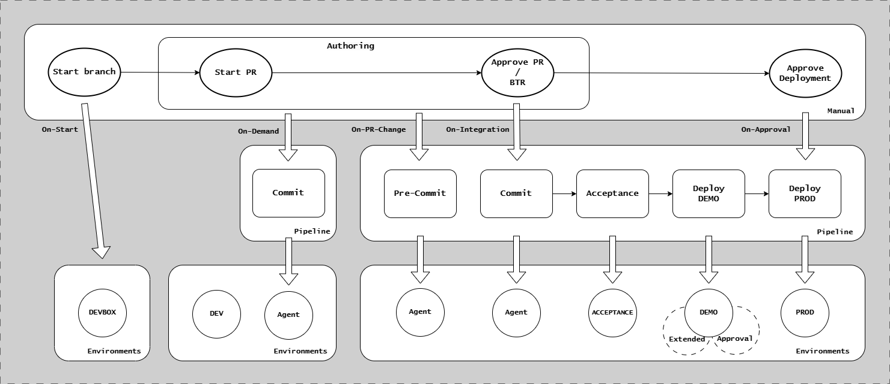

**This diagram shows the complete pipeline architecture for the Release Approval pattern:** The pipeline is organized into three distinct flows triggered by different branch types. Topic branches trigger Stages 2-3 (pre-commit checks and peer review). Trunk commits trigger Stages 4-7 (commit validation, acceptance testing in PLTE, extended testing, and demo deployment). Release branches trigger Stages 8-10 (release candidate validation, manual approval gate at Stage 9, and production deployment). Notice the two manual approval gates: peer review at Stage 3 and release approval at Stage 9, shown as decision points where human judgment is required before proceeding.

**Key Stages**:

- Topic branch triggers Stages 2-3
- Trunk commit triggers Stages 4-7
- Release branch triggers Stages 8-10
- Manual approval required at Stage 9

**CDe Pattern Pipeline**:

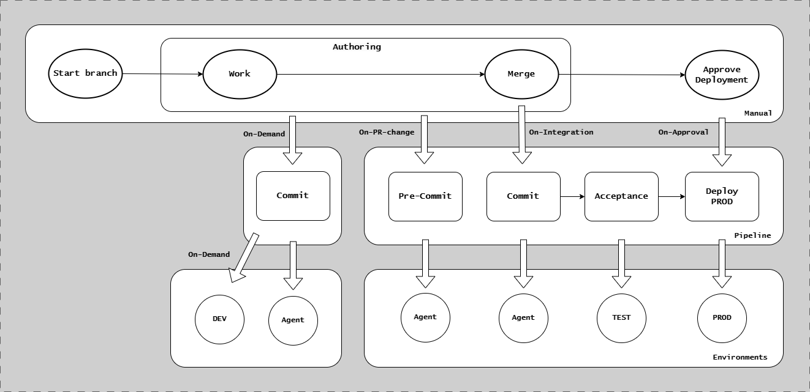

**This diagram shows the streamlined pipeline architecture for Continuous Deployment:** Compare this to the RA pattern - the key difference is that trunk commits trigger Stages 4-10 automatically in one continuous flow without a separate release branch pipeline. Topic branches still trigger Stages 2-3 (identical to RA). But once merged to trunk, the pipeline proceeds directly from testing through to production deployment. Stage 9 has automated approval based on quality gates (test pass rate, coverage, no vulnerabilities) instead of manual sign-off. No release branch pipeline exists, simplifying the architecture significantly and enabling the rapid deployment cycle.

**Key Stages**:

- Topic branch triggers Stages 2-3
- Trunk commit triggers Stages 4-10 (automated)
- No release branch pipeline
- Automated approval at Stage 9

### Pinning and Stitching Dependencies

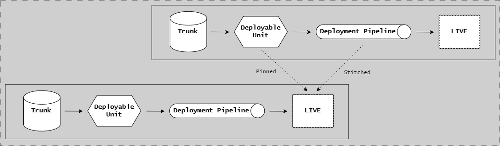

**This diagram illustrates the pin and stitch dependency management pattern:** The diagram shows how deployable units declare dependencies on specific versions of shared modules. **Pinning** occurs in the build manifest (e.g., `shared-models: v1.2.3`) where the dependent explicitly declares which version it requires. **Stitching** happens at build time when the pinned version is retrieved from artifact storage (or local cache) and built into the immutable artifact. This ensures deterministic builds - the same commit always produces the same artifact with the same dependencies, including all transitive dependencies, regardless of when it's built. The pattern supports independent release cadences for different deployable units while maintaining version compatibility.

**Challenge**: When multiple deployable units depend on each other, how do you ensure compatible versions are deployed together?

**Pin and Stitch Pattern**:

1. **Pin**: Lock dependencies to specific versions in artifact metadata
2. **Stitch**: During deployment, resolve pinned versions to ensure compatibility
3. **Validate**: Test integrated system with pinned versions

**Example (monorepo with multiple deployable units)**:

```yaml
# deployable-unit-api/dependencies.yaml
dependencies:
  shared-models: v1.2.3
  shared-auth: v2.1.0

# deployable-unit-worker/dependencies.yaml
dependencies:
  shared-models: v1.2.3
  shared-queue: v1.5.0
```

During deployment:

```bash
# Stage 10: Deploy API with pinned dependencies
kubectl apply -f api-deployment.yaml \
  --set shared-models.version=v1.2.3 \
  --set shared-auth.version=v2.1.0

# Stage 10: Deploy Worker with pinned dependencies
kubectl apply -f worker-deployment.yaml \
  --set shared-models.version=v1.2.3 \
  --set shared-queue.version=v1.5.0
```

**Benefits**:

- Reproducible deployments
- No "dependency drift" between environments
- Clear traceability of versions
- Supports independent release cadences

---

## Comparison Summary

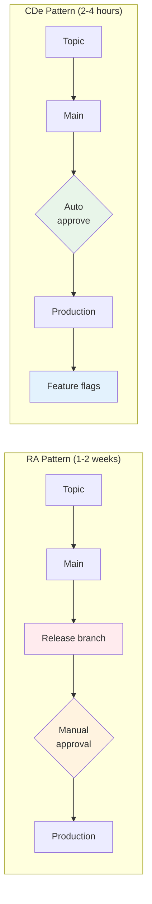

### Branch Type Usage

| Branch Type | RA Pattern | CDe Pattern |
|-------------|-----------|-------------|
| Trunk (main) | ✓ Always | ✓ Always |
| Topic branches | ✓ Hours to 2 days | ✓ Hours to 1 day |
| Release branches | ✓ Required | ✗ Not used |

### Stage Execution

| Stage | RA Pattern | CDe Pattern |
|-------|-----------|-------------|
| 1. Authoring | Manual | Manual |
| 2. Pre-commit | Automated (5-10 min) | Automated (5-10 min) |
| 3. Merge Request | Automated + Peer Review | Automated + Peer Review |
| 4. Commit | Automated (15-30 min) | Automated (15-30 min) |
| 5. Acceptance | Automated (1-2 hrs) | Automated (1-2 hrs) |
| 6. Extended | Automated (2-8 hrs) | Automated (1-2 hrs) |
| 7. Exploration | Manual (days) | Automated or skipped |
| 8. Start Release | Create release branch | Tag trunk commit |
| 9. Release Approval | Manual approval | Automated approval |
| 10. Production | Deploy release branch | Deploy trunk commit |
| 11. Live | Monitor | Monitor + Feature flags |
| 12. Release Toggling | Optional | Critical |

### Timeline Comparison

**RA Pattern**:

- Topic branch: Hours to 2 days
- Trunk testing: 1-2 days (Stages 4-7)
- Release validation: 1-3 days (Stages 8-9)
- **Total**: 1-2 weeks from commit to production

**CDe Pattern**:

- Topic branch: Hours to 1 day
- Trunk testing: 2-4 hours (Stages 4-7)
- Deployment: Minutes (Stages 8-10)
- **Total**: 2-4 hours from commit to production

### When to Use Each Pattern

**Use RA Pattern when**:

- Subject to regulatory oversight
- High-risk system (safety, health, critical operations)
- Requires formal audit trail
- Needs documented approvals
- Building confidence in automation

**Use CDe Pattern when**:

- Non-regulated environment
- Internal tools or low-risk systems
- Mature DevOps practices
- Comprehensive automated testing
- Feature flags implemented
- Fast iteration important

See [Implementation Patterns](../cd-model/implementation-patterns.md) for detailed decision tree.

---

## Best Practices Across Patterns

For general trunk-based development practices (trunk management, topic branch management, commit hygiene, testing strategy), see [Trunk-Based Development](trunk-based-development.md). The sections below focus on pattern-specific practices.

### RA Pattern Specific

**Release Branch Management**:

- Create from trunk only (never from topic branch)
- Only critical fixes allowed on release branch
- Always fix on trunk first, cherry-pick to release
- Archive release branch when superseded

**Approval Process**:

- Document approval criteria clearly
- Automate evidence collection
- Maintain audit trail
- Review quality metrics before approval

**Cherry-Picking**:

- Always cherry-pick from trunk to release
- Never cherry-pick from release to trunk (fix on trunk first)
- Create PR for cherry-picked commits
- Verify fix works in both branches

### CDe Pattern Specific

**Feature Flag Management**:

- Use feature flags for all incomplete features
- Implement kill switches for high-risk features
- Gradual rollout (1% → 10% → 50% → 100%)
- Monitor metrics per flag state

**Automated Quality Gates**:

- Define clear pass/fail criteria
- 100% test pass rate required
- Coverage thresholds enforced
- No critical vulnerabilities
- Performance within acceptable range

**Rollback Strategy**:

- Maintain previous version artifacts
- Automate rollback procedures
- Practice rollback regularly
- Monitor deployment health continuously

---

## Integration with Other Articles

This article focuses on branching flows. For related topics, see:

**Core Concepts**:

- [Unit of Flow](../core-concepts/unit-of-flow.md) - 4-component model overview
- [Deployable Units](../core-concepts/deployable-units.md) - What gets built and deployed
- [Trunk-Based Development](trunk-based-development.md) - Core principles and practices

**CD Model Stages**:

- [CD Model Overview](../cd-model/cd-model-overview.md) - Complete 12-stage framework
- [Stages 1-6](../cd-model/cd-model-stages-1-6.md) - Development and testing stages
- [Stages 7-12](../cd-model/cd-model-stages-7-12.md) - Release and production stages

**Implementation**:

- [Implementation Patterns](../cd-model/implementation-patterns.md) - Choosing between RA and CDe
- [Environments](../architecture/environments.md) - PLTE and production architecture
- [Security](../security/security.md) - Security integration throughout stages

---

## Summary

Branching strategies define how code flows through the CD Model:

**Release Approval (RA)**:

- Uses release branches for validation
- Manual approval at Stage 9
- Suitable for regulated systems
- Cycle time: 1-2 weeks

**Continuous Deployment (CDe)**:

- Deploys directly from trunk
- Automated approval at Stage 9
- Suitable for non-regulated systems
- Cycle time: 2-4 hours

**Common Elements**:

- Trunk-based development (short-lived topic branches)
- Squash-merge to preserve clean history
- Immutable artifacts built once in Stage 4
- Same artifacts deployed to all environments

**Key Differences**:

- Release branches (RA) vs no release branches (CDe)
- Manual approval (RA) vs automated approval (CDe)
- Feature hiding vs feature flags emphasis
- Cycle time (weeks vs hours)

Choose the pattern that matches your regulatory requirements, risk profile, and organizational maturity. Both patterns use the same 12-stage CD Model but differ in branching approach and automation level.

## Next Steps

- [Implementation Patterns](../cd-model/implementation-patterns.md) - Detailed guidance on choosing between RA and CDe
- [Trunk-Based Development](trunk-based-development.md) - Daily development practices
- [Stages 7-12](../cd-model/cd-model-stages-7-12.md) - Understand release stages in detail
- [Deployable Units](../core-concepts/deployable-units.md) - What gets versioned and deployed

## References

- [CD Model Overview](../cd-model/cd-model-overview.md)
- [Unit of Flow](../core-concepts/unit-of-flow.md)
- [Repository Layout](../../../reference/repository-layout.md)
- [Trunk-Based Development (trunkbaseddevelopment.com)](https://trunkbaseddevelopment.com/)
