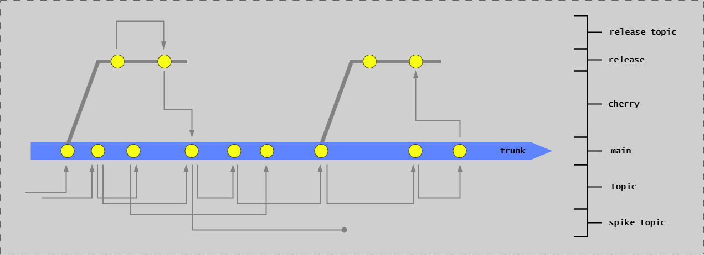
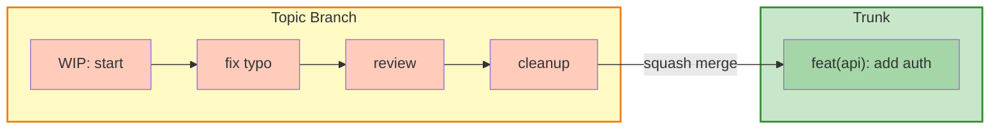

# Trunk-Based Development

## Introduction

Trunk-Based Development (TBD) is the branching strategy that enables Continuous Integration and Continuous Delivery. Instead of long-lived feature branches that delay integration, TBD emphasizes frequent integration to a single main branch (trunk), enabling rapid feedback and reducing merge conflicts.

This approach is fundamental to achieving:

- **Continuous Integration**: All developers integrate to trunk at least daily
- **Continuous Delivery**: Trunk is always in a releasable state
- **Fast feedback**: Issues detected within hours, not weeks
- **Reduced risk**: Small, incremental changes are easier to validate and rollback

### Integration with CD Model

Trunk-Based Development directly supports several CD Model stages:

- **Stage 1 (Authoring)**: Work on short-lived topic branches
- **Stage 3 (Merge Request)**: Squash-merge topic branches to trunk
- **Stage 4 (Commit)**: Trunk commits trigger full validation
- **Stage 8 (Start Release)**: Create release branches from trunk (RA pattern)
- **Stage 12 (Release Toggling)**: Feature flags enable trunk-based development for incomplete features

See [CD Model Overview](../cd-model/cd-model-overview.md) for the complete 12-stage framework.

---

## Core Principles

### 1. Single Source of Truth

**Principle:** _There is only ever one meaningful version of the code: the current one._

- The `main` branch (trunk) is the only source of truth
- All changes integrate to `main` frequently (at least daily)
- `main` is always in a releasable state

**Why this matters:**

- Eliminates confusion about which version is current
- Enables continuous delivery from trunk
- Reduces integration debt
- Provides clear traceability

**Anti-pattern to avoid:** Long-lived feature branches that become "alternative versions" of truth, causing painful merges and integration delays.

### 2. Do Not Branch (Or Branch Very Briefly)

**Principle:** _At any given time, there are only 3 active branch types: trunk, topic branches, and release branches._

- Topic branches live for hours or at most 1-2 days
- Changes are kept small and focused
- Branches are deleted immediately after merging

**Why this matters:**

- Prevents integration drift
- Enables continuous integration
- Reduces merge conflicts
- Faster feedback loops

**Anti-pattern to avoid:** "Feature branches" that live for weeks, accumulating hundreds of changes and causing massive merge conflicts.

### 3. Small, Incremental Changes

**Principle:** _Work in small batches that are continuously integrated._

- Each change is a small, logical increment
- Large features broken into deployable pieces
- Feature hiding used for incomplete features

**Why this matters:**

- Easier to review (< 400 lines)
- Faster to validate (Stage 2-6)
- Lower risk (small changes are safer)
- Enables continuous delivery

**Anti-pattern to avoid:** Massive "big bang" merges with thousands of lines, making review impossible and rollback risky.

### 4. Continuous Integration to Trunk

**Principle:** _Integrate at least daily, preferably multiple times per day._

- Developers pull from `main` frequently
- Push changes as soon as they pass local validation
- Pipeline validates every trunk commit

**Why this matters:**

- Early detection of integration issues
- Prevents merge conflicts
- Maintains releasable trunk
- Supports rapid delivery

**Anti-pattern to avoid:** Developers working in isolation for days/weeks before attempting integration.

---

## Branch Types and Flow



**This diagram shows the three active branch types and their relationships:** The **trunk** (center) is the single source of truth. **Topic branches** (left and right) branch from trunk or release branches for short-lived development work. Changes on topic branches are squash-merged back, resulting in one topic branch creating exactly one commit on the destination branch. **Release branches** (bottom) branch from trunk at Stage 8 for the Release Approval pattern. Topic branches can also become spikes (experimental work) that never merge back. All paths to trunk and release branches go through merge requests, never direct commits.

### Trunk Branch (Main)

**Definition:** The single branch representing the trunk.

**Characteristics:**

- Always deployable
- Protected - no direct commits
- All changes via merge request
- Updated multiple times per day
- Only meaningful version of the code

**Access:**

- Read: All developers
- Write: Via approved merge requests only

**Purpose:**

- Single source of truth
- Continuous integration point
- Release candidate source

### Topic Branches

**Definition:** Short-lived branches for individual changes.

**Characteristics:**

- Branched from trunk (or occasionally release branch)
- Live for hours to maximum 2 days
- Squash-merged to preserve clean history
- Deleted immediately after merge
- Temporary, local development scope

**One topic branch = One trunk commit after squash merge**:

**Naming Convention:**

```text
feature/short-description
fix/bug-description
docs/documentation-update
refactor/improve-component
```

**Purpose:**

- Isolate work in progress
- Enable code review via merge request
- Provide temporary workspace
- NOT for hiding incomplete features (use feature flags)

**Topic branches are NOT feature branches:**

- Feature branches live for weeks/months
- Topic branches live for hours/days
- Feature branches accumulate many commits
- Topic branches result in single squash commit

### Release Branches

**Definition:** Short branches isolating releases.

**Characteristics:**

- Created from trunk at Stage 8 (Start Release)
- Short-lived (days to weeks)
- Only critical fixes allowed
- Fixes cherry-picked back to trunk
- Used in Release Approval (RA) pattern, not Continuous Deployment (CDE)

**Naming Convention:**

```text
release/1.2.0
release/v1.2.0
release/product-name/1.2.0
```

**Purpose:**

- Isolate release for validation
- Allow trunk to continue evolving
- Apply critical fixes without trunk changes
- Maintain stable release candidate

See [Implementation Patterns](../cd-model/implementation-patterns.md) for RA vs CDE details and [Branching Strategies](branching-strategies.md) for detailed flows.

---

## Commits

In trunk-based development, a **commit** refers specifically to commits made to **trunk** or **release** branches, not local commits on topic branches.

**Key Principles:**

- Local commits on topic branches are temporary
- Only squash-merged commits to trunk/release branches are lasting
- Trunk and release branch history are straight lines
- Each topic branch integration = one commit

**Commit Format:**

Commits follow semantic commit conventions:

```text
type(scope): short description

Longer description if needed.

Related to #123
```

**Types:** feat, fix, docs, refactor, test, chore

See [Semantic Commits](../../reference/continuous-delivery/semantic-commits.md) for detailed format.

**Why Squash Merge:**

- Clean, linear history
- One commit per logical change
- Easy to revert
- Clear traceability
- Simplifies cherry-picking

**Example:**



---

## Daily Development Flow

**Typical workflow:**

1. **Sync with trunk**: `git pull origin main` - Start with latest changes
2. **Create topic branch**: `git checkout -b feature/short-description` - Isolate your work
3. **Make small changes**: Keep under 400 lines, one logical change per branch
4. **Integrate regularly**: Pull from trunk every few hours to avoid conflicts
5. **Push and create merge request**: Triggers Stage 2 (Pre-commit) and Stage 3 (Merge Request) validation
6. **Address review feedback**: Push additional commits to topic branch
7. **Squash merge to trunk**: One topic branch becomes one trunk commit, branch deleted automatically

**Key command:**

```bash
gh pr merge --squash --delete-branch
```

This squash-merges your topic branch to trunk, triggering Stage 4 (Commit) validation, and automatically deletes the topic branch.

---

## Feature Hiding

### The Problem: Incomplete Features in Trunk

When practicing Continuous Integration with small batches, you'll often integrate partial features into trunk. These incomplete features must not affect production behavior.

**You cannot rely on branches to hide incomplete work** - the work is in trunk, potentially deployed to production.

### Feature Hiding Strategies

**Level 1: Code-Level Hiding**:

Hide new code by simply not activating it:

```go
// New implementation exists but not injected
type NewPaymentProcessor struct {}

// Still using old implementation
func main() {
    processor := OldPaymentProcessor{} // Not injecting new one yet
}
```

**Benefits:** Simple, no infrastructure needed
**Limitation:** Requires deployment to activate

**Level 2: Configuration-Based Activation**:

Use configuration to control feature activation:

```yaml
# config.yaml
features:
  newCheckoutFlow: false  # Deploy OFF, flip to true later
```

**Benefits:** Activation decoupled from deployment
**Limitation:** Requires redeployment to change config

**Level 3: Feature Flags (Recommended)**:

Use runtime feature flags for full control:

```go
if featureFlags.IsEnabled("new-checkout-flow", user) {
    return NewCheckoutFlow(user)
} else {
    return OldCheckoutFlow(user)
}
```

**Benefits:**

- Deployment fully decoupled from release
- Enable for percentage of users (gradual rollout)
- Instant rollback without redeployment
- A/B testing capabilities

**This is Stage 12 (Release Toggling) of the CD Model.**

See [Stages 7-12](../cd-model/cd-model-stages-7-12.md#stage-12-release-toggling) for feature flag implementation patterns.

### When to Use Each Strategy

| Strategy | Use When | Don't Use When |
|----------|----------|----------------|
| Code-Level | Simple internal changes, refactoring | Customer-facing features, high-risk changes |
| Configuration | Features ready for immediate activation | Need gradual rollout or A/B testing |
| Feature Flags | Customer-facing features, risky changes, gradual rollouts | Simple internal changes (overhead not worth it) |

### Branch by Abstraction

For large refactorings, use "branch by abstraction":

1. Create abstraction layer
2. Implement new code behind abstraction
3. Gradually migrate calls to new implementation
4. All changes integrated to trunk incrementally
5. Remove old implementation when migration complete

This avoids long-lived branches for major architectural changes.

---

## Release Flows and Branching

The branching strategy differs based on your release flow.

### Release Approval (RA) Pattern

**For regulated systems requiring formal approval:**

1. **Stage 8**: Create release branch from trunk (`release/v1.2.0`)
2. **Stage 9**: Validate in PLTE, obtain approval
3. **Stage 10**: Deploy release branch to production
4. **Hotfixes**: Create topic branch from release, merge via PR, cherry-pick back to trunk

**Branch Lifecycle:**

- Release branch lives until release is superseded
- Only critical fixes allowed on release branch
- All fixes MUST be cherry-picked back to trunk (avoid regressions)

See [Implementation Patterns](../cd-model/implementation-patterns.md#release-approval-ra-pattern) and [Branching Strategies](branching-strategies.md) for details.

### Continuous Deployment (CDE) Pattern

**For non-regulated systems with high confidence:**

1. **Trunk is always production-ready**
2. **Deploy directly from trunk** (no release branches)
3. **Fix-forward or rollback** if issues occur
4. **Feature flags** provide control instead of branches

**No release branches needed** - trunk IS the release.

See [Implementation Patterns](../cd-model/implementation-patterns.md#continuous-deployment-cde-pattern) for details.

---

## Cherry-Picking Fixes

### What is Cherry-Picking?

Cherry-picking copies a commit from one branch to another, creating a new commit with the same changes.

**Primary use case:** Bringing fixes from trunk to release branches.

### When to Cherry-Pick

**Scenario:** Critical bug found after release branch created

1. **Fix on trunk first** (always the preferred path)
2. Create topic branch from trunk
3. Implement fix
4. Merge to trunk via PR
5. **Cherry-pick** trunk commit to release branch
6. Create PR for release branch with cherry-picked commit

**Why fix on trunk first?**

- Ensures fix is in next release
- Avoids regressions
- Maintains trunk as single source of truth

### Emergency: Fixing Directly on Release Branch

**Only when trunk has diverged significantly and fix is urgent:**

1. Create topic branch from release branch
2. Implement minimal fix
3. Merge to release branch
4. **Immediately cherry-pick to trunk**
5. Verify fix works in both branches

⚠️ **Warning:** Fixing on release branch first risks forgetting to cherry-pick to trunk, causing regressions.

### Emergency Fixes in Production

For critical bugs requiring immediate fixes: Create hotfix topic branch from trunk, make minimal change, test thoroughly, merge to trunk with priority, and cherry-pick to release branch if needed.

### Git Commands

```bash
# On trunk, after merging fix via PR
git log  # Find commit SHA of the fix

# Switch to release branch
git checkout release/v1.2.0

# Cherry-pick the fix commit
git cherry-pick <commit-sha-from-trunk>

# Create PR with cherry-picked commit
git push origin release/v1.2.0

# Via GitHub CLI
gh pr create --base release/v1.2.0 --title "Cherry-pick: Fix critical bug"
```

---

## Best Practices

### DO

- **Integrate at least daily** - preferably multiple times per day
- **Keep changes small** - < 400 lines ideal, < 200 excellent
- **Write semantic commit messages** - enables automated versioning and release notes
- **Pull from trunk frequently** - every few hours to stay current
- **Run Stage 2 checks before pushing** - all tests, linting, security scans
- **Use feature flags for incomplete features** - deploy dark, enable later
- **Delete branches immediately after merge** - keep repository clean
- **Squash-merge topic branches** - one topic branch = one trunk commit
- **Cherry-pick from trunk to release** - maintain single source of truth
- **Fix-forward in production** - prefer fixing over reverting when possible

### DON'T

- **Keep topic branches open > 2 days** - violates continuous integration
- **Make large, sweeping changes in single commit** - breaks reviewability
- **Let your branch diverge significantly from trunk** - causes merge conflicts
- **Push broken code to trunk** - violates "always releasable" principle
- **Keep "work in progress" branches** - integrate incrementally instead
- **Create long-lived feature branches** - antithetical to trunk-based development
- **Fix on release branch without cherry-picking to trunk** - causes regressions
- **Use topic branches to hide incomplete features** - use feature flags instead

### Stage Duration Guidelines

If these stages take longer than indicated, your changes are too large - break them down:

- **Stage 2 (Pre-commit)**: < 10 minutes (L0/L1 tests, linting, secret scanning)
- **Stage 3 (Merge Request)**: < 30 minutes (Stage 2 + L2 tests + peer review)
- **Stage 4 (Commit)**: < 30 minutes (all previous + Hybrid E2E + artifact build)

---

## Conflict Resolution

**Prevention is key:** Pull from trunk frequently (every few hours), keep changes small, and integrate daily. When conflicts occur: pull latest, resolve locally, run tests, commit, and push immediately.

---

## Summary

Trunk-Based Development enables Continuous Integration and Continuous Delivery:

**Core Principles:**

1. Single source of truth (trunk)
2. Short-lived topic branches (hours to 2 days max)
3. Small, incremental changes (< 400 lines)
4. Continuous integration (at least daily)

**Branch Types:**

- **Trunk**: Single main branch, always releasable
- **Topic branches**: Temporary workspace, squash-merged
- **Release branches**: Optional, for RA pattern only

**Key Practices:**

- Feature flags for incomplete features
- Cherry-pick fixes from trunk to release
- Squash merge for clean history
- Daily integration to trunk

**Integration with CD Model:**

- Stages 1-3: Topic branch development
- Stage 4: Trunk commit validation
- Stages 5-7: Testing and exploration
- Stage 8: Release branch creation (RA) or trunk deployment (CDE)

## Next Steps

- [Branching Strategies](branching-strategies.md) - Detailed flows for RA and CDE patterns
- [Unit of Flow](../core-concepts/unit-of-flow.md) - See how trunk fits into the bigger picture
- [Deployable Units](../core-concepts/deployable-units.md) - What gets built from trunk
- [Implementation Patterns](../cd-model/implementation-patterns.md) - RA vs CDE decision guidance
- [Stages 7-12](../cd-model/cd-model-stages-7-12.md) - Release stages including feature flags

## References

- [CD Model Overview](../cd-model/cd-model-overview.md)
- [Semantic Commits](../../reference/continuous-delivery/semantic-commits.md)
- [Repository Layout](../../reference/continuous-delivery/repository-layout.md)
- [Versioning](../../reference/continuous-delivery/versioning.md)
- [Trunk-Based Development (trunkbaseddevelopment.com)](https://trunkbaseddevelopment.com/)
- [Feature Branches Considered Evil (YouTube)](https://www.youtube.com/watch?v=h7LeD7VevyI)
- [Why CI is Better Than Feature Branching (YouTube)](https://www.youtube.com/watch?v=lXQEi1O5IOI)
