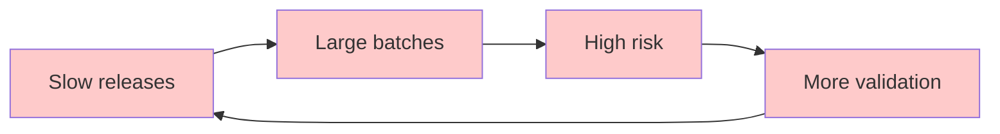

# The Compliance-Velocity Paradox

> **The fundamental contradiction facing regulated industries**

## The Challenge

Organizations in regulated industries—pharmaceuticals, medical devices, financial services, aviation, healthcare, SaaS providers face a fundamental contradiction:

**Regulatory pressure is increasing:**

- More stringent data integrity requirements across multiple frameworks
- Expanded audit scope and frequency
- Higher penalties for non-compliance
- Growing complexity as regulations multiply and overlap
- New regulatory domains (AI/ML systems, cloud services)

### The Regulatory Landscape

Organizations must now navigate an increasingly complex web of regulations:

**Life Sciences & Pharmaceuticals:**

- **EU EudraLex Volume 4, Annex 11** - Computerized Systems (data integrity, validation, audit trails)
- **US 21 CFR Part 11** - Electronic Records and Electronic Signatures
- **FDA Guidances** - Data Integrity and Compliance (ALCOA+ principles), Computer Software Assurance
- **GAMP 5** - Risk-based approach to compliant GxP computerized systems
- **ISO 13485** - Medical devices quality management

**Information Security:**

- **ISO 27001** - Information Security Management Systems (ISMS)
- **ISO 27002** - Information security controls
- **SOC 2** - Service Organization Controls (Trust Services Criteria)
- **NIST Cybersecurity Framework** - Risk management framework

**Data Protection & Privacy:**

- **GDPR** - EU General Data Protection Regulation
- **HIPAA** - Health Insurance Portability and Accountability Act
- **CCPA/CPRA** - California Consumer Privacy Act

**Financial Services:**

- **SOX** - Sarbanes-Oxley Act
- **PCI-DSS** - Payment Card Industry Data Security Standard
- **Basel III/IV** - Banking supervision and capital requirements

**Emerging Regulations:**

- **EU AI Act** - Artificial Intelligence regulation (risk-based classification, transparency, human oversight)
- **Digital Operational Resilience Act (DORA)** - ICT risk management for financial entities
- **Medical Device Regulation (MDR)** - EU medical device compliance

**The challenge:** Each regulation demands documentation, validation, traceability, and evidence—often with overlapping but not identical requirements.

**Market pressure is accelerating:**

- Digital transformation demands
- Customer expectations for rapid innovation
- Competitive threats from tech-native companies
- Need for faster time-to-market

**Traditional approaches cannot satisfy both:**

- Manual compliance processes create bottlenecks
- Documentation lags behind implementation
- Validation cycles take weeks or months
- Audit preparation consumes enormous resources
- Knowledge trapped in individual experts
- Risk of human error in critical compliance steps

---

## The Real Cost of Manual Compliance

Consider a typical regulated software release:

**Timeline:** 6-12 weeks
**Risk points:** 15+ manual handoffs
**Documentation:** Scattered across systems
**Traceability:** Reconstructed retroactively
**Auditability:** Requires weeks of preparation

This creates:

- **Traceability Gaps** – Requirements in one system, tests in another, code in a third, and deployment records elsewhere. Manual correlation is error-prone and time-consuming.
- **Documentation Drift** – Specifications created before implementation are never updated to match reality, causing the gap between documented and actual behavior to grow over time.
- **Validation Theater** – Checking boxes without improving quality. Manual review processes that can be skipped under pressure don’t provide real assurance.
- **Audit Burden** – Teams spend months preparing evidence that should already exist. Instead of building value, resources are spent extracting and compiling scattered information.
- **Delayed Value** – Features ready for production wait in validation purgatory. Business value sits on shelves while paperwork catches up.
- **Risk Accumulation** – Large, infrequent releases create high-risk deployments. When changes are batched together, failures become harder to diagnose and roll back.

---

## Evidence from Research: DORA Metrics Apply to Regulated Industries

The [DevOps Research and Assessment (DORA)](https://dora.dev/research/) program has measured software delivery performance across industries since 2014. Their research shows that **DORA metrics are applicable across all industries**, including highly regulated ones.

### Industry Representation in DORA Research

The State of DevOps Report 2025 includes respondents from regulated industries:

| Industry                     | % of Survey Respondents |
|------------------------------|-------------------------|
| Technology                   | 38.0%                   |
| Financial Services           | 13.6%                   |
| Other                        | 9.7%                    |
| Retail/Consumer/E-commerce   | 7.2%                    |
| Healthcare & Pharmaceuticals | 5.8%                    |
| Government                   | 4.5%                    |

> Source: [State of DevOps Report 2025](../references.md#state-of-devops)

**Key insight:** While regulated industries are underrepresented in DevOps research, they ARE included proving that DORA metrics and modern software engineering practices are applicable to regulated environments.

### High Performers Exist in Regulated Industries

The research shows that high performers in **all industries**, including regulated ones, achieve:

- **208x** faster deployment frequency
- **106x** faster lead time from commit to deploy
- **7x** lower change failure rate
- **2,604x** faster time to recover from incidents

### The Critical Insights

- **DORA metrics work for regulated industries too** – The research proves that high-performance practices apply universally. Regulated industries can and do achieve the same performance levels as tech companies—when they adopt modern practices.
- **The challenge is adoption, not regulations** – Regulations don’t prevent high performance. The real barriers are:
  - Cultural assumptions (“compliance requires manual processes”)
  - Organizational inertia (“we’ve always done it this way”)
  - Lack of tooling and guidance for regulated environments
  - Fear of regulatory pushback (unfounded—automation provides better evidence)
- **High performers automate compliance** – Organizations achieving high performance in regulated industries don’t ignore compliance—they automate it.

They recognize that:

- **Automation improves compliance quality** - Consistency, repeatability, completeness
- **Speed and safety are compatible** - Small, frequent, validated changes reduce risk
- **Traceability is better when automated** - Complete immutable history vs. manual reconstruction
- **Documentation stays current when generated** - Auto-generated docs can't drift

### How High Performers Achieve These Results

High performers didn't achieve these metrics overnight. They used **DORA metrics** and **Value Stream Mapping** to systematically identify bottlenecks, then improved their delivery flow through automation and process optimization.

**The continuous improvement cycle:**

1. **Measure** - Collect DORA metrics (automated through Everything as Code)
2. **Map** - Use Value Stream Mapping to visualize where time is wasted
3. **Identify** - Find the biggest bottleneck (manual testing, approvals, deployment)
4. **Improve** - Apply automation to remove the bottleneck
5. **Validate** - Measure again to confirm improvement
6. **Repeat** - Move to the next constraint

Small improvements compound over time. Reducing lead time by 20% every quarter compounds to transformational change over a year.

See: [Measuring and Improving Flow](measuring-and-improving-flow.md)

---

## Why Manual Processes Cannot Scale

Manual compliance processes have fundamental limitations:

### Human Capacity Ceiling

People can only review so much. As complexity grows, either:

- Review becomes superficial (missing issues)
- Review becomes a bottleneck (slowing delivery)

### Knowledge Silos

Critical compliance knowledge resides in specific individuals:

- Vacations create delays
- Turnover creates risk
- Growth requires extensive training

### Inconsistency

Manual processes vary:

- Different people apply different standards
- Pressure leads to shortcuts
- Fatigue causes mistakes

### Poor Scalability

Adding more people doesn't proportionally increase capacity:

- Communication overhead grows
- Coordination complexity increases
- Consistency becomes harder

### Retroactive Reconstruction

Creating audit trails after the fact:

- Relies on memory (unreliable)
- Incomplete evidence
- Time-consuming compilation
- Cannot prove absence of unauthorized changes

---

## The Vicious Cycle

Manual compliance creates a vicious cycle:

Each iteration makes the problem worse:

1. **Slow releases force batching** - Can't deploy frequently, so changes accumulate
2. **Large batches increase risk** - More changes = more potential failures
3. **High risk demands more validation** - Fear drives additional manual checks
4. **More validation slows releases** - More gates = longer cycle time
5. **Return to step 1** - Amplified

---

## The Alternative: Everything as Code

Breaking this cycle requires a fundamentally different approach:

**Instead of reconstructing traceability**, capture it automatically as changes happen.

**Instead of manual validation**, encode requirements as executable tests.

**Instead of documentation that drifts**, generate it from the system itself.

**Instead of large risky batches**, deploy small validated changes continuously.

**Instead of human bottlenecks**, automate compliance checks in the pipeline.

This is the promise of [Everything as Code](paradigm.md).

---

## References

- [Accelerate: The Science of Lean Software and DevOps](../references.md#accelerate)
- [State of DevOps Report 2025** - DORA / Google Cloud](../references.md#state-of-devops)
- [The DevOps Handbook](../references.md#the-devops-handbook)
