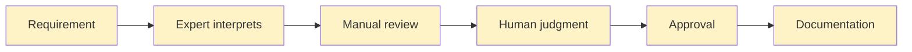
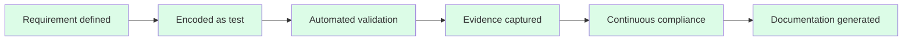
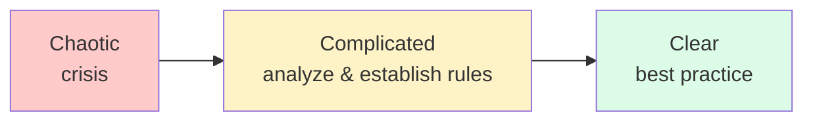

# Understanding Compliance Through Cynefin

> **Why compliance can and should be automated**

## The Cynefin Framework

The Cynefin framework, developed by Dave Snowden, helps us understand different types of problems and choose appropriate responses. It reveals why traditional approaches to compliance fail and why automation succeeds.

### The Four Domains

{ width="800" }

> Cynefin Framework showing Clear, Complicated, Complex, and Chaotic domains with different response patterns
> Source: <https://enliveningedge.org/tools-practices/tour-latest-cynefin-iteration-part-1-framework-dealing-challenges/>

#### Clear Domain (sense-categorize-respond)

- **Characteristics:** Best practices apply, right answer exists
- **Response:** Sense the situation, categorize it, respond with established practice
- **Example:** Following a documented procedure step-by-step
- **Constraints:** Fixed (governed by rules)

#### Complicated Domain (sense-analyze-respond)

- **Characteristics:** Good practices exist, expertise required to determine cause-effect
- **Response:** Sense the situation, analyze with expertise, respond with good practice
- **Example:** Designing a compliance framework, diagnosing a system issue
- **Constraints:** Governing (rules that can be determined)

#### Complex Domain (probe-sense-respond)

- **Characteristics:** Emergent patterns, cause-effect only visible in retrospect
- **Response:** Probe with safe-to-fail experiments, sense patterns, respond to emergence
- **Example:** Organizational change, culture transformation
- **Constraints:** Enabling (boundaries that allow exploration)

#### Chaotic Domain (act-sense-respond)

- **Characteristics:** No discernible patterns, novel situations
- **Response:** Act immediately to establish stability, sense impact, respond
- **Example:** Production outage, crisis management
- **Constraints:** None effective

---

## Where Compliance Actually Lives

### The Common Misunderstanding

Many organizations treat compliance as **Chaotic** or **Complex**:

**Symptoms of this misunderstanding:**

- Every situation feels unique and unprecedented
- Requires expert interpretation case-by-case
- Cannot be predicted or standardized
- Must be handled manually with human judgment
- "Compliance is too complex to automate"
- "Every audit is different"
- "You need an expert to interpret regulations"

### The Reality

Most compliance requirements are actually **Complicated**:

**Characteristics:**

- Cause-and-effect relationships exist and can be determined
- Expert analysis reveals the rules
- Good practices can be established and repeated
- Patterns are consistent and predictable

**Examples:**

- "All patient data modifications must create audit trails" - This is a rule
- "Electronic signatures must be linked to records" - This is a rule
- "Systems must validate user access before operations" - This is a rule
- "Changes must be traceable to requirements" - This is a rule

These aren't emergent patterns that might change—they're governing constraints that can be encoded.

### The Critical Implication

**If compliance is Complicated (not Complex), then it can be automated.**

Rules that can be articulated can be encoded.
Patterns that repeat can be tested.
Requirements that are determinable can be validated automatically.

## Enabling vs. Governing Constraints

The Cynefin framework distinguishes between two types of constraints that map to different domains:

### Enabling Constraints (Complex Domain)

**Purpose:** Create boundaries that allow safe exploration within limits

**Characteristics:**

- Define what you CAN'T do, not what you MUST do
- Allow multiple valid approaches within boundaries
- Enable creativity and emergence
- Support learning and adaptation

**Examples in software:**

- "Keep changes small" - Doesn't specify how small or what to change
- "Deploy frequently" - Doesn't dictate the deployment mechanism
- "Work from trunk" - Doesn't prescribe branch naming or workflow details
- "Use automated tests" - Doesn't specify test frameworks or coverage targets

These create "guard rails" while allowing teams to find their own path.

### Governing Constraints (Complicated Domain)

**Purpose:** Establish fixed rules and procedures that must be followed

**Characteristics:**

- Define exactly what MUST happen
- Prescribe specific behaviors
- Can be validated objectively
- Same result expected every time

**Examples in compliance:**

- "All patient data modifications MUST create audit trails containing: original value, new value, user, timestamp"
- "Electronic signatures MUST be cryptographically linked to signed records"
- "User authentication MUST occur before any data access"
- "All changes MUST be traceable to approved requirements"

These are not guidelines—they're rules that can be right or wrong.

### Why This Distinction Matters

**Governing constraints can be automated.**

If you can write a compliance requirement as a "MUST" statement with objective validation criteria, you can:

1. **Encode it** - Write it as code or configuration
2. **Test it** - Verify it automatically
3. **Enforce it** - Make systems comply by design
4. **Audit it** - Prove compliance with evidence

**Most regulatory requirements are governing constraints.**

The challenge isn't that they CAN'T be automated it's that organizations haven't invested in automating them.

## The Domain Shift

### Traditional Approach: Treating Complicated as Chaotic

This treats each instance as novel, requiring fresh interpretation. It's expensive, slow, and inconsistent.

### Modern Approach: Recognizing Complicated as Automatable

This recognizes the rule is repeatable and codifies it once. It's fast, consistent, and scalable.

---

## The Insight: Shift Left on Complexity

### Instead of Complex (Manual, Expert-Driven)

- Compliance officer reviews changes after development
- QA manually validates regulatory requirements
- Audit prepares evidence retroactively
- Experts interpret requirements case-by-case

### Make it Complicated (Automated, Rule-Based)

- Requirements encoded as executable specifications
- Automated tests validate compliance with every commit
- Evidence captured automatically in version control
- Rules interpreted once, applied consistently

### Eventually Make it Clear (Best Practice, Routine)

- Compliance validation just happens
- Teams don't think about it consciously
- Culture shift: "Of course we validate that"
- New normal

## Moving Between Domains

Cynefin shows us that domains aren't fixed. We can intentionally move practices between them:

**For compliance:**

1. **Start:** Regulations feel chaotic, overwhelming, unpredictable
2. **Analyze:** Expert analysis reveals the actual rules
3. **Encode:** Rules become automated tests (now Complicated)
4. **Routine:** Automation becomes invisible, just how we work (now Clear)

**The goal:** Make compliance so automated it becomes boring.

---

## What This Means

The Cynefin framework reveals a fundamental truth:

**Organizations treat compliance as Complex (requiring expert interpretation) when it's actually Complicated (following determinable rules).**

This misunderstanding drives manual processes, slow delivery, and high costs.

Once you recognize that compliance requirements are **governing constraints** in the **Complicated domain**, the path forward becomes clear:

1. **Analyze** - Expert analysis determines the rules once
2. **Encode** - Rules become executable specifications
3. **Automate** - Validation runs continuously
4. **Routine** - Compliance becomes best practice

This is the foundation of [Everything as Code](paradigm.md) - recognizing that rules can be encoded, and automation can enforce them consistently.

---

## References

- [The Cynefin Framework](https://en.wikipedia.org/wiki/Cynefin_framework)
- [Accelerate](../references.md#accelerate) - Evidence for automation effectiveness
