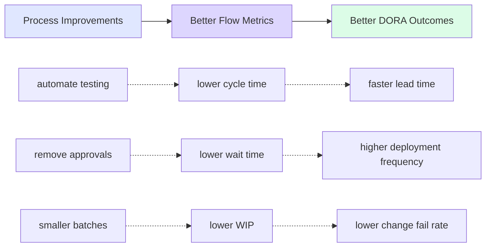

# Measuring and Improving Flow

> **How to continuously optimize delivery performance using DORA metrics and Value Stream Mapping**

## The Continuous Improvement Principle

High-performing teams don't achieve their results through one-time transformation. They achieve them through continuous measurement and improvement.

**The cycle:**

1. **Measure** - Collect data on current performance
2. **Map** - Visualize the value stream to identify bottlenecks
3. **Identify** - Find the biggest constraint
4. **Improve** - Apply automation, remove waste, optimize flow
5. **Validate** - Measure again to confirm improvement
6. **Repeat** - Move to the next bottleneck

This is how "Everything as Code" and continuous improvement work together: automation enables fast delivery, while systematic measurement and improvement ensure that delivery gets faster over time.

---

## Why Measurement Matters

You can't improve what you don't measure.

DORA (DevOps Research and Assessment) has been researching high-performing software teams since 2014. Their research consistently shows that **four key metrics** predict organizational performance:

1. **Lead Time for Changes** - How long from code commit to production
2. **Deployment Frequency** - How often you deploy to production
3. **Mean Time to Recovery (MTTR)** - How quickly you recover from failures
4. **Change Fail Rate** - What percentage of deployments cause failures

**The findings:**

High performers achieve:

- **Lead time**: Less than one day (often hours or minutes)
- **Deployment frequency**: Multiple deployments per day
- **MTTR**: Less than one hour
- **Change fail rate**: 0-15%

Low performers have:

- **Lead time**: One to six months
- **Deployment frequency**: Once per month to once every six months
- **MTTR**: One day to one week
- **Change fail rate**: 46-60%

The gap between high and low performers is **not luck or talent** it's systematic improvement through measurement and automation.

### DORA Metrics as Outcome Indicators

**DORA metrics are outcome metrics** - They measure the results of good practices, not the practices themselves.

**What they tell you:**

- **Long lead time** → You have bottlenecks somewhere in your delivery process
- **Low deployment frequency** → Something is preventing you from deploying more often
- **High MTTR** → Your incident response and recovery processes need improvement
- **High change fail rate** → Your quality and validation processes aren't catching issues

**What they don't tell you:**

- WHERE the bottlenecks are (manual testing? approval gates? large batches?)
- WHAT is causing the problems (lack of automation? too many handoffs? poor tooling?)
- HOW to fix them (automate testing? remove approvals? reduce batch size?)

**Use DORA metrics to identify where you need to improve.** Then measure the underlying **flow metrics** (cycle time, wait time, WIP) and **process metrics** (test coverage, manual steps, review time) that you can actually act on.

**Learn more:**

- [DORA State of DevOps Reports](https://dora.dev/research/)

---

## Value Stream Mapping: Finding the Bottlenecks

**Value Stream Mapping (VSM)** is a lean management practice that visualizes the entire flow of work, from idea to production, and identifies where time is wasted.

### What Gets Mapped

A value stream map shows:

- **Process steps** - Each activity in the delivery process
- **Cycle time** - Time spent actively working on each step
- **Wait time** - Time spent waiting between steps (handoffs, queues, approvals)
- **Lead time** - Total time from start to finish (cycle time + wait time)

**Learn more:**

- [DORA: Value Stream Management](https://dora.dev/guides/value-stream-management/)

---

## What to Measure

Different metrics serve different purposes in the improvement cycle. Understanding which metrics to track helps teams focus on actionable improvements rather than just monitoring outcomes.

### Outcome Metrics (DORA)

DORA metrics show **overall performance** and indicate **where** you need to improve:

- **Long lead time** → Focus on reducing wait time and cycle time
- **Low deployment frequency** → Focus on reducing batch size and increasing automation
- **High MTTR** → Focus on observability, rollback capability, and incident response
- **High change fail rate** → Focus on automated testing, smaller batches, and validation

**Use DORA metrics to identify improvement areas**, not as the only metrics to track. They tell you there's a problem, but not what's causing it.

### Flow Metrics

Flow metrics reveal **where bottlenecks occur** in your value stream:

- **Cycle time per step** - Which activities take the longest?
- **Wait time per step** - Where does work sit idle? (Usually the biggest waste)
- **Work in progress (WIP)** - Where does work pile up?
- **Batch size** - How many changes per deployment? (Smaller is better)
- **Rework rate** - How often does work return to previous steps?

**Use flow metrics from Value Stream Mapping to find constraints.** These metrics help you understand where time is actually being spent or wasted.

### Process Metrics

Process metrics show **what causes bottlenecks**:

- **Automated test coverage** - What percentage of testing is automated?
- **Manual steps count** - How many manual handoffs exist?
- **Review time** - How long do code reviews take?
- **Build/pipeline time** - How long does CI/CD take?
- **Approval wait time** - How long for manual approvals?

**Use process metrics to decide what to automate or improve.** These are the metrics you can directly act on.

### The Relationship

Don't just measure DORA metrics and hope they improve. **Measure the underlying flow and process metrics that you can actually improve**, then validate that those improvements lead to better DORA outcomes.

---

## The Continuous Improvement Cycle

High performers don't optimize once—they optimize continuously.

### Step 1: Measure Current State

Start by measuring metrics that reveal bottlenecks in your delivery flow:

**Outcome metrics (DORA)** - Show overall performance:

- **Lead time** - How long from commit to production
- **Deployment frequency** - How often you deploy
- **MTTR** - How quickly you recover from failures
- **Change fail rate** - What percentage of deployments fail

**Flow metrics** - Reveal where bottlenecks occur:

- **Cycle time per step** - How long each activity takes (coding, review, testing, deployment)
- **Wait time per step** - How long work waits between activities (queue time, approval delays)
- **Work in progress (WIP)** - How many items are in flight at each stage
- **Batch size** - How many changes in each deployment
- **Rework rate** - How often work returns to previous steps

**Process metrics** - Show what causes bottlenecks:

- **Automated test coverage** - What percentage of testing is automated
- **Manual steps count** - How many manual handoffs exist
- **Review time** - How long code reviews take
- **Build time** - How long CI/CD pipelines take

**The connection**:

- Poor DORA metrics (long lead time, low deployment frequency) indicate problems
- Flow metrics reveal WHERE the problems are (long wait times, large batch sizes)
- Process metrics show WHAT to fix (manual testing, manual approvals)

**Everything as Code enables measurement** - Version control and automated pipelines provide the data automatically.

**Start where it makes sense**: You don't need to measure everything immediately. Start with metrics that help you identify your biggest bottleneck.

### Step 2: Map the Value Stream

Run a Value Stream Mapping workshop:

1. Select a recent feature that went to production
2. Map all steps from idea to deployment
3. Estimate cycle time and wait time for each stesp
4. Calculate total lead time
5. Identify the biggest sources of wait time

**The goal:** Find the constraint—the step that causes the most delay.

### Step 3: Identify the Constraint

Use the **Theory of Constraints** principle: improving the bottleneck has the biggest impact on overall flow.

Common bottlenecks:

- Manual testing (days of waiting)
- Manual approval gates (days of waiting)
- Manual deployment (hours + risk of errors)
- Infrequent integration (merge conflicts, coordination delays)
- Large batch sizes (weeks of work = high risk = more waiting)

### Step 4: Improve the Constraint

Apply automation and process changes to eliminate or reduce the bottleneck:

- **Automated testing** - Replace manual test cycles with instant feedback
- **Automated validation** - Replace manual approvals with policy enforcement
- **Continuous deployment** - Replace manual deployments with automated pipelines
- **Trunk-based development** - Replace long-lived branches with frequent integration
- **Smaller batch sizes** - Replace large releases with frequent small deployments

### Step 5: Validate the Improvement

Measure again to confirm the improvement worked:

**Did the local metric improve?**

- If you automated testing: Did test cycle time decrease?
- If you removed approval gates: Did wait time decrease?
- If you implemented continuous deployment: Did deployment frequency increase?

**Did DORA metrics improve?**

- Check if the local improvement affected overall lead time, deployment frequency, etc.
- Sometimes local improvements take time to show up in DORA metrics
- Multiple local improvements compound to DORA metric improvement

**If yes**: The improvement worked. Document it and move to the next constraint.

**If no**:

- The bottleneck might be elsewhere
- The improvement might not have had the expected impact
- Try a different approach or dig deeper to understand why

### Step 6: Repeat

Continuous improvement is continuous. There's always a next bottleneck to address.

**The compound effect:** Small improvements add up over time. Reducing lead time by 20% every quarter compounds to transformational change over a year.

---

## Flow Engineering Workshops

[Flow Engineering](https://flowengineering.org/) is a structured approach to improving software delivery flow through collaborative workshops.

**The workshop sequence:**

1. **Outcome Mapping** - Define desired business and technical outcomes
2. **Value Stream Mapping** - Visualize current flow and identify bottlenecks
3. **Dependency State Mapping** - Analyze dependencies and coordination challenges
4. **Desired State Mapping** - Envision the ideal future state
5. **Flow Roadmap** - Create a prioritized plan for improvement

These workshops provide a systematic framework for teams to identify improvement opportunities and align on a shared vision for optimizing delivery flow.

**Learn more:**

- [Flow Engineering Book](../references.md#flow-engineering---from-value-stream-mapping-to-effective-actions)
- [Flow Engineering Quick Start Guide](../../assets/lfs/pdf/Flow_Engineering_Quick_Start_Guide.pdf)
