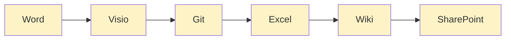
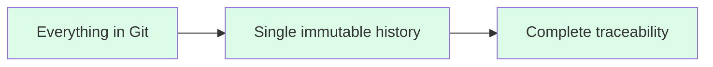
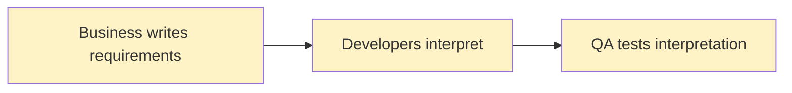
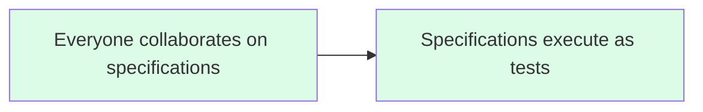
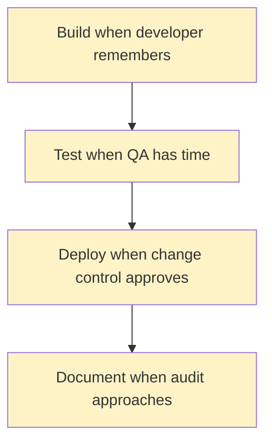
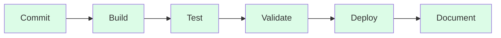

# The "Everything as Code" Paradigm

> **What it means to treat everything as version-controlled, executable artifacts**

## What "Everything as Code" Means

"Everything as Code" is the practice of representing all aspects of your system lifecycle as version-controlled, executable, machine-readable artifacts.

### Not Just Infrastructure

Most teams are familiar with:

- **Infrastructure as Code** - Terraform, CloudFormation, Ansible
- **Configuration as Code** - YAML, JSON, environment variables

But "Everything as Code" extends much further:

- **Specifications as Code** - Requirements that execute as automated tests
- **Documentation as Code** - Living docs generated from code and specifications
- **Compliance as Code** - Regulatory requirements enforced automatically
- **Policy as Code** - Governance rules that run in CI/CD pipelines
- **Architecture as Code** - Design decisions captured in executable form

### The Core Principle

**If it can be represented as text, it can be versioned.**
**If it can be versioned, it can be reviewed.**
**If it can be reviewed, it can be tested.**
**If it can be tested, it can be automated.**

## The Three Fundamental Changes

"Everything as Code" creates three fundamental changes in how teams work:

### Single Timeline for Traceability

#### Traditional Approach: Multiple Disconnected Systems

**Problems:**

- Six different systems with six different timelines
- Manual correlation required
- Version mismatches inevitable
- Traceability reconstructed retroactively
- Audit trail compilation takes weeks

#### Everything as Code Approach: Single Source of Truth

**Benefits:**

- All artifacts in one version control system
- Single timeline from requirement to deployment
- Automatic correlation through commits
- Cryptographic integrity (Git SHA hashes)
- Traceability exists in real-time
- Audit trail always available

### Building Shared Language: Domain-Driven Design

Before teams can collaborate through executable specifications, they need a **shared language**—a common vocabulary that both business stakeholders and developers understand.

**The challenge**: Business and technical teams often speak different languages:

- Business: "The customer's order is fulfilled"
- Technical: "The transaction state transitions to complete"

This misalignment causes:

- Specifications that don't reflect business intent
- Rework when teams discover they meant different things
- Tests that pass but don't validate actual business rules

**The solution**: **Domain-Driven Design (DDD)** provides techniques for building a **Ubiquitous Language**—a rigorous, shared vocabulary based on the domain model.

**How it works**:

1. **Event Storming** - Collaborative domain discovery surfaces shared vocabulary
2. **Example Mapping** - Uses that vocabulary to define requirements
3. **Executable Specifications** - Written using the same language, ensuring alignment

When specifications use the Ubiquitous Language:

- Business stakeholders can read and validate them
- Developers implement exactly what the business means
- QA tests reflect actual business rules
- Living documentation uses terms everyone understands

For more on building shared language for specifications, see:

- [Ubiquitous Language](../specifications/ubiquitous-language.md) - DDD foundation
- [Event Storming](../specifications/event-storming.md) - Domain discovery workshops

### Collaboration Through Executable Specifications

#### Traditional Approach: Telephone Game

**Problems:**

- Three different mental models
- Inevitable misalignment
- "Not what I meant" feedback loops
- Ambiguous requirements
- Test cases don't match intent

#### Everything as Code Approach: Shared Language + Executable Specifications

**Benefits:**

- Single shared language (Gherkin)
- Readable by all stakeholders
- Executable by automation
- Impossible to drift from implementation
- Immediate feedback on misunderstanding

**In this project:**

- All stakeholders collaborate on a single `specification.feature` file using Gherkin
- File contains Feature → Rule → Scenario structure
  - **Rules** define acceptance criteria (ATDD layer)
  - **Scenarios** under Rules provide concrete examples (BDD layer)
- Specifications execute as automated tests, ensuring alignment
- When tests pass, requirements are met by definition
- Business-readable language bridges stakeholder communication

### Continuous Automation With Every Change

#### Traditional Approach: Manual Gates

**Problems:**

- Validation delayed until late
- Manual steps can be skipped
- Inconsistent execution
- Batch processing creates risk
- Bottlenecks slow delivery

#### Everything as Code Approach: Automated Pipeline

**Benefits:**

- Build automatically on every commit
- Test automatically with every build
- Validate compliance in pipeline
- Deploy automatically when tests pass
- Document automatically from code/tests
- Every change is validated identically
- Feedback in minutes, not weeks

## The Value Proposition

| Aspect | Manual Approach | Everything as Code |
|--------|----------------|-------------------|
| **Traceability** | Reconstructed retroactively, gaps likely | Complete immutable history, cryptographically verified |
| **Documentation** | Created after the fact, often incomplete | Auto-generated, always current, never drifts |
| **Testing** | Sample-based, may miss edge cases | 100% execution on every change |
| **Reviews** | Can be skipped under pressure | Enforced by automation (branch protection) |
| **Audit Trail** | Compiled from logs, may be incomplete | Complete Git history with all context |
| **Reproducibility** | "Works on my machine" syndrome | Deterministic builds, identical environments |
| **Compliance Validation** | Weeks of manual checking | Minutes of automated validation |
| **Knowledge Transfer** | Tribal knowledge in people's heads | Encoded in executable specifications |
| **Risk** | Accumulates in large batches | Distributed across small, frequent changes |
| **Audit Preparation** | Months of evidence compilation | Always audit-ready, evidence exists |
| **Consistency** | Varies by person, day, pressure | Identical every time |
| **Scalability** | Limited by human capacity | Scales with compute resources |

---

## Key Principles

"Everything as Code" operates on several key principles:

### Version Everything

If it matters, version it:

- Requirements and specifications
- Source code (obviously)
- Tests at all levels
- Infrastructure definitions
- Configuration
- Documentation
- Architecture decisions
- Compliance policies
- Deployment scripts

### Make It Executable

Passive documents drift. Executable artifacts stay current:

- Specifications run as tests
- Architecture diagrams generated from code
- Documentation built from source
- Policies enforced in pipelines

### Automate Validation

Humans forget. Automation is consistent:

- Every commit triggers validation
- Tests run identically every time
- No manual steps in critical path
- Failure stops progression

### Capture Evidence Continuously

Don't reconstruct—capture as you go:

- Version control is audit trail
- Test results are compliance evidence
- Build artifacts are reproducible
- Documentation auto-generated

### Single Source of Truth

Duplication causes drift:

- One repository for related artifacts
- Generate derived artifacts from source
- Link, don't duplicate
- Git is the authority

---

## References

- [Accelerate: The Science of Lean Software and DevOps](../references.md#accelerate)
- [The DevOps Handbook](../references.md#the-devops-handbook)
- [Continuous Delivery](../references.md#continuous-delivery)
