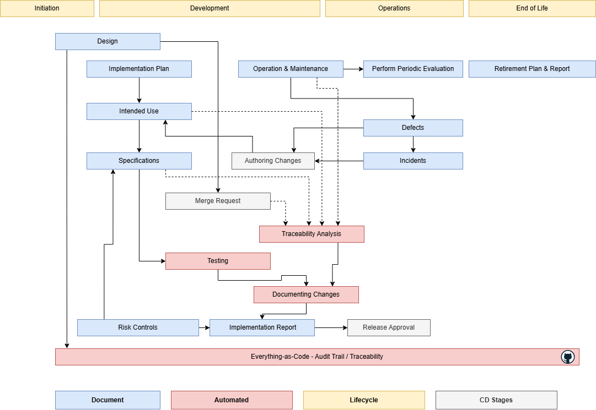

# Software Delivery Lifecycle

This lifecycle ensures that regulatory requirements are met while maintaining efficiency and enabling continuous delivery.

- **Documents** marked as ●
    These are documents that are created manually, typically written in Markdown format and Gherkin for specifications. The files are then processed to generate the required compliance artifacts.
- **Process** marked as ●
  These artifacts are designed to seamlessly integrate into the team's workflow, ensuring full traceability of changes.
  It is crucial that all required work is directly linked to the corresponding code changes.

