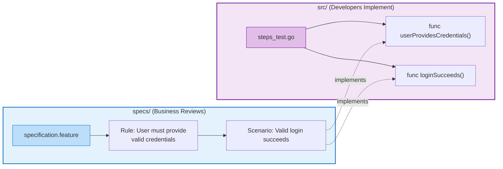
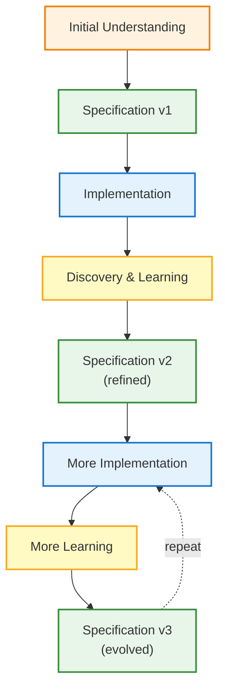

# ATDD and BDD with Gherkin Rule Blocks

Understanding how Acceptance Test-Driven Development and Behavior-Driven Development work together using unified Gherkin format.

---

## The Unified Approach

This project maintains the conceptual distinction between ATDD (acceptance criteria) and BDD (behavior scenarios) while using a single unified format: Gherkin.

### ATDD Layer: Rule Blocks

- **Purpose**: Define acceptance criteria
- **Format**: `Rule:` blocks in Gherkin
- **Location**: `specs/<module>/<feature>/specification.feature`
- **Origin**: Blue cards from Example Mapping
- **Audience**: Product owners, stakeholders, QA
- **Focus**: WHAT the system must do

### BDD Layer: Scenario Blocks

- **Purpose**: Executable behavior examples
- **Format**: `Scenario:` blocks under Rules
- **Location**: `specs/<module>/<feature>/specification.feature` (same file as Rules)
- **Implementation**: `src/<module>/tests/steps_test.go` (separate from specification)
- **Origin**: Green cards from Example Mapping
- **Audience**: Developers, QA, automation engineers
- **Focus**: HOW the system behaves (described in specs/, implemented in src/)

### Architectural Principle: Specs vs Implementation

**IMPORTANT**: This documentation emphasizes the separation between:

- **Specifications** (in `specs/`): Business-readable Gherkin describing WHAT
- **Implementations** (in `src/`): Technical Go code describing HOW



---

## What is ATDD?

**Acceptance Test-Driven Development (ATDD)** is a collaborative approach where business stakeholders, developers, and testers define acceptance criteria **before** development begins. It focuses on capturing business value and measurable success criteria from the customer's perspective.

### Core Purpose

ATDD answers the question: **"What does 'done' mean for this feature?"**

By defining acceptance criteria upfront, all stakeholders agree on:

- What business value the feature delivers
- How success will be measured
- What conditions must be satisfied for acceptance

### Why Use ATDD?

- **Business Alignment**
  - **Problem:** Developers build features that don't meet business needs
  - **Solution:** ATDD ensures everyone agrees on requirements before coding starts
- **Reduced Rework**
  - **Problem:** Discovering missing requirements after implementation
  - **Solution:** ATDD catches misunderstandings early through collaborative discussion
- **Measurable Success**
  - **Problem:** Subjective acceptance ("Does this look good?")
  - **Solution:** ATDD requires measurable criteria (e.g., "Creates 3 directories", "Completes in <2s")
- **Stakeholder Collaboration**
  - **Problem:** Product owners can't review technical test code
  - **Solution:** ATDD uses natural language (Gherkin) that stakeholders can read and validate

---

## What is BDD?

**Behavior-Driven Development (BDD)** is a specification technique that describes user-facing behavior through concrete examples. BDD focuses on **observable behavior** - what users can see and interact with, not internal implementation details.

### Core Purpose

BDD answers the question: **"How does the system behave from the user's perspective?"**

By writing scenarios in natural language (Given/When/Then), teams create:

- Shared understanding of expected behavior
- Executable specifications that become automated tests
- Living documentation that stays synchronized with code

### Why Use BDD?

- **Common Language**
  - **Problem:** Developers, testers, and product owners speak different languages
  - **Solution:** BDD uses Gherkin (Given/When/Then), which is readable by all stakeholders
- **Focus on Behavior**
  - **Problem:** Tests focus on implementation details that change frequently
  - **Solution:** BDD tests describe **what the system does**, not **how it does it**
- **Living Documentation**
  - **Problem:** Documentation becomes outdated
  - **Solution:** BDD scenarios are executable — if they pass, the documentation is accurate

---

## Gherkin and the Ubiquitous Language

BDD scenarios are most effective when written using the **Ubiquitous Language** from Domain-Driven Design. The shared vocabulary that both business and technical teams understand.

### Why This Matters

**Using technical language** (harder for business to validate):

```gherkin
Given the database record exists
When the API endpoint is called
Then the response code should be 200
```

**Using Ubiquitous Language** (clear to all stakeholders):

```gherkin
Given an order awaiting approval
When the manager approves the order
Then the order status should be "Approved"
```

The second version uses domain terms that:

- Business stakeholders recognize and can validate
- Developers implement using the domain model
- QA tests reflect actual business rules

**Best practice**: Before writing specifications, participate in Event Storming and Example Mapping workshops to establish the shared language.

See: [Ubiquitous Language](./ubiquitous-language.md) for DDD foundation and [Event Storming](./event-storming.md) for domain discovery workshops

---

## Requirements Discovery with Example Mapping

Requirements for features are discovered through **Example Mapping**, a collaborative workshop technique that uses colored index cards to surface acceptance criteria (Blue cards → Rules) and concrete examples (Green cards → Scenarios).

### Card to Gherkin Mapping

| Card Color | Represents | Maps To | Location |
|-----------|------------|---------|----------|
| 🟡 **Yellow** | User Story | Feature description | `specs/` |
| 🔵 **Blue** | Acceptance Criteria | `Rule:` blocks (ATDD) | `specs/` |
| 🟢 **Green** | Concrete Examples | `Scenario:` blocks (BDD) | `specs/` |
| 🔴 **Red** | Questions/Unknowns | issues.md | `specs/` |
| N/A | Step Implementation | Go functions | `src/` |

**Workshop Format**:

- 15-25 minutes, time-boxed
- Collaborative: Product Owner + Developer + Tester
- Produces cards that map directly to Gherkin elements
- Surfaces questions and risks early

**Result**: A feature is ready to implement when you have:

- 1 Yellow Card (user story)
- 2-6 Blue Cards (acceptance criteria)
- 2-4 Green Cards per Blue Card (examples)
- Few or no Red Cards (questions resolved)

**See**: [Example Mapping Guide](./example-mapping.md) for complete workshop process, best practices, and detailed examples.

---

## From Discovery to Implementation

The complete workflow proceeds through these phases:

1. **Discovery**: Example Mapping workshop → produces colored cards
2. **Specification**: Convert cards → Gherkin in `specs/`
3. **Implementation**: Write step definitions in `src/` → implement features
4. **Validation**: All scenarios pass → feature complete

**Key Points**:

- **Before development**: Run Example Mapping, write specifications in `specs/`
- **During development**: Implement steps in `src/`, write unit tests, implement features
- **After development**: All scenarios pass = acceptance criteria met

**See**: [Three-Layer Approach](./three-layer-approach.md) for detailed workflow showing how ATDD, BDD, and TDD integrate throughout the development lifecycle.

---

## Key Principles

### Measurable Acceptance Criteria

**Bad** (subjective):

```gherkin
Rule: The interface is user-friendly
Rule: Performance is good
Rule: Error messages are helpful
```

**Good** (measurable):

```gherkin
Rule: Creates 3 directories (src/, tests/, docs/)
Rule: Command completes in under 2 seconds
Rule: Error message contains "already initialized" text
```

### Collaboration Before Code

ATDD and BDD are **collaborative** - they require:

- Product Owner (business perspective)
- Developer (technical perspective)
- Tester (quality perspective)

**Don't**: Have developers write specifications alone
**Do**: Run Example Mapping workshop with all roles present

### Acceptance Criteria Drive Development

Acceptance criteria define "done":

- Development starts when criteria are clear
- Development ends when all criteria pass
- No "scope creep" mid-implementation

### Living Documentation

Gherkin specifications serve as:

- **Requirements documentation** (what the feature does)
- **Automated tests** (validation that it works)
- **Audit trail** (proof of testing for compliance)

All in one place, always up to date.

### Behavior Over Implementation

Focus on **what** the system does, not **how** it does it:

**Bad**:

```gherkin
When the ConfigManager loads the file
And the YAML parser deserializes the content
Then the Config struct is populated
```

**Good**:

```gherkin
When I run "r2r init"
Then a file named "r2r.yaml" should be created
And the configuration should contain default values
```

---

## Specifications Evolve with Understanding

Specifications are not static artifacts written once and frozen. They are **living documents** that evolve as your understanding deepens through implementation, usage, and feedback.

### Initial Specification

After Example Mapping, you might write:

```gherkin
Feature: cli_user-registration

  Rule: Users must provide contact information

    @success @ac1
    Scenario: User provides email
      Given I am registering a new account
      When I provide my email "user@example.com"
      Then my account should be created
      And I should see "Registration successful"
```

**What we knew**: Users need to provide an email to register.

### After Implementation Learning

During implementation, you discover:

- Email validation requirements (TDD reveals format rules)
- Verification workflow (not just storage)
- Error cases (what if email already exists?)

Updated specification:

```gherkin
Feature: cli_user-registration

  Rule: Users must provide verified contact information

    @success @ac1
    Scenario: User provides valid email format
      Given I am registering a new account
      When I provide my email "user@example.com"
      Then I should receive a verification email
      And my account should be in "pending verification" status
      And I should see "Check your email to verify your account"

    @error @ac1
    Scenario: User provides invalid email format
      Given I am registering a new account
      When I provide my email "not-an-email"
      Then I should see an error "Invalid email format"
      And my account should not be created

    @error @ac1
    Scenario: User provides already registered email
      Given an account exists with email "existing@example.com"
      When I provide my email "existing@example.com"
      Then I should see an error "Email already registered"
      And I should be directed to password reset
```

**What changed**:

- **Rule refined**: "contact information" → "verified contact information"
- **Scenario expanded**: Added verification workflow steps
- **Edge cases added**: Invalid format, duplicate email
- **Acceptance criteria clarified**: Actual behavior now explicit

### After Production Use

After users interact with the feature, you learn:

- Typos are common (help users correct them)
- Verification emails go to spam (provide resend option)
- Users forget which email they used (need lookup)

Further updated specification:

```gherkin
Feature: cli_user-registration

  Rule: Users must provide verified contact information with error recovery

    @success @ac1
    Scenario: User provides valid email format
      Given I am registering a new account
      When I provide my email "user@example.com"
      Then I should receive a verification email
      And my account should be in "pending verification" status
      And I should see "Check your email to verify your account"
      And I should see "Didn't receive it? Resend verification email"

    @success @ac1
    Scenario: User corrects email typo before verification
      Given I registered with email "user@exampl.com"
      And I have not yet verified my email
      When I run "simply account update-email --new user@example.com"
      Then my verification email should be resent to "user@example.com"
      And I should see "Verification email sent to updated address"

    @error @ac1
    Scenario: User provides invalid email format
      Given I am registering a new account
      When I provide my email "not-an-email"
      Then I should see an error "Invalid email format"
      And I should see a suggestion "Did you mean: not-an-email@gmail.com?"
      And my account should not be created

    @error @ac1
    Scenario: User provides already registered email
      Given an account exists with email "existing@example.com"
      When I provide my email "existing@example.com"
      Then I should see "This email is already registered"
      And I should see "Forgot your password? Reset it here"
      And I should not create a duplicate account
```

**What changed**:

- **Rule expanded**: Added "with error recovery" (learned from user behavior)
- **Scenarios added**: Email correction, typo suggestions
- **User guidance**: Added helpful error messages and next steps
- **Real-world refinement**: Specs now match actual user needs

### Evolution Triggers

Update specifications when:

| Trigger | Example | Action |
|---------|---------|--------|
| **Implementation reveals** | TDD finds edge case | Add error scenario |
| **Stakeholder feedback** | "This isn't what I meant" | Refine acceptance criteria |
| **Production bugs** | Users encounter unexpected behavior | Add regression scenario |
| **Domain evolution** | Business process changes | Update Rules and scenarios |
| **Language refinement** | Team adopts clearer terminology | Refactor scenario language |
| **Requirements change** | New regulatory requirement | Add compliance scenarios |

### Maintaining Specification Quality

As specifications evolve:

✅ **Do**:

- Update specifications **immediately** when you learn something new
- Refactor for clarity as understanding deepens
- Keep specifications synchronized with implementation
- Document why changes were made (commit messages)

❌ **Don't**:

- Leave specifications unchanged while code evolves
- Accumulate "specification debt" to fix later
- Let scenarios become outdated documentation
- Treat specifications as write-once artifacts

### The Evolution Cycle



**Remember**: Each iteration brings you closer to a specification that accurately captures both the **intended behavior** and the **actual behavior** of your system.

---

## Related Documentation

- [Three-Layer Testing Approach](./three-layer-approach.md) - How ATDD/BDD/TDD work together
- [Ubiquitous Language](./ubiquitous-language.md) - DDD and shared vocabulary foundation
- [Event Storming](./event-storming.md) - Domain discovery workshops
- [Example Mapping](./example-mapping.md) - Requirements discovery workshops
- [Gherkin File Organization](./gherkin-concepts.md) - How to structure and organize specifications
- [Review and Iterate](review-and-iterate.md) - Detailed evolution practices
