# Example Mapping

Workshop technique for discovering requirements through collaborative conversation in 15-25 minutes.

---

## What is Example Mapping?

**[Example Mapping](https://cucumber.io/blog/bdd/example-mapping-introduction/)** is a time-boxed collaborative workshop that uses colored index cards to discover acceptance criteria and concrete examples before development begins.

**Core purpose**: Answers three questions:

1. What does this feature need to do? (Acceptance criteria)
2. What are concrete examples? (Test scenarios)
3. What don't we know yet? (Questions and risks)

**Prerequisites**: Establish **Ubiquitous Language** through **Event Storming** first. See: [Event Storming](./event-storming.md) and [Ubiquitous Language](./ubiquitous-language.md)

**Why use it?** Discovers requirements early (15-25 min conversation vs days/weeks of coding), produces concrete measurable criteria (not subjective), creates fast feedback loop, builds collaborative understanding.

---

## The Four Card Colors

| Color | Purpose | Maps to Gherkin | Quantity |
|-------|---------|-----------------|----------|
| 🟡 **Yellow** | User Story: WHO, WHAT, WHY | Feature description | 1 per feature |
| 🔵 **Blue** | Acceptance Criteria: Success conditions | `Rule:` blocks (ATDD) | 2-6 per story |
| 🟢 **Green** | Concrete Examples: Specific scenarios | `Scenario:` blocks (BDD) | 2-4 per criterion |
| 🔴 **Red** | Questions/Unknowns: Blockers | issues.md | 0-N (fewer is better) |

### Card Guidelines

**Yellow** (User Story):

```text
As a [role]
I want [capability]
So that [business value]
```

**Blue** (Rules): Measurable business rules

- ✅ "Creates 3 directories (src/, tests/, docs/)"
- ❌ "Interface is user-friendly" (not measurable)

**Green** (Examples): [Context] → [Action] → [Result]

- ✅ "Empty folder → init → creates src/, tests/, docs/"
- ❌ "It creates directories" (too abstract)

**Red** (Questions): Capture without solving during workshop

- "What if r2r.yaml already exists?"
- "Should we support a --force flag?"

---

## Workshop Process

**Participants**: Product Owner + Developer + Tester
**Duration**: 15-25 minutes (strictly time-boxed)

### Steps

1. **Place Yellow Card** (2 min) - Write user story
2. **Generate Blue Cards** (8-12 min) - Brainstorm 2-6 acceptance criteria
3. **Create Green Cards** (5-10 min) - Write 2-4 concrete examples per Blue Card
4. **Capture Red Cards** (ongoing) - Write down questions, don't solve them
5. **Assess Readiness** (2 min) - Ready to implement, too large, or too uncertain?

### Readiness Assessment

**✅ Ready**: 2-6 Blue Cards, 2-4 Green Cards each, few Red Cards
**⚠️ Too Large**: >6 Blue Cards or >25 minutes → Split into multiple features
**❌ Too Uncertain**: >3 blocking Red Cards → Research spike, then re-run

---

## Visual Layout

```mermaid
flowchart TD
    Yellow["🟡 User Story<br/>As a developer..."]

    Yellow --> Blue1["🔵 AC 1<br/>Creates dirs"]
    Yellow --> Blue2["🔵 AC 2<br/>Generates config"]
    Yellow --> Blue3["🔵 AC 3<br/>Handles errors"]

    Blue1 --> Green1a["🟢 Example 1a"]
    Blue1 --> Green1b["🟢 Example 1b"]

    Blue2 --> Green2a["🟢 Example 2a"]
    Blue2 --> Green2b["🟢 Example 2b"]

    Blue3 --> Green3a["🟢 Example 3a"]
    Blue3 --> Green3b["🟢 Example 3b"]

    Red1["🔴 What if config exists?"]
    Red2["🔴 Support --force flag?"]

    style Yellow fill:#FFD700
    style Blue1 fill:#4169E1,color:#fff
    style Blue2 fill:#4169E1,color:#fff
    style Blue3 fill:#4169E1,color:#fff
    style Green1a fill:#32CD32
    style Green1b fill:#32CD32
    style Green2a fill:#32CD32
    style Green2b fill:#32CD32
    style Green3a fill:#32CD32
    style Green3b fill:#32CD32
    style Red1 fill:#DC143C,color:#fff
    style Red2 fill:#DC143C,color:#fff
```



**Workshop tips**: Use physical cards on table (or Miro/Mural for virtual), everyone can add cards, take photos for documentation.

---

## From Cards to Gherkin

```mermaid
flowchart LR
    subgraph Workshop["Example Mapping Cards"]
        Yellow["🟡 Yellow<br/>User Story"]
        Blue["🔵 Blue<br/>AC"]
        Green["🟢 Green<br/>Example"]
        Red["🔴 Red<br/>Question"]
    end

    subgraph Spec["specification.feature"]
        Feature["Feature:<br/>description"]
        Rule["Rule:<br/>AC block"]
        Scenario["Scenario:<br/>under Rule"]
    end

    subgraph Issues["issues.md"]
        Issue["## Questions"]
    end

    Yellow --> Feature
    Blue --> Rule
    Green --> Scenario
    Red --> Issue

    style Yellow fill:#FFD700
    style Blue fill:#4169E1,color:#fff
    style Green fill:#32CD32
    style Red fill:#DC143C,color:#fff
```



### Example Conversion

**Workshop Cards**:

```text
🟡 As a developer, I want to initialize a CLI project with one command
🔵 [BLUE-1] Creates project directory structure
🟢 [GREEN-1a] Empty folder → init → creates src/, tests/, docs/
🟢 [GREEN-1b] Existing project → init → error "already initialized"
```

**Resulting Gherkin** (`specs/cli/init-project/specification.feature`):

```gherkin
@cli @critical
Feature: cli_init-project

  As a developer
  I want to initialize a CLI project with one command
  So that I can quickly start development

  Rule: Creates project directory structure

    @success @ac1
    Scenario: Initialize in empty directory creates structure
      Given I am in an empty folder
      When I run "r2r init my-project"
      Then a directory named "my-project/src/" should exist
      And a directory named "my-project/tests/" should exist
      And a directory named "my-project/docs/" should exist

    @error @ac1
    Scenario: Initialize in existing project shows error
      Given I am in a directory with "r2r.yaml"
      When I run "r2r init"
      Then the command should fail
      And stderr should contain "already initialized"
```

---

## After the Workshop

### Immediate (Same Day)

1. **Write specification.feature** - Convert cards to Gherkin while context is fresh
2. **Share for review** - Product Owner, Developers, QA validate
3. **Document Red Cards** - Create `issues.md` with ownership and deadlines

### Short-term (1-2 Days)

1. **Incorporate feedback** - Refine ambiguous steps, add missing criteria
2. **Resolve Red Cards** - Research, mini-sessions, spike implementations
3. **Confirm scope** - All three amigos agree before implementation starts

### During Implementation (1 Week)

1. **Discover edge cases** - TDD reveals boundary conditions → Add scenarios
2. **Refine language** - Vague steps become precise → Update specification
3. **Keep synchronized** - Commit spec changes with code changes

### After Implementation

1. **Retrospective review** - Did spec match what was built?
2. **Refactor for clarity** - Consolidate duplicates, simplify verbose scenarios
3. **Document lessons learned** - Improve next workshop

**Remember**: Specifications are **living documents**. They evolve through discovery, feedback, refinement, and iteration. See: [Review and Iterate](review-and-iterate.md)

---

## Best Practices

### Do's ✅

- Time-box strictly (25 min max)
- Use domain language from Event Storming
- Be specific: "Creates 3 directories" not "Creates directories"
- Include error cases (at least one per Blue Card)
- Set Red Cards aside (don't solve during workshop)
- Invite all three amigos (Product + Dev + Test)

### Don'ts ❌

- Don't make Blue Cards subjective → Use measurable criteria
- Don't use abstract Green Cards → Use specific input/output
- Don't debate Red Cards → Write down, resolve later
- Don't exceed 6 Blue Cards → Split the feature
- Don't skip edge cases → Error scenarios matter

---

## Common Anti-Patterns

❌ **Solution in User Story**: "I want a YAML config file" → ✅ "I want to configure my CLI tool"
❌ **Unmeasurable criteria**: "Performance is good" → ✅ "Completes in <2 seconds"
❌ **Too many Green Cards**: 10+ examples for one Blue Card → ✅ Split into multiple Blue Cards
❌ **Implementation details**: "Parser loads YAML → deserializes" → ✅ "Valid YAML → init succeeds"

---

## When to Split Features

Split when:

- **>6 Blue Cards** - Group related criteria into separate features
- **Workshop >25 minutes** - Prioritize and split
- **Every Blue Card has 6+ Green Cards** - Keep MVP, defer edge cases

---

## See Also

- [ATDD and BDD with Gherkin](./atdd-bdd-with-gherkin.md) - Concepts behind specifications
- [Three-Layer Approach](./three-layer-approach.md) - How Example Mapping fits the workflow
- [Review and Iterate](review-and-iterate.md) - Maintaining living specifications
- [Create Feature Spec](../../how-to-guides/specifications/create-specifications.md) - Step-by-step conversion guide
- [Gherkin Format](../../reference/specifications/gherkin-format.md) - Syntax reference
