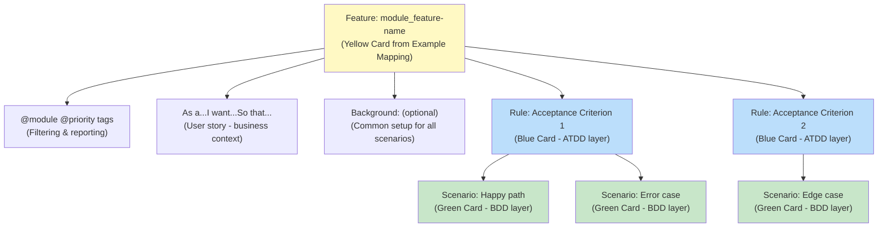

# Gherkin File Organization

Understanding how to structure and organize Gherkin specification files effectively.

---

## Purpose

This guide explains **how to organize Gherkin files** for maintainability and clarity. For understanding ATDD/BDD concepts, see [ATDD and BDD with Gherkin](./atdd-bdd-with-gherkin.md).

---

## File Structure Philosophy

### Specifications vs Implementation

The project maintains strict separation:

```text
specs/<module>/<feature>/
└── specification.feature    ← WHAT the system should do (business-readable)

src/<module>/tests/
└── steps_test.go            ← HOW to verify (technical implementation)
```

**Why separate?**

- **Business reviews specs** without seeing technical code
- **Developers refactor implementations** without changing specs (if behavior unchanged)
- **Specifications evolve with business**, implementations evolve with technology
- **Clear ownership**: Product Owners review specs/, Developers review src/

### Feature Hierarchy

Every feature file follows this hierarchy:



**Design principle**: Each level serves a distinct purpose and audience.

---

## Organizing Rules

### What Makes a Good Rule?

Rules define **acceptance criteria** - the conditions that must be satisfied for the feature to be accepted by stakeholders.

**Good Rules are**:

- **Measurable**: Objective criteria, not subjective opinions
- **Business-focused**: Expressed in domain language, not technical terms
- **Independent**: Each Rule can be validated separately
- **Granular**: One clear acceptance criterion per Rule

**Example: Bad Rules** (subjective, vague):

```gherkin
Rule: The system is user-friendly

Rule: Performance is acceptable

Rule: Error handling works correctly
```

**Example: Good Rules** (measurable, specific):

```gherkin
Rule: All modules must be shown with their type and path

Rule: Command completes in under 2 seconds for projects with 100 files

Rule: Missing configuration file displays error with path and suggestion
```

### How Many Rules Per Feature?

| Rule Count | Assessment | Action |
|-----------|-----------|--------|
| **2-4** | ✅ Ideal | Good feature scope |
| **5-6** | ✅ Acceptable | Monitor complexity |
| **7-10** | ⚠️ Large | Consider splitting |
| **>10** | ❌ Too large | Must split feature |

**Why limit Rules?**

- **Cognitive load**: More than 6 acceptance criteria becomes hard to reason about
- **Feature scope**: Large Rule count suggests feature does too much
- **Maintainability**: Smaller features are easier to review and update
- **Testing**: Fewer Rules = faster, more focused test execution

**How to split**: Create focused features by domain concept or user workflow.

**Before** (12 Rules - too many):

```text
Feature: project_validation
  Rule: File structure must be valid
  Rule: Configuration must be valid
  Rule: Dependencies must be valid
  Rule: Module boundaries must be respected
  Rule: Naming conventions must be followed
  Rule: Documentation must exist
  Rule: Tests must exist
  Rule: Coverage must meet threshold
  Rule: Performance benchmarks must pass
  Rule: Security checks must pass
  Rule: Linting must pass
  Rule: Type checking must pass
```

**After** (split into 3 features with 4 Rules each):

```text
Feature: project_structure-validation
  Rule: File structure must be valid
  Rule: Configuration must be valid
  Rule: Module boundaries must be respected
  Rule: Naming conventions must be followed

Feature: project_quality-validation
  Rule: Tests must exist with minimum coverage
  Rule: Documentation must exist for public APIs
  Rule: Performance benchmarks must pass
  Rule: Linting must pass

Feature: project_security-validation
  Rule: Dependencies must have no known vulnerabilities
  Rule: Security checks must pass (SAST)
  Rule: Secrets must not be committed
  Rule: Authentication must be enforced
```

---

## Organizing Scenarios

### Scenario Coverage Strategy

Each Rule typically needs **2-4 scenarios**:

1. **Happy path** - Primary use case
2. **Error cases** - How system handles failures
3. **Edge cases** - Boundary conditions, special states

**Example**:

```gherkin
Rule: Configuration file must contain valid module definitions

  @ov
  Scenario: Valid configuration with all required fields
    Given I have a configuration with module name and path
    When I validate the configuration
    Then validation should succeed

  @ov
  Scenario: Configuration missing required module name
    Given I have a configuration without a module name
    When I validate the configuration
    Then I should see error "module.name is required"

  @ov
  Scenario: Configuration with invalid module path
    Given I have a configuration with non-existent path
    When I validate the configuration
    Then I should see error "module.path does not exist: src/invalid"
```

### Scenario Independence

**Critical principle**: Each scenario must be **completely independent**.

**Why?**

- Scenarios may run in **any order** (parallel execution, filtered runs)
- Scenario failure doesn't cascade to others
- Each scenario is self-documenting (complete context visible)

**Bad** (scenarios depend on each other):

```gherkin
Scenario: Create project
  When I run "r2r init myproject"
  Then project "myproject" is created

Scenario: Build project  # Assumes previous scenario ran!
  When I run "r2r build"
  Then build succeeds
```

**Good** (each scenario is independent):

```gherkin
Scenario: Create project
  When I run "r2r init myproject"
  Then project "myproject" is created

Scenario: Build existing project
  Given I have a project "myproject"  # Explicit setup
  When I run "r2r build"
  Then build succeeds
```

---

## Tag Strategy

Tags enable filtering, categorization, and traceability. This section covers organizational aspects; for complete tag taxonomy see **[Tag Reference](tag-reference.md)**.

### Scenario-Level Tags

**Required Tags:**

Every scenario MUST have:

1. **Verification tag** (`@ov`, `@iv`, `@pv`, `@piv`, `@ppv`) - REQUIRED for testing taxonomy
2. **Acceptance criteria tag** (`@ac1`, `@ac2`, etc.) - Organizational linkage to Rule

**Example**:

```gherkin
Rule: Creates project directory structure

  @ov @ac1
  Scenario: Initialize in empty directory
    Given I am in an empty folder
    When I run "simply init"
    Then a file named "simply.yaml" should be created

  @ov @ac1
  Scenario: Initialize in existing project
    Given I am in a directory with "simply.yaml"
    When I run "simply init"
    Then the command should fail
```

**Tag Categories:**

**Testing Taxonomy Tags** (see **[Tag Reference](tag-reference.md)**):

- Test level tags (`@L0`-`@L4`) - Execution environment and scope
- Verification tags (`@ov`, `@iv`, `@pv`, `@piv`, `@ppv`) - REQUIRED
- System dependencies (`@dep:*`) - Declare required tooling
- Risk controls (`@risk-control:<name>-<id>`) - Compliance traceability

**Organizational Tags** (this document):

- Module tags (`@cli`, `@vscode`, `@mcp`, etc.) - Codebase organization
- Priority tags (`@critical`, `@high`, `@medium`, `@low`) - Execution priority
- Acceptance criteria (`@ac1`, `@ac2`, etc.) - Links to Rule blocks

---

## Feature Naming and Traceability

### Feature Name Format

Feature names use kebab-case: `[module-name_feature-name]`

**Structure**:

- Module name in kebab-case (e.g., `src-commands`, `vscode-extension`)
- Underscore separator
- Feature name in kebab-case (e.g., `design-command`, `init-project`)

**Examples**:

```gherkin
Feature: cli_init-project
Feature: src-commands_design-command
Feature: vscode-extension_status-bar
Feature: mcp-server_tools-registration
```

### Why This Format?

**Traceability**: Feature name appears in:

- Specification file path: `specs/cli/init-project/specification.feature`
- Step definition comments: `// Feature: cli_init-project`
- Unit test comments: `// Feature: cli_init-project`
- Test reports and logs

**Benefits**:

- **Find all tests** for a feature: `grep -r "Feature: cli_init-project" src/`
- **Module context** visible in the name itself
- **Unique identifiers** across the codebase
- **Consistent** with file system paths

---

## Feature File Size Guidelines

### Scenario Count

| Scenario Count | Assessment | Action |
|---------------|-----------|--------|
| **10-15** | ✅ Ideal | Optimal readability |
| **15-20** | ✅ Acceptable | Still manageable |
| **20-30** | ⚠️ Large | Should split |
| **>30** | ❌ Too large | Must split |

**Why limit scenarios?**

- **Readability**: Files over 20 scenarios become hard to navigate
- **Execution time**: Large files take longer to run
- **Merge conflicts**: Multiple developers editing same large file
- **Focus**: Many scenarios suggest feature does too much

### How to Split Large Features

**Strategy 1: Split by Rule**:

If you have 8+ Rules, create separate features:

```text
Before: audit-logging.feature (40 scenarios, 8 Rules)

After:
├── audit-logging_user-actions.feature (15 scenarios, 3 Rules)
├── audit-logging_admin-actions.feature (15 scenarios, 3 Rules)
└── audit-logging_system-events.feature (10 scenarios, 2 Rules)
```

**Strategy 2: Split by Workflow**:

If scenarios cluster around different user workflows:

```text
Before: user-management.feature (35 scenarios, 6 Rules)

After:
├── user-management_registration.feature (12 scenarios, 2 Rules)
├── user-management_authentication.feature (15 scenarios, 2 Rules)
└── user-management_profile.feature (8 scenarios, 2 Rules)
```

**Strategy 3: Split by Scenario Type**:

If you have many error scenarios:

```text
Before: config-validation.feature (30 scenarios, 4 Rules)

After:
├── config-validation.feature (15 scenarios, 4 Rules - happy paths)
└── config-validation_errors.feature (15 scenarios, 4 Rules - error cases)
```

---

## Template Usage

### Canonical Template

The project provides a complete template at `templates/specs/specification.feature`:

**Template includes**:

- Architectural notes (specs/ vs src/ separation)
- Instructions for each component
- Examples of all tag types
- Comments explaining choices

**Documentation examples** (like in this guide) omit the notes for brevity, but users should **copy the actual template file** to get full context.

### Starting a New Feature

**Step 1**: Copy template to feature directory

```bash
mkdir -p specs/cli/new-feature
cp templates/specs/specification.feature specs/cli/new-feature/specification.feature
```

**Step 2**: Replace placeholders

- `[module-name_feature-name]` → Feature name in kebab-case
- `[role]` → User role (developer, admin, user, etc.)
- `[capability]` → What user wants to do
- `[business value]` → Why this matters

**Step 3**: Add Rules and Scenarios from Example Mapping

Convert Blue Cards → Rules, Green Cards → Scenarios

---

## Best Practices Summary

### Structure

✅ **Do**:

- Maintain 2-6 Rules per feature
- Keep 2-4 scenarios per Rule
- Use Background for truly common setup (3 steps max)
- Ensure scenario independence

❌ **Don't**:

- Create features with >10 Rules
- Create files with >30 scenarios
- Use Background for setup needed by only some scenarios
- Make scenarios depend on each other

### Naming

✅ **Do**:

- Use kebab-case for feature names: `module_feature-name`
- Write measurable Rule statements
- Use concrete scenario names describing the behavior

❌ **Don't**:

- Use subjective Rule statements ("user-friendly", "good performance")
- Use vague scenario names ("test error", "edge case")
- Duplicate feature names across modules

### Tags

✅ **Do**:

- Tag every feature with module and priority
- Tag every scenario with verification tag (REQUIRED) and acceptance criteria link
- See **[Tag Reference](tag-reference.md)** for complete tag documentation

❌ **Don't**:

- Forget required tags (verification tag, acceptance criteria)
- Over-tag (too many tags reduces their value)
- Use deprecated tags (see Tag Reference for details)

---

## Related Documentation

- [ATDD and BDD with Gherkin](./atdd-bdd-with-gherkin.md) - Understanding ATDD/BDD
- [Three-Layer Approach](./three-layer-approach.md) - ATDD/BDD/TDD integration
- [Example Mapping](./example-mapping.md) - Discovery workshops
