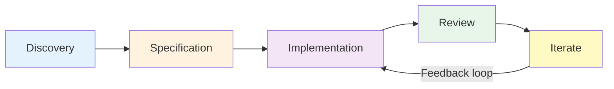

# Review and Iterate: Living Specifications

## Overview

Specifications are living documents that evolve with understanding. This article explains how to continuously refine specifications after Example Mapping.

**Goal**: Maintain specifications that reflect both **intended behavior** and **actual behavior** as understanding deepens through implementation, usage, and feedback.

## The Specification Lifecycle



Specifications evolve through continuous cycles of review and refinement.

---

## When to Review Specifications

### Review Triggers

1. **After Implementation** - Did spec match reality?
2. **When Tests Fail** - Spec wrong or code wrong?
3. **Requirements Change** - New regulations, processes, features
4. **Regular Cadence** - Weekly (active), Monthly (maintenance), Quarterly (comprehensive)
5. **Before Extensions** - Refresh understanding, check drift

### Signs of Specification Debt

- 🚩 Scenarios always pass but don't verify behavior
- 🚩 Ambiguous steps with multiple interpretations
- 🚩 Gap between spec language and code reality
- 🚩 Scenarios test implementation details, not behavior
- 🚩 File unchanged >6 months while code evolved
- 🚩 >30 scenarios in single file
- 🚩 Technical jargon instead of domain language

---

## After Example Mapping

### Immediate (Same Day)

- [ ] Write `specification.feature` with Rules and Scenarios
- [ ] Document Ubiquitous Language terms
- [ ] Create `issues.md` for red cards
- [ ] Share with stakeholders for review

### Short-term (1-2 Days)

- [ ] Incorporate stakeholder feedback
- [ ] Refine ambiguous scenarios
- [ ] Add missing edge cases
- [ ] Resolve red card questions

### During Implementation (1 Week)

- [ ] Implement step definitions
- [ ] Discover edge cases via TDD → Add scenarios
- [ ] Refine vague steps → Update spec
- [ ] Keep synchronized - commit spec with code

### After Implementation

- [ ] Retrospective: Did spec match build?
- [ ] Refactor for clarity
- [ ] Remove redundant scenarios
- [ ] Document lessons learned

---

## Continuous Iteration Practices

### Weekly (Active Development)

**Focus**: Synchronize specs with code

- Review failing scenarios
- Add discovered edge cases
- Refine step wording
- 30-min team review: new scenarios, ambiguous language, missing coverage

### Monthly (Maintenance)

**Focus**: Prevent drift

- Check scenario relevance
- Verify language matches code
- Consolidate similar scenarios
- Update evolved terminology
- Verify traceability (specs/ ↔ src/)

### Quarterly (Comprehensive)

**Focus**: Major refactoring

- Review all specs in module
- Split files >20 scenarios
- Update to current Ubiquitous Language
- Remove outdated scenarios
- Run Event Storming to validate domain

**Metrics**: Files >20 scenarios, unchanged >6 months, no assertions, duplicate patterns

---

## Feedback Loops

### From Implementation to Specification

| Discovery | Action |
|-----------|--------|
| Missing acceptance criteria | Add new `Rule:` block |
| Ambiguous steps | Refine with concrete examples |
| Edge cases | Add `@error` scenarios |
| Wrong assumptions | Revise preconditions |
| Incomplete verification | Add `Then`/`And` steps |

### From Production to Specification

**Bug-Driven Process**:

1. Write scenario that would have caught bug
2. Verify scenario fails (regression test)
3. Fix code until passes
4. Keep scenario in suite

---

## Specification Refactoring

### When to Refactor

- File >20 scenarios
- Multiple distinct concerns in one file
- Duplicate logic patterns
- Language evolved but specs haven't
- Scenarios test implementation, not behavior

### How to Refactor

1. Identify cohesive sub-features
2. Create focused `.feature` files (10-15 scenarios each)
3. Move related scenarios with Rules and @ac tags
4. Delete old monolithic file
5. Update step definitions if needed

**Example**: Split `validation.feature` (40 scenarios) → `format-validation.feature`, `completeness-validation.feature`, `business-rule-validation.feature`, `edge-case-validation.feature` (10 each)

---

## Review Ceremonies

### Weekly Specification Review

**Duration**: 30 min | **Attendees**: Developers, QA, Product Owner

1. Review new/changed scenarios (10 min)
2. Discuss ambiguous language (10 min)
3. Identify missing coverage (5 min)
4. Refactor verbose scenarios (5 min)

### Three Amigos (Before New Features)

**Duration**: 45-60 min | **Attendees**: Business, Development, Testing

1. Review existing related specs (15 min)
2. Identify needed updates (10 min)
3. Mini Example Mapping (20 min)
4. Update specifications together (15 min)

---

## Specification Health Metrics

### Red Flags 🚩

- Scenarios unchanged >6 months while code evolved
- All scenarios always passing (not testing anything)
- Testing implementation: "database updated", "cache cleared"
- >30 scenarios in single file
- Technical jargon: "POST to /api/users", "response code 201"

### Green Indicators ✅

- Specs committed with code changes
- Scenarios catch regression bugs
- Business can read and validate
- Clear traceability: spec → step → code
- Consistent Ubiquitous Language

---

## Handling Specification Changes

### Process

1. Update scenario in `specification.feature`
2. Update step definitions in `src/*/tests/`
3. Run tests - verify passing
4. Update production code if behavior changed
5. Commit spec and code together

**Breaking changes**: Tag old scenario `@deprecated`, add new scenario, implement, remove deprecated.

---

## Integration with Other Practices

**Ubiquitous Language Evolution**: Event Storming identifies terms → Update glossary → Refactor specs → Update step definitions → Rename code. See: [Ubiquitous Language](ubiquitous-language.md)

**Event Storming Updates**: Quarterly workshops reveal new domain understanding → Identify changed events → Find affected specs → Update scenarios → Refactor code. See: [Event Storming](event-storming.md)

**Risk Control Reviews**: Risk changes → Update `specs/risk-controls/` → Update user scenarios with `@risk-control:<name>-<id>` → Verify implementation → Generate evidence. See: [Risk Controls](risk-controls.md)

---

## Common Pitfalls

❌ **"We'll clean up specs later"** - They never get cleaned
✅ **Refactor immediately** when issues found

❌ **Specs as write-once documentation**
✅ **Specs as living, evolving understanding**

❌ **Only developers maintain specs**
✅ **Whole team collaborates** on health

❌ **Never remove old scenarios**
✅ **Regular pruning** of outdated content

---

## Tools and Automation

### Health Checks

```bash
# Large files (>500 lines)
find specs/ -name "*.feature" -exec wc -l {} \; | awk '$1 > 500 {print}'

# Old specs (unchanged >6 months)
find specs/ -name "*.feature" -mtime +180

# Count scenarios per feature
grep -r "Scenario:" specs/ | cut -d: -f1 | uniq -c | sort -rn
```

### Automation

- Lint Gherkin for style consistency
- Verify Feature IDs match across specs/ and src/
- Check @risk-control:[name]-[id] tag integrity
- Validate Rule → Scenario → @ac tag links

---

## Summary

### Key Principles

1. **Specifications are living documents** - Evolve with understanding, refine through feedback, update as domain changes
2. **Review regularly** - Weekly (active), Monthly (maintenance), Quarterly (comprehensive)
3. **Implementation improves specs** - Reveals edge cases, uncovers missing scenarios, adds regression tests
4. **Whole team maintains health** - Product Owner, Developers, QA, Security all contribute
5. **Refactor aggressively** - Split large files, consolidate duplicates, remove outdated, improve clarity

**Remember**: The goal is **executable, maintainable specifications** that guide development - not bureaucratic overhead. Specifications that evolve with understanding are more valuable than perfect specs written once.

---

## See Also

- [Three-Layer Approach](three-layer-approach.md) - Continuous workflow
- [Example Mapping](example-mapping.md) - Where specifications begin
- [Ubiquitous Language](ubiquitous-language.md) - Language evolution
- [Event Storming](event-storming.md) - Domain discovery
- [ATDD and BDD with Gherkin](atdd-bdd-with-gherkin.md) - Writing scenarios
- [Risk Controls](risk-controls.md) - Compliance reviews
