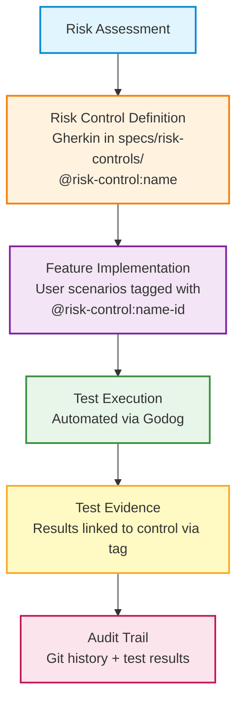

# Risk Controls in Executable Specifications

> **Understanding risk-based testing and compliance traceability**

## What Are Risk Controls?

Risk controls are **mitigation measures** that address identified risks. They answer:

- **What could go wrong?** (Risk)
- **What must we do to prevent it?** (Control)
- **How do we prove it works?** (Evidence)

**Traditional**: Risk assessment → Spreadsheet → Manual verification → Periodic audits (artifacts in separate systems, evidence gathered retroactively)

**Executable**: Risk assessment → Gherkin scenarios → Automated verification → Continuous evidence (all in version control, traceability in real-time)

**Benefits**: Clear business-language requirements, executable verification, version controlled, reusable, traceable via @risk-control tags, audit-ready

## IMPORTANT: Assessment-First Process

**You MUST conduct a risk assessment BEFORE creating controls.**

1. **Conduct Risk Assessment** - Identify YOUR specific threats, vulnerabilities, and risks
2. **Select Controls** - Review catalog for inspiration, tailor to YOUR context
3. **Create Control Features** - Document as Gherkin based on YOUR assessment
4. **Link to Implementation** - Tag implementations with @risk-control:[name]-[id]

The [Control Catalog](templates/specs/risk-controls/catalog/) provides 299 example controls for **INSPIRATION ONLY**. These mappings are **INDICATIVE** and should NOT be used as-is. Always validate with qualified personnel.

---

## When You Need Risk Controls

### Regulated Domains

Risk controls are essential when you operate in regulated industries or handle sensitive data:

- **Healthcare** - HIPAA, FDA 21 CFR Part 11, pharmaceutical GxP/GAMP5, medical device ISO 13485/IEC 62304, MDR/IVDR
- **Financial** - SOX, PCI-DSS, data privacy regulations
- **AI/ML Systems** - EU AI Act, NIST AI RMF, ISO 42001
- **Cloud Services** - CSA CCM, ISO 27017/27018
- **General Security** - ISO 27001, NIST 800-53, OWASP
- **Data Privacy** - GDPR, CCPA, LGPD
- **Cryptography** - FIPS-140-2/3
- **Aerospace** - DO-178C, DO-254
- **Automotive** - ISO 26262, ASPICE
- **Critical Infrastructure** - IEC 61508, NERC CIP

### Risk-Based Development

Even outside regulated domains:

- High consequence of failure (safety-critical, financial loss, reputation)
- Security requirements (authentication, authorization, encryption)
- Compliance obligations (SOC 2, ISO 27001, contractual)
- Audit requirements (internal, external, certification)

### When You Don't Need Them

Skip for: Low-risk internal tools, prototypes/experiments, simple utilities, open source side projects without regulatory obligations.

---

## Creating Risk Controls

### Template Location

Use the [template](templates/specs/risk-controls/risk-control.feature) as your starting point.

### Process

1. **Conduct Risk Assessment** - Use FMEA, Hazard Analysis, Threat Modeling (STRIDE, PASTA), or compliance gap analysis to identify YOUR specific risks
2. **Review Catalog** - Browse the [Control Catalog](templates/specs/risk-controls/catalog/) for inspiration (DO NOT copy as-is)
3. **Select and Tailor Controls** - Choose controls that address YOUR identified risks and customize them
4. **Define Metadata** - Add industry tags, regulatory references (validated by YOUR team), severity, risk/control types
5. **Write Control Scenarios** - Use MUST/SHALL, state WHAT (not HOW), reference YOUR assessment
6. **Organize in specs/** - Create control files in `specs/risk-controls/`

### Example

**Risk**: Unauthorized access to patient data (Severity: High, from Assessment RA-2025-001)

**Control** (`specs/risk-controls/auth-mfa.feature`):

```gherkin
@risk-control:auth-mfa
Feature: Multi-Factor Authentication

  # Source: Risk Assessment RA-2025-001
  # Date: 2025-01-15
  # Reviewed by: Security Team, Compliance Officer

  Rule: Authentication requires multiple factors

    @risk-control:auth-mfa-01
    Scenario: MFA required for access
      Given a system with protected resources
      Then authentication MUST require at least two factors
      And authentication MUST occur before granting access
      And failed authentication attempts MUST be logged
```

**Implementation** (`specs/cli/login/specification.feature`):

```gherkin
@success @risk-control:auth-mfa-01
Scenario: Login with MFA credentials
  Given I have valid credentials and MFA token
  When I run "simply login --mfa"
  Then I should be authenticated
```

---

## The Traceability Chain



---

## Common Compliance Examples

| Framework | Key Requirements | Example Control Tags |
|-----------|------------------|----------------------|
| **FDA 21 CFR Part 11** | Electronic signatures, audit trails, validation, access controls | `@risk-control:auth-mfa`, `@risk-control:audit-trail`, `@risk-control:doc-esignatures` |
| **ISO 13485 / IEC 62304** | Safety classification, risk management, V&V, traceability | `@risk-control:validation-csv`, `@risk-control:risk-assessment` |
| **PCI-DSS** | Protect cardholder data, secure systems, access control, monitoring | `@risk-control:encrypt-rest`, `@risk-control:encrypt-transit`, `@risk-control:auth-mfa` |
| **GDPR** | Data protection by design, right to be forgotten, consent, breach notification | `@risk-control:privacy-consent`, `@risk-control:privacy-erasure`, `@risk-control:incident-breach` |
| **EU AI Act** | Risk classification, transparency, human oversight, data governance | `@risk-control:ai-bias`, `@risk-control:ai-explainability`, `@risk-control:ai-monitoring` |

---

## Best Practices

### Do ✅

- **Start with risk assessment** - Don't create controls without YOUR identified risks
- **Review catalog for inspiration** - Browse examples but tailor to YOUR context
- **Use clear naming** - `@risk-control:auth-mfa`, `@risk-control:encrypt-rest`
- **Reference YOUR assessment** - Link to YOUR assessment document/ID
- **Use MUST/SHALL** - For mandatory requirements
- **Keep atomic** - One control requirement per scenario
- **Tag implementations** - Always link features to controls
- **Review regularly** - Update when risks/regulations change

### Don't ❌

- **Don't copy catalog as-is** - Controls are INDICATIVE, not ready for production
- **Don't create controls "just in case"** - Only for YOUR identified risks
- **Don't skip assessment** - Risk assessment is MANDATORY first step
- **Don't skip validation** - Always engage qualified personnel for regulations
- **Don't make too specific** - Keep controls implementation-agnostic when possible
- **Don't skip traceability** - Always tag implementation scenarios
- **Don't forget to execute** - Controls are worthless if not verified

---

## Review and Maintenance

Risk controls evolve with threats, regulations, and system architecture.

### Why Review?

- **Regulations evolve**: GDPR amendments, PCI-DSS updates, FDA guidance changes
- **Threats evolve**: New attack vectors, zero-days, industry incidents
- **Systems evolve**: Architecture changes, new integrations, increased scale

### Review Cadence

**Quarterly (Regular)**:

- Review @risk-control tagged scenarios
- Verify controls address current risks
- Check for new regulations
- Update risk scenarios
- Validate regulatory mappings with qualified personnel

**Event-Driven (Triggered)**:

- New regulation → Add/update controls and tags
- Audit finding → Add missing controls
- Security incident → Add defensive scenarios
- Architecture change → Update related controls
- Threat intelligence → Add protective scenarios

### Update Process

1. **Risk Register Review** - Has the risk changed? Update likelihood, impact, control requirements
2. **Control Update** - Refactor control scenarios in `specs/risk-controls/`, update metadata, document change in CHANGELOG
3. **Propagate Changes** - Find affected user scenarios: `grep -r "@risk-control:auth-mfa" specs/`
4. **Update User Scenarios** - Align with updated control requirements
5. **Verify Coverage** - Check traceability: all @risk-control tags link to controls
6. **Update Implementation** - Update step definitions, run tests
7. **Document Evidence** - Generate compliance report, update audit trail

### Summary

**Key practices**:

1. Review regularly (quarterly + event-driven)
2. Update promptly (when risks/regulations change)
3. Verify coverage (all risks → controls → implementations)
4. Automate checks (CI/CD validates continuously)
5. Whole team ownership (everyone understands controls)

**Remember**: Risk controls are living documents that evolve with your threat landscape and regulatory environment.

---

## See Also

- [Review and Iterate](review-and-iterate.md) - General specification maintenance
- [ATDD and BDD with Gherkin](atdd-bdd-with-gherkin.md) - Writing control scenarios
- [Three-Layer Approach](three-layer-approach.md) - Integrating controls into workflow
