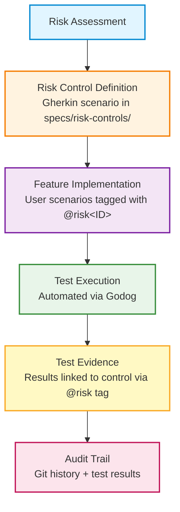

# Risk Controls in Executable Specifications

> **Understanding risk-based testing and compliance traceability**

## What Are Risk Controls?

Risk controls are **mitigation measures** that address identified risks. They answer:

- **What could go wrong?** (Risk)
- **What must we do to prevent it?** (Control)
- **How do we prove it works?** (Evidence)

**Traditional**: Risk assessment → Spreadsheet → Manual verification → Periodic audits (artifacts in separate systems, evidence gathered retroactively)

**Executable**: Risk assessment → Gherkin scenarios → Automated verification → Continuous evidence (all in version control, traceability in real-time)

**Benefits**: Clear business-language requirements, executable verification, version controlled, reusable, traceable via @risk tags, audit-ready

---

## When You Need Risk Controls

### Regulated Domains

- **Medical devices** (FDA 21 CFR Part 820, ISO 13485, IEC 62304)
- **Pharmaceuticals** (FDA 21 CFR Part 11, GxP)
- **Financial services** (SOX, PCI-DSS, GDPR)
- **Aerospace** (DO-178C, DO-254)
- **Automotive** (ISO 26262, ASPICE)
- **Critical infrastructure** (IEC 61508, NERC CIP)
- **Data privacy** (GDPR, HIPAA, CCPA)

### Risk-Based Development

Even outside regulated domains:

- High consequence of failure (safety-critical, financial loss, reputation)
- Security requirements (authentication, authorization, encryption)
- Compliance obligations (SOC 2, ISO 27001, contractual)
- Audit requirements (internal, external, certification)

### When You Don't Need Them

Skip for: Low-risk internal tools, prototypes/experiments, simple utilities, open source side projects without regulatory obligations.

---

## Creating Risk Controls

### Process

1. **Conduct Risk Assessment** - Use FMEA, Hazard Analysis, Threat Modeling (STRIDE, PASTA), or compliance gap analysis
2. **Define Control Requirements** - For each high/medium risk, define what must be true to mitigate it
3. **Organize by Category** - Group related controls in `specs/risk-controls/`
4. **Write as Gherkin Scenarios** - Use MUST/SHALL, state what (not how), reference source

### Example

**Risk**: Unauthorized access to patient data (Severity: High)

**Control** (`specs/risk-controls/authentication-controls.feature`):

```gherkin
Feature: authentication-controls

  # Source: Assessment-2025-001
  # Date: 2025-01-15

  @risk1
  Scenario: RC-001 - User authentication required
    Given a system with protected resources
    Then all user access MUST be authenticated
    And authentication MUST occur before granting access
    And failed authentication attempts MUST be logged
```

**Implementation** (`specs/cli/login/specification.feature`):

```gherkin
@success @ac1 @risk1
Scenario: Login with valid credentials
  Given I have valid credentials
  When I run "simply login"
  Then I should be authenticated
```

**Directory Structure**:

```text
specs/risk-controls/
├── authentication-controls.feature      # RC-001 to RC-009
├── data-protection-controls.feature     # RC-010 to RC-019
├── audit-trail-controls.feature         # RC-020 to RC-029
└── input-validation-controls.feature    # RC-030 to RC-039
```

---

## The Traceability Chain



**Audit Query**:

```bash
# "Show me all scenarios that verify authentication control"
grep -r "@risk1" specs/ --exclude-dir=risk-controls
```

---

## Common Compliance Frameworks

| Framework | Key Requirements | Example Controls |
|-----------|------------------|------------------|
| **FDA 21 CFR Part 11** | Electronic signatures, audit trails, validation, access controls | RC-001 (authentication), RC-005 (audit trail), RC-020 (e-signature) |
| **ISO 13485 / IEC 62304** | Safety classification, risk management, V&V, traceability | RC-030 (input validation), RC-040 (output verification) |
| **PCI-DSS** | Protect cardholder data, secure systems, access control, monitoring | RC-010 (encrypt at rest), RC-011 (encrypt in transit), RC-001 (MFA) |
| **GDPR** | Data protection by design, right to be forgotten, consent, breach notification | RC-050 (consent), RC-051 (deletable data), RC-052 (breach logging) |

---

## Best Practices

### Do ✅

- Start with risk assessment (don't create controls without identified risks)
- Use clear IDs (RC-001, RC-002 or RC-AUTH-001)
- Reference source (link to assessment document/ID)
- Use MUST/SHALL for mandatory requirements
- Keep atomic (one control requirement per scenario)
- Review regularly (update when risks change)

### Don't ❌

- Don't create controls "just in case" (only for identified risks)
- Don't make controls too specific (implementation-agnostic)
- Don't skip traceability (always tag implementation scenarios)
- Don't forget to execute (controls are worthless if not verified)
- Don't duplicate (reuse controls across features)

---

## Review and Maintenance

Risk controls evolve with threats, regulations, and system architecture.

### Why Review?

- **Regulations evolve**: GDPR amendments, PCI-DSS updates, FDA guidance changes
- **Threats evolve**: New attack vectors, zero-days, industry incidents
- **Systems evolve**: Architecture changes, new integrations, increased scale

### Review Cadence

**Quarterly (Regular)**:

- Review @risk-tagged scenarios
- Verify controls address current risks
- Check for new regulations
- Update risk scenarios

**Event-Driven (Triggered)**:

- New regulation → Add/update controls
- Audit finding → Add missing controls
- Security incident → Add defensive scenarios
- Architecture change → Update related controls
- Threat intelligence → Add protective scenarios

### Update Process

1. **Risk Register Review** - Has the risk changed? Update likelihood, impact, control requirements
2. **Control Update** - Refactor control scenarios in `specs/risk-controls/`, document change in CHANGELOG
3. **Propagate Changes** - Find affected user scenarios: `grep -r "@risk1" specs/`
4. **Update User Scenarios** - Align with updated control requirements
5. **Verify Coverage** - Check traceability: all @risk tags link to controls
6. **Update Implementation** - Update step definitions, run tests
7. **Document Evidence** - Generate compliance report, update audit trail

### Review Ceremony

**When**: Quarterly (or event-driven)
**Duration**: 2 hours
**Attendees**: Security, Compliance, Development, Testing, Product

**Agenda**: Risk register review (30 min) → Control effectiveness (45 min) → Coverage review (30 min) → Action planning (15 min)

### Automation

```bash
# Check traceability
./scripts/check-risk-coverage.sh
# ✓ RC-001: 8 user scenarios tagged @risk1
# ✗ RC-003: 0 user scenarios tagged @risk3  ← Missing!

# Run compliance tests
go test -tags="risk1,risk2,risk3,risk4" ./src/.../tests
```

**CI/CD Integration**:

```yaml
# .github/workflows/compliance.yml
jobs:
  risk-coverage:
    steps:
      - run: ./scripts/check-risk-coverage.sh
      - run: go test -tags="risk1,risk2,risk3,risk4" ./src/.../tests
      - run: ./scripts/generate-compliance-report.sh
```

### Common Pitfalls

❌ **Wait until audit** → Controls outdated, violations accumulate
✅ **Quarterly + event-driven reviews** → Controls current, violations caught early

❌ **Only security maintains** → Disconnect, theoretical controls
✅ **Whole team participates** → Practical, testable, built-in compliance

❌ **Separate repository** → Drift, no traceability, manual verification
✅ **In specs/ alongside features** → Direct traceability, automated checks, continuous compliance

### Summary

**Key practices**:

1. Review regularly (quarterly + event-driven)
2. Update promptly (when risks/regulations change)
3. Verify coverage (all risks → controls → implementations)
4. Automate checks (CI/CD validates continuously)
5. Whole team ownership (everyone understands controls)

**Remember**: Risk controls are living documents that evolve with your threat landscape and regulatory environment.

---

## See Also

- [Review and Iterate](review-and-iterate.md) - General specification maintenance
- [ATDD and BDD with Gherkin](atdd-bdd-with-gherkin.md) - Writing control scenarios
- [Three-Layer Approach](three-layer-approach.md) - Integrating controls into workflow
- [Link Risk Controls (How-To)](../../how-to-guides/specifications/link-risk-controls.md) - Step-by-step implementation
- [Gherkin Format Reference](../../reference/specifications/gherkin-format.md) - Tag syntax
