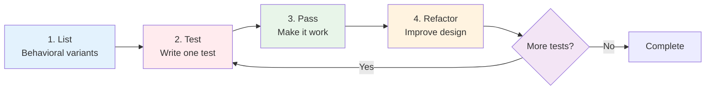
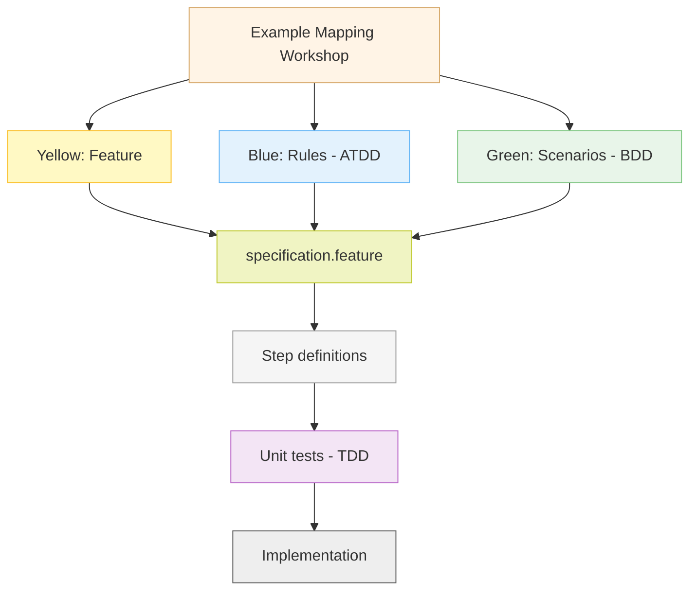
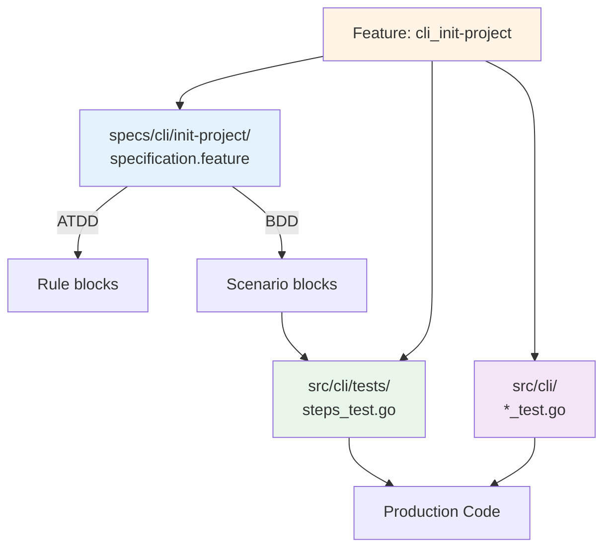
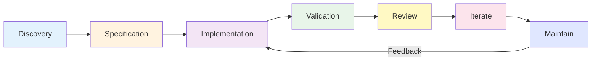
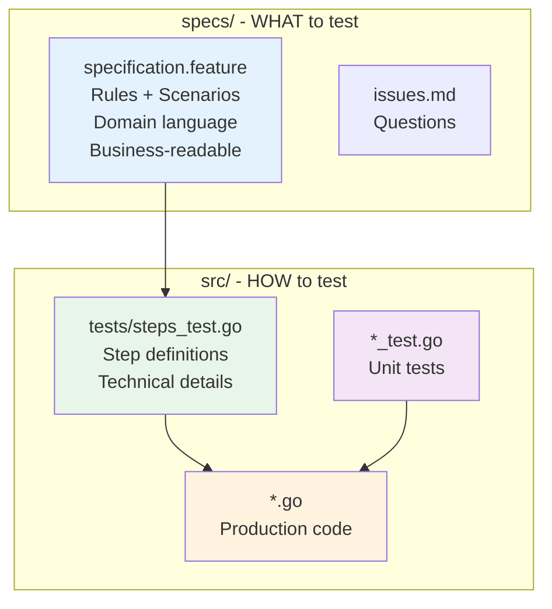

# Three-Layer Testing Approach

How ATDD, BDD, and TDD work together to deliver quality software.

---

## Overview

This project uses **three complementary testing methodologies**:

- **ATDD** (Acceptance Test-Driven Development) - Business requirements and customer value
- **BDD** (Behavior-Driven Development) - User-facing behavior specifications
- **TDD** (Test-Driven Development) - Implementation correctness and code quality

Each layer serves a distinct purpose, uses different tools, and addresses different stakeholders' needs.

---

## The Three Layers

| Layer | Question | Stakeholders | Tool | Representation | Location |
|-------|----------|--------------|------|----------------|----------|
| **ATDD** | "What business value?" | Product Owner, Business | Godog | `Rule:` blocks | `specs/` |
| **BDD** | "How does user interact?" | QA, Developers, Product | Godog | `Scenario:` under Rules | `specs/` + `src/tests/` |
| **TDD** | "Does code work?" | Developers | Go test | Unit test functions | `src/*_test.go` |

### Layer 1: ATDD (Acceptance Criteria)

**Purpose**: Define business requirements before development

**Format**: `Rule:` blocks in Gherkin

```gherkin
@cli @critical
Feature: cli_init-project

  As a developer
  I want to initialize a CLI project
  So that I can quickly start development

  Rule: Creates project directory structure

  Rule: Generates valid configuration file

  Rule: Command completes in under 2 seconds
```

**Origin**: 🔵 Blue cards from Example Mapping
**Location**: `specs/<module>/<feature>/specification.feature`

### Layer 2: BDD (Behavior Examples)

**Purpose**: Specify observable behavior through concrete examples

**Format**: `Scenario:` blocks nested under `Rule:` blocks

```gherkin
Rule: Creates project directory structure

  @ov
  Scenario: Initialize in empty directory
    Given I am in an empty folder
    When I run "simply init"
    Then a file named "simply.yaml" should be created
    And a directory named "src/" should exist

  @ov
  Scenario: Initialize in existing project
    Given I am in a directory with "simply.yaml"
    When I run "simply init"
    Then the command should fail
    And stderr should contain "already initialized"
```

**Origin**: 🟢 Green cards from Example Mapping
**Specification**: `specs/<module>/<feature>/specification.feature`
**Implementation**: `src/<module>/tests/steps_test.go`

### Layer 3: TDD (Unit Tests)

**Purpose**: Ensure code correctness through systematic test-first development

**Format**: Unit tests in `*_test.go` files

**Tool**: Go test framework

#### Canon TDD Workflow

Kent Beck's **Canon TDD** provides a specific five-step workflow for test-driven development:



*Based on [Canon TDD by Kent Beck](https://tidyfirst.substack.com/p/canon-tdd), flowchart concept by Vic Wu*

**The Five Steps**:

1. **List** - Behavioral analysis: Identify all expected behavioral variants and edge cases through systematic analysis
2. **Test** - Write one automated test with setup, invocation, and assertions (Red)
3. **Pass** - Modify code to make the test pass without shortcuts (Green)
4. **Refactor** - Optionally improve implementation design after test passes
5. **Repeat** - Continue until the test list is empty

**Key Principle**: Focus on **interface design** (how behavior is invoked) before **implementation design** (internal mechanics). Tests specify the interface; refactoring improves the implementation.

**Red-Green-Refactor Cycle**:
- 🔴 **Red**: Write failing test (from list)
- 🟢 **Green**: Implement minimum code to pass
- 🔵 **Refactor**: Improve design (optional)
- 🔁 **Repeat**: Next test from list

**Example**:

```go
// Feature: cli_init-project

// Step 1: List behavioral variants
// - Create config in empty directory (success)
// - Create config with custom path (success)
// - Create config when file exists (error)
// - Create config in read-only directory (error)

// Step 2-5: Test, Pass, Refactor, Repeat for each variant
func TestCreateConfig(t *testing.T) {
    tmpDir := t.TempDir()
    configPath := filepath.Join(tmpDir, "simply.yaml")

    err := CreateConfig(configPath)

    if err != nil {
        t.Fatalf("CreateConfig failed: %v", err)
    }
}

func TestCreateConfigWhenFileExists(t *testing.T) {
    tmpDir := t.TempDir()
    configPath := filepath.Join(tmpDir, "simply.yaml")

    // Create existing file
    os.WriteFile(configPath, []byte("existing"), 0644)

    err := CreateConfig(configPath)

    if err == nil {
        t.Fatal("Expected error when file exists")
    }
}
```

**Location**: `src/<module>/*_test.go`

---

## How Layers Interact

### Discovery to Implementation Flow



### Traceability Chain



---

## Development Workflow

### Discovery Phase

**Activities**:

1. **Event Storming** → Domain understanding and Ubiquitous Language
2. **Example Mapping** → Feature scenarios using domain vocabulary
3. Write `specification.feature` with Rules and Scenarios

**Outputs**:

- Domain vocabulary documented
- `specs/<module>/<feature>/specification.feature` created
- `specs/<module>/<feature>/issues.md` for red cards

### Implementation Phase

**Red-Green-Refactor**:

1. Write step definitions (`src/<module>/tests/steps_test.go`)
2. Write failing unit test (Red)
3. Implement minimum code (Green)
4. Refactor for quality
5. Repeat until scenarios pass

**Definition of Done**:

- ✅ All scenarios passing
- ✅ Code reviewed and refactored
- ✅ Specs synchronized with implementation
- ✅ Stakeholders validated behavior

### Continuous Improvement



**Review Cadence**:

- **Weekly** during active development - sync specs with code
- **Monthly** during maintenance - prevent drift
- **Quarterly** comprehensive - major refactoring, Event Storming validation
- **Event-driven** when requirements change

**Iteration Activities**:

- Add scenarios for discovered edge cases
- Refine ambiguous steps
- Update Rules based on learnings
- Split large files (>20 scenarios)
- Remove deprecated scenarios
- Align language with Ubiquitous Language

---

## Architecture: Specifications vs Implementation

### Critical Separation: WHAT vs HOW



**Why Separate?**:

- **Clarity**: Specs focus on "what should happen", code focuses on "how"
- **Accessibility**: Business reviews specs without seeing code
- **Flexibility**: Refactor implementation without changing specs (if behavior unchanged)
- **Maintenance**: Specs evolve with business, code evolves with technology

**Example**:

| Specification (WHAT) | Implementation (HOW) |
|---------------------|---------------------|
| `Given I have an account` | `testDB.CreateUser(username, hash)` |
| `When I run "simply login"` | `exec.Command("simply", "login").Run()` |
| `Then I should be authenticated` | `os.ReadFile("~/.simply/session")` |

**Key Insight**: Specification describes user-visible behavior; implementation handles technical details (database, filesystem, process execution).

---

## Practical Example: Evolution

### Week 1 (Initial)

```gherkin
Rule: Valid credentials grant access

  @ov
  Scenario: User logs in
    When I login
    Then I am authenticated
```

### Week 2 (After Implementation)

```gherkin
Rule: Valid credentials grant access

  @ov
  Scenario: User logs in with valid credentials
    Given I have an account with username "admin"
    When I run "simply login --user admin --password secret"
    Then I should be authenticated
    And my session token should be stored in ~/.simply/session
    And I should see "Login successful"
```

### Month 1 (After Production)

```gherkin
Rule: Valid credentials grant access within rate limits

  @ov
  Scenario: User logs in with valid credentials
    Given I have an account with username "admin"
    When I run "simply login --user admin --password secret"
    Then I should be authenticated
    And my session token should be stored in ~/.simply/session

  @ov
  Scenario: User exceeds login attempt rate limit
    Given I have failed to login 5 times in the last minute
    When I run "simply login --user admin --password secret"
    Then I should see "Rate limit exceeded. Try again in 60 seconds"
    And I should not be authenticated
```

**Evolution drivers**: Implementation discovery, production usage, security requirements

---

## Tag Usage Across Layers

The three layers use different tag types:

**ATDD Layer** (Rules):
- Uses **organizational tags** for traceability: `@ac1`, `@ac2` (links scenarios to Rules)

**BDD Layer** (Scenarios):
- Uses **testing taxonomy tags**: `@ov`, `@iv`, `@pv` (verification) + `@L2`, `@L3`, `@L4` (level)
- See **[Tag Reference](tag-reference.md)** for complete taxonomy

**TDD Layer** (Go tests):
- Uses **build tags** for test levels: `//go:build L0` for L0, default is L1

**Example**:
```gherkin
Rule: Valid credentials grant access

  @ov
  Scenario: User logs in with valid credentials
```

For complete tag documentation, see:
- **Testing taxonomy tags**: [Tag Reference](tag-reference.md)
- **Organizational tags**: [Gherkin File Organization](gherkin-concepts.md#tag-strategy)

---

## Key Principles

1. **Three layers, one file** - ATDD Rules and BDD Scenarios in `specification.feature`, implementations in `src/`
2. **Continuous evolution** - Specs and code evolve together through feedback loops
3. **Ubiquitous Language** - Same terms across business discussions, specs, and code
4. **Traceability** - Feature Name links all artifacts across `specs/` and `src/`
5. **Separation of concerns** - Specs define WHAT, implementations define HOW

**Remember**: The goal is **executable, maintainable specifications** that guide development - not bureaucratic overhead.

---

## Related Documentation

- [ATDD and BDD with Gherkin](atdd-bdd-with-gherkin.md) - Unified approach using Rule blocks
- [Ubiquitous Language](ubiquitous-language.md) - Shared vocabulary foundation
- [Review and Iterate](review-and-iterate.md) - Continuous improvement
- [Event Storming](event-storming.md) - Domain discovery workshops
- [Example Mapping](example-mapping.md) - Requirements discovery
- [Risk Controls](risk-controls.md) - Integrating compliance requirements
