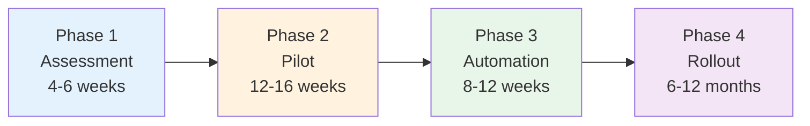

# Compliance Transformation Framework

## Introduction

Compliance transformation is a journey, not a destination. Organizations that successfully transform compliance practices do so through a structured, phased approach that proves the concept with a pilot, builds reusable automation, and scales systematically across the organization.

This document describes a four-phase framework that guides compliance transformation from initial assessment through organization-wide adoption. The framework has been validated across multiple organizations and regulatory contexts.

**Timeline**: 12-18 months from start to organization-wide adoption
**Investment**: 2-3 FTE dedicated resources plus team participation
**Expected ROI**: 3-10 month payback period, $1.8M - $6.4M annual benefit for typical mid-size organization

## The Journey Overview

| Phase | Duration | Primary Objective | Success Criterion |
|-------|----------|------------------|-------------------|
| **Phase 1: Assessment** | 4-6 weeks | Understand current state, plan transformation | Approved roadmap |
| **Phase 2: Pilot** | 12-16 weeks | Prove approach with one team | Successful test audit |
| **Phase 3: Automation** | 8-12 weeks | Build reusable automation tools | Documented tools, trained teams |
| **Phase 4: Rollout** | 6-12 months | Scale to organization | 80% adoption |

**Total**: 12-18 months from start to organization-wide adoption

---

## Guiding Principles

These principles guide successful transformation:

1. **Start with Why**: Communicate value clearly to all stakeholders
2. **Pilot First**: Prove approach before scaling to avoid large-scale failures
3. **Measure Everything**: Track improvements to maintain support and identify issues
4. **Automate Ruthlessly**: If it can be automated, it should be automated
5. **Feedback Loops**: Learn and adapt continuously based on pilot experience
6. **Governance Matters**: Clear decision authority accelerates progress
7. **Training is Critical**: Teams cannot adopt what they don't understand
8. **Long-term View**: This is an 18-month journey, not a 3-month sprint

---

## Phase 1: Assessment and Planning (4-6 weeks)

### Objective

Establish baseline understanding of current state, define target state, and create approved roadmap for transformation.

### Key Activities

**1. Enumerate Compliance Requirements**:

Inventory all compliance obligations:

- List all applicable standards (ISO 27001, GDPR, SOC 2, HIPAA, GxP, etc.)
- Extract specific control requirements from each standard
- Identify overlapping controls across standards
- Document current evidence collection methods

**Starting Point**:

- **If you have existing SOPs**: Take outset in these documented procedures. They provide organization-specific context for how requirements are currently interpreted.
- **If you don't have SOPs**: Look directly at the regulations applicable to your domain. For GxP organizations, consult ICH guidelines. For security, reference ISO 27001 control requirements.

**Deliverable**: Compliance Requirements Inventory (spreadsheet or database)

**2. Assess Current State Maturity**:

Evaluate current practices:

- Manual vs automated activities breakdown
- Time overhead measurement (hours per team per week)
- Technical capability assessment (CI/CD maturity, testing practices)
- Compliance office capacity and constraints

**Key Metrics to Establish Baseline**:

- Manual compliance work: hours per team per week
- Audit preparation time: person-hours per audit cycle
- Evidence collection: % manual vs automated
- Compliance validation time: days to approve release
- Audit findings: number per audit cycle

Track these same metrics throughout transformation to demonstrate ROI. Typical improvements: 70-80% reduction in manual work, 95%+ evidence automation, release approval time from days to hours.

**Deliverable**: Current State Assessment Report

**3. Value Stream Mapping**:

Map compliance activities to identify waste:

- Select representative compliance process (e.g., release approval)
- Map current state with lead time, cycle time, and waste identification
- Design future state with automation
- Calculate expected improvements

**Reference**: See [Measuring and Improving Flow](../everything-as-code/measuring-and-improving-flow.md) for detailed guidance on Value Stream Mapping and flow engineering principles.

**Deliverable**: Value Stream Maps (current + future states)

**4. Select Pilot Team**:

Choose pilot team carefully:

- **High compliance burden**: Team feels pain of current approach
- **Technical capability**: Team has CI/CD pipelines and testing practices
- **Willing to change**: Team enthusiastic about modernization
- **Representative scope**: Team's work representative of broader organization
- **Leadership support**: Team leadership committed to pilot success

**Deliverable**: Pilot Team Selection Document with justification

**5. Define Target State and Roadmap**:

Create vision and plan:

- How requirements become executable specifications (Gherkin format)
- Which CD Model stages validate compliance (see [CD Model](../continuous-delivery/cd-model/cd-model-overview.md))
- How evidence will be collected automatically
- Transformation timeline with milestones
- Resource requirements and budget

**Deliverable**: Transformation Roadmap approved by stakeholders

### Exit Criteria

- ✅ Requirements enumerated from SOPs or regulations
- ✅ Baseline metrics established (current time overhead, audit prep time)
- ✅ Pilot team selected and committed
- ✅ Roadmap approved by executive sponsor and compliance office
- ✅ Budget secured for pilot phase

---

## Phase 2: Pilot Implementation (12-16 weeks)

### Objective

Prove the compliance-as-code approach with one team, validate through test audit with internal or external auditors.

### Key Activities

**1. Create Risk Control Specifications**:

Translate requirements to executable format:

- Select subset of requirements for pilot scope
- Write risk control specifications in Gherkin format
- Tag with @risk IDs for traceability
- Review with compliance office for approval

**Format**: See [Risk Control Specifications](risk-control-specifications.md) for detailed guidance

**Deliverable**: Risk control specifications (`specs/risk-controls/*.feature`)

**2. Move Artifacts to Version Control**:

Transition from document management to version control:

- Convert policies/procedures from Word to Markdown
- Store in Git repository with branch protection
- Establish pull request workflow for changes
- Use [existing template catalog](https://github.com/ready-to-release/eac/blob/main/templates/index.md) as starting point
- Keep external systems unchanged during pilot (reduce complexity)

**Deliverable**: Version-controlled compliance artifacts

**3. Design Compliance Validation Pipeline**:

Integrate compliance into CI/CD:

- Map compliance checks to CD Model stages (see [CD Model](../continuous-delivery/cd-model/cd-model-overview.md))
- Implement validation at Stages 2 (pre-commit), 4 (commit), 5 (acceptance), 11 (production)
- Design PLTE for L3 testing (see [Testing Strategy](../continuous-delivery/testing/testing-strategy-overview.md))
- Implement quality gates that block non-compliant changes

**Security Integration**: See [Security in CD Model](../continuous-delivery/security/index.md) for security tooling

**Deliverable**: Compliance validation pipeline

**4. Implement Automated Tests**:

Write test code for specifications:

- Implement L0-L2 tests (local/agent execution, fast feedback)
- Implement L3 tests (PLTE vertical testing)
- Implement L4 tests (production monitoring)

**Reference**: [Three-layer testing approach](../specifications/three-layer-approach.md)

**Deliverable**: Automated test suite with passing tests

**5. Automate Evidence Collection**:

Build evidence collection capability:

- Define evidence requirements for pilot scope
- Implement collection scripts for pipeline artifacts
- Extract relevant data from Git history
- Generate traceability matrix automatically
- Create evidence package generator

**Automation Note**: This step requires an automation layer. Ready-to-Release (r2r) CLI tries to help with evidence collection and packaging.

**Deliverable**: Evidence collection system

**6. Conduct Test Audit**:

Validate approach with auditors:

- Generate evidence package for pilot scope
- Present approach to internal auditors
- Demonstrate traceability (requirement → test → evidence)
- Address findings and document lessons learned
- Get auditor endorsement of approach

**Deliverable**: Test audit report and auditor feedback

### Exit Criteria

- ✅ Risk controls created and approved by compliance office
- ✅ Artifacts in version control (100% of pilot scope)
- ✅ Pipeline implemented and functional
- ✅ Tests passing (100% of implemented scenarios)
- ✅ Evidence automated (90%+ of pilot scope)
- ✅ Test audit passed with no major findings
- ✅ 50%+ reduction in manual overhead demonstrated
- ✅ Lessons learned documented

---

## Phase 3: Automation and Scaling (8-12 weeks)

### Objective

Build reusable automation tools to accelerate adoption by other teams.

### Key Activities

**1. Extract Reusable Patterns**:

Identify what's generalizable:

- What's team-specific vs organization-wide?
- What patterns should all teams follow?
- What automation is highest value?
- What documentation is needed?

**Deliverable**: Automation backlog prioritized by value

**2. Build Automation Layer**:

An automation layer is needed to accelerate adoption. This typically includes:

**CLI Tool** with core commands:

- Initialize compliance structure
- Validate requirements locally
- Generate evidence packages
- Create compliance reports
- Show traceability

**Deliverable**: Automation tools (CLI or scripts)

**3. Create Documentation and Training**:

Enable other teams:

- Update existing how-to guides with compliance practices
- Create training materials (workshop + self-paced)
- Document lessons learned from pilot
- Write migration guide for other teams

**Deliverable**: Documentation and training materials

**4. Validate with Additional Teams**:

Test with early adopters:

- Onboard 2-3 additional teams using automation tools
- Collect feedback on what works and what doesn't
- Refine tools and documentation based on feedback
- Validate that non-pilot teams can adopt successfully

**Deliverable**: Validation report from early adopter teams

### Exit Criteria

- ✅ Automation layer implemented and tested
- ✅ Documentation complete and validated
- ✅ Training materials ready and piloted
- ✅ 2-3 teams validated successfully using tools
- ✅ Feedback incorporated into tools and docs

### Deliverables

- Automation tools (CLI or scripts)
- Updated documentation
- Training materials (slides, exercises, recordings)
- Migration guide

---

## Phase 4: Organization-Wide Rollout (6-12 months)

### Objective

Scale transformation across the organization achieving 80%+ adoption.

### Key Activities

**1. Plan Phased Rollout**:

Create systematic rollout plan:

- Prioritize teams by risk, readiness, and impact
- Create rollout schedule (batches of 3-5 teams every 4-6 weeks)
- Allocate support resources
- Define success criteria per batch

**Deliverable**: Rollout plan and schedule

**2. Execute Team Onboarding**:

Systematic 6-week onboarding cycle per batch:

- **Week 1**: Assessment - Team readiness, tooling gaps, training needs
- **Week 2**: Training and setup - Workshop, tool installation, pipeline integration
- **Weeks 3-4**: Implementation - Teams implement with coaching support
- **Week 5**: Validation - Test audit-style review of team's implementation
- **Week 6**: Review and handoff - Lessons learned, handoff to operations support

**Deliverable**: Onboarding completion reports per batch

**3. Integrate External Systems**:

Connect to organizational systems.

**Deliverable**: Integration documentation and connectors

**4. Establish Ongoing Operations**:

Transition from project to business-as-usual:

- Define operating model (who owns what)
- Create support [Enabling Team](https://teamtopologies.com/)
- Establish governance (working group, quarterly reviews)
- Define SLAs (response times, uptime expectations)
- Create runbooks for common issues

**Deliverable**: Operations handbook and support team

**5. Communication and Change Management**:

Maintain momentum and engagement:

- Executive updates (monthly) on progress and wins
- All-hands presentations (quarterly) showcasing teams
- Team newsletters (bi-weekly) with tips and successes
- Champions network for peer-to-peer support
- Recognition program for teams achieving milestones

**Deliverable**: Communication artifacts and champion network

### Exit Criteria

- ✅ 80%+ of teams onboarded and using automated compliance
- ✅ External system integrations operational
- ✅ Operations support team established and trained
- ✅ 60%+ reduction in overhead organization-wide
- ✅ Compliance office endorsement and satisfaction
- ✅ Transformation transitioned to business-as-usual

---

## Continuous Improvement

After transformation completes, maintain and improve:

**Quarterly Activities**:

- Review metrics and identify improvement opportunities
- Update tools based on user feedback
- Refresh training materials
- Celebrate wins and recognize high-performers

**Annual Activities**:

- Generate evidence packages for annual audits
- Coordinate with external auditors
- Review alignment with latest regulations
- Update roadmap for new requirements

**Ongoing Community**:

- Monthly community of practice meetings
- Knowledge sharing across teams
- Tool enhancements and feature requests
- Continuous documentation maintenance

---

## Common Pitfalls

Avoid these common mistakes:

### 1. Skipping Assessment

**Mistake**: Jumping to implementation without understanding current state
**Impact**: Build wrong solution, miss key requirements
**Avoidance**: Invest full 4-6 weeks in Phase 1

### 2. Boiling the Ocean

**Mistake**: Trying to transform everything at once
**Impact**: Overwhelm teams, project fails
**Avoidance**: Start with pilot, scale systematically

### 3. Building Without User Input

**Mistake**: Automation team builds tools in isolation
**Impact**: Tools don't match needs, low adoption
**Avoidance**: Deeply involve pilot team in design

### 4. Inadequate Training

**Mistake**: Assuming teams will figure it out
**Impact**: Slow adoption, frustration, workarounds
**Avoidance**: Invest in comprehensive training

### 5. Losing Compliance Buy-In

**Mistake**: Proceeding without compliance office endorsement
**Impact**: Auditors reject approach, transformation fails
**Avoidance**: Compliance officer as co-sponsor, test audits early

### 6. No Operations Plan

**Mistake**: Treating transformation as project with end date
**Impact**: Tools degrade, support vanishes, teams revert
**Avoidance**: Plan for ongoing operations from start

### 7. Ignoring Change Management

**Mistake**: Focusing only on technology, ignoring people
**Impact**: Resistance, slow adoption, partial implementation
**Avoidance**: Communication, training, recognition throughout

---

## Next Steps

To understand the transformation in detail:

1. **Understand risk controls** - Read [Risk Control Specifications](risk-control-specifications.md)
2. **Study shift-left** - Read [Shift-Left Compliance](shift-left-compliance.md)

To begin transformation:

1. Build business case using [Why Transformation?](why-transformation.md)
2. Engage executive sponsor and compliance officer
3. Identify pilot team
4. Begin Phase 1: Assessment

---

## Related Documentation

- [Why Transformation?](why-transformation.md) - Business case and opportunity
- [Compliance as Code](compliance-as-code.md) - Core principles
- [Risk Control Specifications](risk-control-specifications.md) - Technical pattern
- [Shift-Left Compliance](shift-left-compliance.md) - Early detection
- [CD Model](../continuous-delivery/cd-model/cd-model-overview.md) - Pipeline integration points
- [Testing Strategy](../continuous-delivery/testing/testing-strategy-overview.md) - Testing approach
