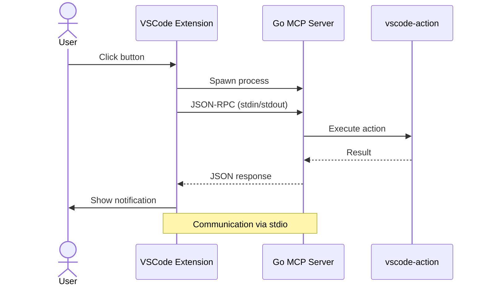

# VS Code Extension Architecture

Understanding how the VSCode extension integrates with Model Context Protocol (MCP) servers to provide AI-generated commit messages and Git operations.

---

## What It Does

The extension provides:

- **Robot button** (🤖) in the Git Source Control toolbar
- **MCP integration** - Calls local MCP servers via JSON-RPC
- **AI-generated commit messages** - Analyzes staged changes and creates meaningful commits
- **Git actions** - Commit, push, pull through MCP
- **Extensible** - Easy to add new actions

---

## How It Works

The extension uses a client-server architecture where VSCode acts as a client that spawns and communicates with MCP servers via JSON-RPC:



### Architecture Components

**1. VSCode Extension (Client)**:

- Location: `.vscode/extensions/claude-mcp-vscode/`
- Language: TypeScript
- Responsibilities:
  - Displays robot button in Source Control toolbar
  - Presents action menu to user
  - Spawns MCP server process
  - Sends JSON-RPC requests
  - Displays results to user

**2. MCP Server (Server)**:

- Location: `src/mcp/vscode/`
- Language: Go
- Responsibilities:
  - Implements JSON-RPC protocol
  - Provides `vscode-action` tool
  - Executes Git operations
  - Generates commit messages
  - Returns results to extension

**3. Communication Protocol**:

- **Protocol**: JSON-RPC 2.0
- **Transport**: stdin/stdout
- **Format**: Line-delimited JSON

---

## How Commit Message Generation Works

When you click "Git Commit", here's what happens:

**Step 1: Extension reads staged changes**:

```typescript
// Extension gathers Git status
const stagedChanges = await git.diff(['--staged']);
```

**Step 2: Extension spawns MCP server**:

```typescript
const serverProcess = spawn('bash', ['src/mcp/vscode/run.sh']);
```

**Step 3: Extension sends JSON-RPC request**:

```json
{
  "jsonrpc": "2.0",
  "id": 1,
  "method": "tools/call",
  "params": {
    "name": "vscode-action",
    "arguments": {
      "action": "git-commit",
      "diff": "... staged changes ..."
    }
  }
}
```

**Step 4: MCP server analyzes diff**:

```go
// Server analyzes the diff and generates semantic message
func generateCommitMessage(diff string) string {
    // Analyze changes
    // Generate meaningful message
    return "feat: add user authentication with JWT tokens"
}
```

**Step 5: Extension receives response and commits**:

```typescript
// Extension receives generated message
const message = response.result.message;
// Creates commit with generated message
await git.commit(message);
// Shows notification
vscode.window.showInformationMessage(`Committed: ${message}`);
```

**Key Point**: The extension analyzes only **staged** changes, so you must stage files before clicking "Git Commit".

---

## Project Structure

```text
.vscode/extensions/claude-mcp-vscode/
├── src/
│   └── extension.ts          # Main extension code
├── package.json               # Extension manifest
│   ├── contributes           # Commands, menus, buttons
│   ├── activationEvents      # When extension loads
│   └── dependencies          # npm packages
└── out/                       # Compiled JavaScript

src/mcp/
├── vscode/                    # VSCode action server
│   ├── main.go               # JSON-RPC handler
│   └── run.sh                # Server launcher
├── pwsh/                      # PowerShell commands
│   ├── main.go
│   └── run.sh
├── docs/                      # Documentation management
│   ├── main.go
│   └── run.sh
└── github/                    # GitHub API integration
    ├── main.go
    └── run.sh

.mcp.json                      # MCP server configuration
```

---

## Why MCP?

**Model Context Protocol (MCP)** is a standard protocol for AI tool integration that provides:

**1. Language Independence**:

- Extension is TypeScript
- Servers can be Go, Python, Node.js, etc.
- Protocol works across languages

**2. Process Isolation**:

- Servers run as separate processes
- Crashes don't affect VSCode
- Easy to restart/reload

**3. Extensibility**:

- Add new servers without modifying extension
- Configure servers in `.mcp.json`
- Multiple specialized servers (Git, Docs, GitHub, PowerShell)

**4. Standard Protocol**:

- Based on JSON-RPC 2.0
- Well-defined message format
- Tool discovery via `tools/list`

**5. AI Integration**:

- Designed for AI tool calling
- Structured input/output
- Context management

---

## Available MCP Servers

Four servers are configured in `.mcp.json`:

| Server | Purpose | Location | Language |
|--------|---------|----------|----------|
| **vscode** | VSCode actions (Git, etc.) | `src/mcp/vscode/` | Go |
| **pwsh** | PowerShell commands | `src/mcp/pwsh/` | Go |
| **docs** | Documentation management | `src/mcp/docs/` | Go |
| **github** | GitHub API integration | `src/mcp/github/` | Go |

Each server:

- Runs independently
- Implements JSON-RPC handlers
- Provides specific tools
- Can be tested manually

---

## Design Benefits

**Separation of Concerns**:

- Extension handles UI
- Servers handle business logic
- Clean interface between layers

**Testability**:

- Test servers independently
- Send JSON-RPC commands manually
- No VSCode required for server testing

**Maintainability**:

- Update server logic without touching extension
- Add new servers without extension changes
- Configure servers declaratively

**Performance**:

- Servers start on demand
- Process per operation
- No long-running processes

---

## Extension Lifecycle

**1. Activation**:

```typescript
// Extension activates when VSCode opens a Git repo
"activationEvents": ["onStartupFinished"]
```

**2. Registration**:

```typescript
// Register robot button in Source Control toolbar
vscode.scm.inputBox.registerSourceControlInputBoxProvider(...)
```

**3. User Interaction**:

```typescript
// User clicks robot button → show quick pick menu
const action = await vscode.window.showQuickPick([...]);
```

**4. MCP Communication**:

```typescript
// Spawn server, send request, await response
const result = await callMCPServer(serverPath, action, data);
```

**5. Result Display**:

```typescript
// Show notification with result
vscode.window.showInformationMessage(result);
```

---

## Related Documentation

- **Get Started**: [Quick Start Tutorial](../tutorials/vscode-extension-quickstart.md)
- **Add Actions**: [Add a New Action](../how-to-guides/vscode-extension/add-action.md)
- **Work with Servers**: [Work with MCP Servers](../how-to-guides/vscode-extension/work-with-mcp-servers.md)
- **Reference**: [VS Code Extension Reference](../reference/vscode-extension.md)
- **MCP Protocol**: [Model Context Protocol Spec](https://modelcontextprotocol.io/)
