# Intelligent Module Detection Guide

This document explains how the commit message generator automatically detects which module a file belongs to based on its path structure.

## Overview

The module detection system uses **pattern-based path analysis** to extract module names from file paths, eliminating the need for hardcoded mappings.

## Detection Flow


## Module Type Classification

```mermaid
graph TB
    subgraph Deployable["Deployable Units (Versioned)"]
        MCP["MCP Servers<br/>src/mcp/*/<br/>→ mcp-*"]
        VSCodeExt["VSCode Extension<br/>.vscode/extensions/*/<br/>→ vscode-ext"]
    end

    subgraph Infrastructure["Infrastructure (Type-Prefixed)"]
        AutoShell["Shell Scripts<br/>automation/sh-*/<br/>→ sh-*"]
        AutoPwsh["PowerShell<br/>automation/pwsh-*/<br/>→ pwsh-*"]
        AutoPy["Python<br/>automation/py-*/<br/>→ py-*"]
        Containers["Containers<br/>containers/*/<br/>→ container-name"]
    end

    subgraph Supporting["Supporting Modules"]
        Docs["Documentation<br/>docs/*/, *.md<br/>→ docs"]
        Contracts["Contracts<br/>contracts/*/<version>/<br/>→ contracts-*"]
        Claude["Claude Config<br/>.claude/<br/>→ claude-config"]
        VSCode["VSCode Config<br/>.vscode/<br/>→ vscode-config"]
        Repo["Repo Config<br/>root configs<br/>→ repo-config"]
    end

    style MCP fill:#87CEEB
    style VSCodeExt fill:#FFB6C1
    style AutoShell fill:#90EE90
    style AutoPwsh fill:#90EE90
    style AutoPy fill:#90EE90
    style Containers fill:#98FB98
    style Docs fill:#F0E68C
    style Contracts fill:#DDA0DD
    style Claude fill:#FFA07A
    style VSCode fill:#FFA07A
    style Repo fill:#D3D3D3
```



## Pattern Examples

### Pattern 1: Automation Modules


### Examples

| File Path                         | Detected Module | Type Inferred      |
| --------------------------------- | --------------- | ------------------ |
| `automation/sh-vscode/install.sh` | `sh-vscode`     | Shell (sh-)        |
| `automation/pwsh-build/build.ps1` | `pwsh-build`    | PowerShell (pwsh-) |
| `automation/py-test/test.py`      | `py-test`       | Python (py-)       |

### Pattern 2: Container Modules


### Examples

| File Path                           | Detected Module |
| ----------------------------------- | --------------- |
| `containers/mkdocs/Dockerfile`      | `mkdocs`        |
| `containers/nginx-proxy/nginx.conf` | `nginx-proxy`   |
| `containers/postgres/init.sql`      | `postgres`      |

### Pattern 3: MCP Server Modules


### Examples

| File Path                | Detected Module |
| ------------------------ | --------------- |
| `src/mcp/pwsh/main.go`   | `mcp-pwsh`      |
| `src/mcp/docs/server.go` | `mcp-docs`      |
| `src/mcp/github/api.go`  | `mcp-github`    |
| `src/mcp/vscode/main.go` | `mcp-vscode`    |

### Pattern 4: Contract Modules


### Examples

| File Path                                       | Detected Module              |
| ----------------------------------------------- | ---------------------------- |
| `contracts/deployable-units/0.1.0/mcp-pwsh.yml` | `contracts-deployable-units` |

## File-to-Module Mapping


## Module Categories


## Commit Message Assembly


## Example: Multi-Module Commit


**Result:**

```text
# Revision abc123...

This commit adds automated build tooling, updates container images,
enhances the VSCode MCP server, and documents the module detection
system. These changes improve developer productivity and system
maintainability across the mono-repository.

| Status   | File                                    | Module      |
| -------- | --------------------------------------- | ----------- |
| added    | automation/pwsh-build/build.ps1         | pwsh-build  |
| modified | containers/mkdocs/Dockerfile            | mkdocs      |
| modified | src/mcp/vscode/main.go                  | mcp-vscode  |
| added    | docs/guide/module-detection.md          | docs        |

---

pwsh-build: feat: add CI/CD build automation

Implements automated build pipeline with
artifact generation and test execution.

---

mkdocs: chore: update base image to Python 3.11

Updates base image for improved performance
and security patches.

---

mcp-vscode: feat: add intelligent module detection

Implements path-based module extraction for
automatic module identification from file paths.

---

docs: docs: add module detection guide

Documents the intelligent module detection
system with visual flowcharts and examples.
```

## Benefits


### Before vs After


**Commit Comparison:**

❌ **Before (Generic):**

```text
infra: feat: add installation script
```

✅ **After (Specific):**

```text
sh-vscode: feat: add automated installation

Implements shell script for automated
VSCode extension installation and setup.
```

## Implementation Reference

- **Source Code:** `src/mcp/vscode/main.go:499-594`
- **Tests:** `src/mcp/vscode/module_test.go`
- **Documentation:** [Repository Layout](../reference/trunk/repository-layout.md)

## Adding New Modules


### Examples

```bash
# 1. Create directory
mkdir -p automation/py-test

# 2. Add files
echo "#!/usr/bin/env python3" > automation/py-test/run_tests.py

# 3. Commit (module automatically detected as "py-test")
git add automation/py-test/
# Click robot button in VSCode
# Generated commit will use: "py-test: feat: ..."
```

No code changes required! 🎉
