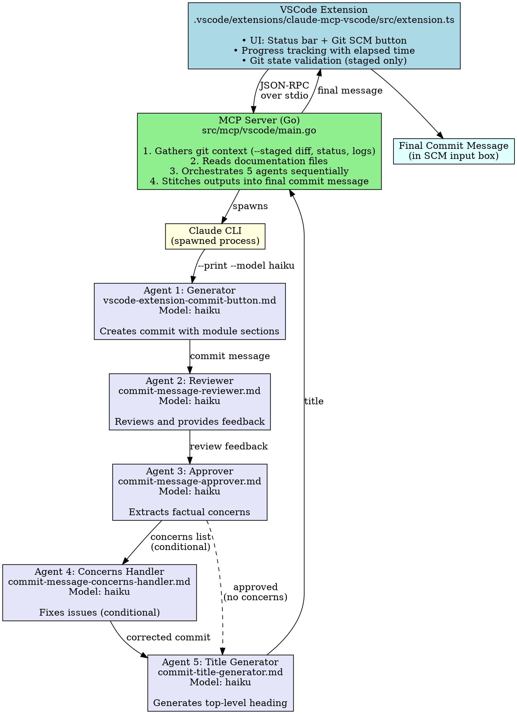

# Commit Agent Pipeline - Technical Specification

## Overview

The Commit Agent Pipeline is a 5-agent system that generates high-quality, semantic commit messages for a mono-repository with module-based versioning. It integrates with VSCode through an MCP (Model Context Protocol) server and provides a one-click commit message generation experience.

## Architecture



## Components

### 1. VSCode Extension

**Location**: `.vscode/extensions/claude-mcp-vscode/`

**Files**:

- `src/extension.ts` - Main extension logic
- `package.json` - Extension manifest and contributions

**Responsibilities**:

- Register command `claude-mcp-vscode.callMCP`
- Add button to Git SCM title bar with dynamic icon
- Add status bar item with rainbow animation
- Validate git state before execution
- Display progress notifications
- Write results to git commit input box

**User Interface**:

1. **Status Bar Item**:

   - Idle: `$(robot) Claude Commit` (normal background)
   - Active: `$(sync~spin) Claude Commit` (rainbow cycling background)
   - Location: Right side of status bar

2. **Git SCM Button**:

   - Idle: `$(robot)` icon
   - Active: `$(sync~spin)` icon (animated)
   - Location: Git SCM title bar (navigation group)

3. **Progress Notifications**:

   - Random emoji + title
   - Stage-aware messages (generator, reviewer, approver, concerns, title)
   - Smart simulation updates every 3 seconds
   - Real progress from MCP server via `$/progress` notifications

4. **Output Channel**:
   - Name: "Claude Commit Agent"
   - Logs which agent is running and what content it receives
   - Visual separators with agent emojis

**Git State Validation**:

- Requires staged changes (`indexChanges.length > 0`)
- No unstaged changes allowed (`workingTreeChanges.length === 0`)
- Shows error messages for invalid states

### 2. MCP Server (Go)

**Location**: `src/mcp/vscode/`

**Main File**: `main.go`

**Responsibilities**:

1. Implement MCP JSON-RPC protocol
2. Gather git context (diff, status, logs, file changes)
3. Read documentation files (with glob pattern support)
4. Detect modules from file paths
5. Generate module metadata (glob patterns)
6. Orchestrate 5 agents sequentially
7. Stitch agent outputs into final commit message
8. Send progress notifications to extension

**Git Context Collection**:

```go
type GitContext struct {
    Status      string        // Raw porcelain output
    Diff        string        // Complete staged diff
    RecentLog   string        // Last 50 commits
    HeadSHA     string        // Current HEAD SHA
    FileChanges []FileChange  // Normalized changes
}

type FileChange struct {
    Status   string  // added, modified, deleted, renamed
    FilePath string  // Relative path
    Module   string  // Detected module name
}
```

**Module Detection**:

- Intelligent path-based module detection
- Patterns: `src/mcp/<name>`, `.vscode/extensions/<name>`, `automation/<name>`, etc.
- Special handling for docs, configs, and root files

**Documentation Loading**:

- Supports glob patterns (`contracts/deployable-units/0.1.0/*.yml`)
- Files loaded:
  - `docs/reference/trunk/revisionable-timeline.md`
  - `docs/reference/trunk/repository-layout.md`
  - `docs/reference/trunk/versioning.md`
  - `docs/reference/trunk/semantic-commits.md`
  - `contracts/repository/0.1.0/definitions.yml`
  - `contracts/deployable-units/0.1.0/*.yml` (all module definitions)

**Agent Orchestration**:

```go
// Step sequence
1. Load & call generator agent
2. Load & call reviewer agent (with generator output)
3. Load & call approver agent (with generator + review)
4. If concerns: Load & call concerns handler agent
5. Load & call title generator agent (with final commit)
6. Stitch all outputs together
```

**Model Enforcement**:

- Extracts `model:` from agent frontmatter
- **Required**: Errors if model field is missing
- Passes model via `--model` flag to Claude CLI

**Claude CLI Invocation**:

```go
args := []string{
    "--print",
    "--setting-sources", "",  // Bypass hooks and CLAUDE.md
    "--settings", `{"includeCoAuthoredBy":false}`,  // No footer
    "--model", model,  // From agent frontmatter
}
```

**Output Stitching**:

```go
finalCommit :=
    "# " + titleFromAgent5 + "\n\n" +
    cleanedCommitBody + "\n\n" +
    "Agent: " + approvalStatus + "\n"
```

### 3. Agent Definitions

**Location**: `.claude/agents/`

All agents use YAML frontmatter with required fields:

- `name:` Agent identifier
- `description:` What the agent does
- `model:` Which model to use (enforced)
- `color:` UI color hint

#### Agent 1: Generator (vscode-extensionension-commit-button.md)

**Model**: `haiku`

**Input**:

- Git context (diff, status, logs, HEAD SHA)
- Documentation files (inline in prompt)
- Module metadata with glob patterns
- File changes table (pre-formatted)

**Output**:

````markdown
# Revision <sha>

[2-4 sentence summary of changes and impact]

## Files affected

| Status   | File                        | Module     |
| -------- | --------------------------- | ---------- |
| added    | src/mcp/vscode/main.go      | src-mcp-vscode |
| modified | .vscode/.../extension.ts    | vscode-extension |

## Summary

| Module     | Globs                    |
| ---------- | ------------------------ |
| src-mcp-vscode | `src/mcp/vscode/**`      |
| vscode-extension | `.vscode/extensions/...` |

---

## src-mcp-vscode

src-mcp-vscode: feat: add commit generation

[Body text explaining WHY, wrapped at 72 chars]

```yaml
paths:
  - 'src/mcp/vscode/**'
````

---

## vscode-extension

[Same format for each module]

```markdown

**Key Rules**:
- One section per module (no duplicates)
- Subject line ≤ 50 characters
- Body text wrapped at 72 characters
- Format: `<module>: <type>: <description>`
- YAML paths block (no heading) after body
- File table appears ONCE at top
- NO Review section (handled by separate agent)

#### Agent 2: Reviewer (commit-message-reviewer.md)

**Model**: `haiku`

**Input**: Complete commit message from generator

**Output**:
```

## Commit Message Review

### Overall Assessment

[Excellent/Good/Needs Improvement/Poor]

### Issues

1. [Most critical issue]

   - Problem: [Explain]
   - Suggestion: [Fix]

2. [Next issue]
   ...

### Recommended Rewrite

[Improved version if needed]

**Additional Notes**: [Best practices advice]

```markdown

**Key Rules**:
- **CRITICAL**: Strip ALL positive affirmations
- Only output factual/actionable issues
- No "Good job", "Excellent", "Well done"
- Focus on what needs attention

#### Agent 3: Approver (commit-message-approver.md)

**Model**: `haiku`

**Input**:
- Original commit message
- Review section from agent 2

**Output**:

**If no concerns**:
```

## Approved

Approved

```markdown

**If concerns exist**:
```

## Approved

Approved (with concerns)

- [Factual issue 1]
- [Factual issue 2]

```markdown

**Key Rules**:
- Output ONLY the `## Approved` section
- Extract ONLY factual/actionable issues from review
- Remove all praise and fluff
- Two outcomes: "Approved" or "Approved (with concerns)"

#### Agent 4: Concerns Handler (commit-message-concerns-handler.md)

**Model**: `haiku`

**Conditional**: Only runs if approver output contains "Approved (with concerns)"

**Input**:
- Original commit message
- `## Approved` section with concerns list

**Output**:
```

[Corrected commit message with concerns fixed]

```markdown

**Key Rules**:
- Apply ALL fixes from concerns list
- Remove the `## Approved` section from output
- Maintain all original formatting and structure
- If no concerns, output original unchanged

#### Agent 5: Title Generator (commit-title-generator.md)

**Model**: `haiku`

**Input**: Final commit message (corrected or original)

**Output**:
```

feat(src-mcp-vscode): add 5-agent commit workflow

```markdown

**Format**: `<type>(<scope>): <description>`

**Types**:
- `feat` - New feature
- `fix` - Bug fix
- `refactor` - Code restructuring
- `docs` - Documentation
- `chore` - Maintenance, configs, build
- `test` - Tests
- `perf` - Performance
- `style` - Formatting

**Scope**:
- Single module: Use module name
- 2-3 modules: Primary module or "multi-module"
- 4+ modules: "multi-module" or category
- Cross-cutting: Component name

**Key Rules**:
- Output ONLY the title text (no `# ` prefix)
- Maximum 72 characters
- Imperative mood
- No period at end

## Final Output Format

```

```markdown
# feat(scope): description
```

[2-4 sentence summary]

## Files affected

[Table]

## Summary

[Module glob table]

---

## module-name

module: type: subject

Body text explaining WHY.

```yaml
paths:
  - 'glob/pattern/**'
```

---

Agent: Approved

```markdown

**Or with concerns**:
```

Agent: Approved (with concerns)

```markdown

## Progress Notifications

The MCP server sends JSON-RPC notifications:

```

```json
{
  "jsonrpc": "2.0",
  "method": "$/progress",
  "params": {
    "stage": "gen-claude",
    "message": "Generating initial commit message..."
  }
}
```

````markdown

**Stages**:

- `git-init` - Gathering git context
- `docs-init` - Loading documentation
- `gen-init` - Loading generator agent
- `gen-prompt` - Building generator prompt
- `gen-claude` - Generating initial commit
- `rev-init` - Loading reviewer agent
- `rev-claude` - Reviewing commit message
- `app-init` - Loading approver agent
- `app-claude` - Final approval
- `concerns-init` - Loading concerns handler
- `concerns-claude` - Fixing concerns
- `title-init` - Loading title generator
- `title-claude` - Generating commit title
- `stitch` - Stitching outputs
- `complete` - Done

## Error Handling

### Extension Errors

1. **No Git Extension**: "Git extension not found"
2. **No Repository**: "No Git repository found"
3. **No Staged Changes**: "No staged changes found. Stage your changes before generating a commit message."
4. **Unstaged Changes**: "You have unstaged changes. Please stage or stash them before generating a commit message."
5. **No Workspace**: "No workspace folder found"
6. **Agent Execution Error**: Shows error from MCP server

### MCP Server Errors

1. **Model Not Specified**: "model not specified in agent frontmatter - all agents must define 'model:' field"
2. **Agent File Not Found**: "failed to read [agent] agent file: [error]"
3. **Git Command Failed**: "git [command] failed: [error]"
4. **Documentation File Not Found**: Warning logged, continues
5. **Claude CLI Failed**: "claude CLI failed: [error]\nStderr: [output]"

## Performance Characteristics

**Typical Execution Time**: 30-90 seconds

**Breakdown**:

- Git context gathering: 1-2s
- Documentation loading: 1-2s
- Generator agent (Haiku): 10-30s
- Reviewer agent (Haiku): 5-15s
- Approver agent (Haiku): 3-8s
- Concerns handler (Haiku, conditional): 10-30s
- Title generator (Haiku): 3-8s
- Stitching: <1s

**Model Choice**: All agents use `haiku` for speed and cost efficiency

## Configuration

### Extension Configuration

No user-facing settings. Behavior is controlled by:

- Git state validation rules (hardcoded)
- Agent file paths (hardcoded relative to workspace)

### Agent Configuration

Each agent configures via frontmatter:

```yaml
---
name: agent-identifier
description: What the agent does
model: haiku
color: blue
---
````

### MCP Server Configuration

Configured via:

- Agent file paths in `.claude/agents/`
- Documentation patterns (hardcoded in `readDocumentationFiles()`)
- Module detection patterns (hardcoded in `determineFileModule()`)
- Glob patterns (hardcoded in `getModuleGlobPattern()`)

## Development

### Extension Development

```bash
cd .vscode/extensions/claude-mcp-vscode
npm install
npm run watch  # Auto-compiles on change
```

Press F5 in VSCode to launch Extension Development Host.

### MCP Server Development

```bash
cd src/mcp/vscode
go build .
go run . < test-input.json  # Test locally
```

### Testing Agents

```bash
# Test individual agent
echo "test prompt" | claude --print --model haiku
```

## Deployment

### Extension Installation

1. Extension is automatically loaded from `.vscode/extensions/`
2. VSCode detects and activates on startup (via `activationEvents: ["*"]`)
3. No installation step required for local development

### MCP Server

No separate deployment - extension spawns `go run .` in MCP server directory on each invocation.

## Markdown Compliance

**MD041**: First line must be top-level heading

- Enforced by adding `# <title>` from agent 5

**MD047**: File must end with newline

- Enforced in `callClaude()` function

**Bold Headers**: Converted to markdown headers

- `**Text**` → `### Text`
- Applied in `callClaude()` post-processing

## Security Considerations

1. **No API Keys**: Uses Claude Code CLI with user's subscription
2. **Settings Bypass**: `--setting-sources ""` bypasses hooks and CLAUDE.md to prevent unintended prompts
3. **Attribution Disabled**: `{"includeCoAuthoredBy":false}` removes footer
4. **Git Safety**: Only reads git state, never modifies repository
5. **File Access**: Only reads files in workspace (no arbitrary file access)

## Future Enhancements

Potential improvements:

- Configurable documentation patterns
- Custom module detection rules
- Agent model selection via settings
- Parallel agent execution where possible
- Caching of git context for faster retries
- Incremental commit message refinement
- Support for unstaged changes (with user confirmation)
