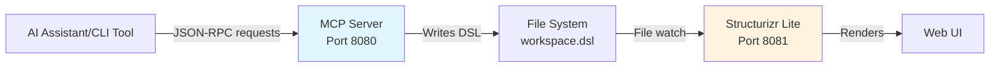
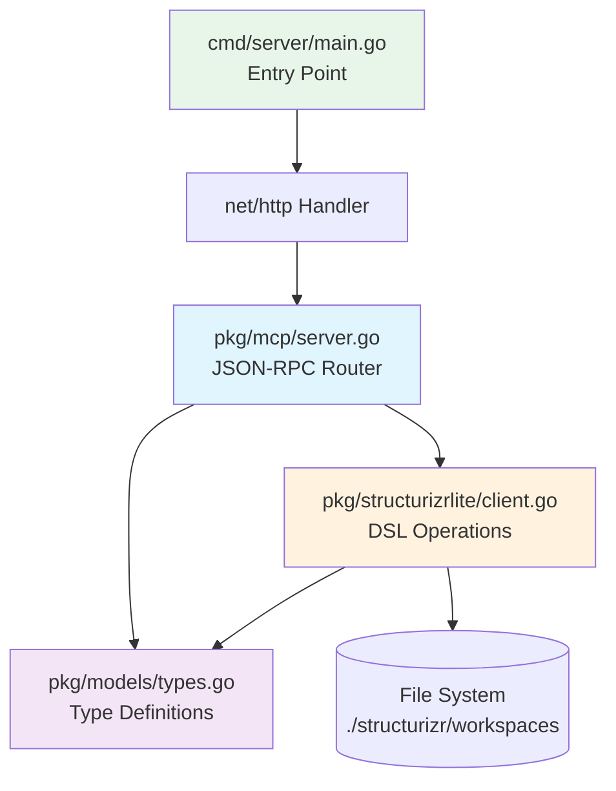
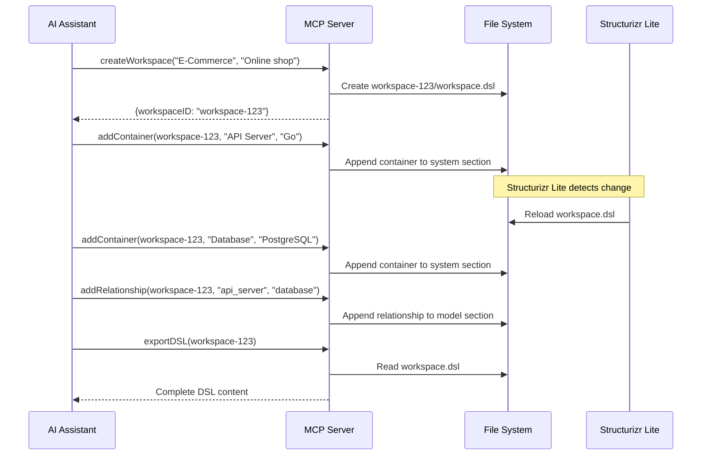

# Structurizr Lite MCP Server - Design Document

**Version**: 1.0.0
**Date**: 2025-11-06
**Status**: Implemented

## Overview

The Structurizr Lite MCP Server is a Go-based JSON-RPC 2.0 server that enables programmatic creation and modification of C4 architecture models through the Model Context Protocol (MCP). It integrates with Structurizr Lite by directly manipulating `.dsl` files that Structurizr Lite watches for changes.

**Location**: `src/mcp/structurizr-lite/`

## Architecture

### System Context



**Key Integration Points**:
- **AI → MCP**: JSON-RPC 2.0 over HTTP POST
- **MCP → File System**: Direct DSL file manipulation
- **File System → Structurizr Lite**: File system watching (no API calls)

### Component Architecture



**Component Responsibilities**:

| Component | Responsibility | Key Functions |
|-----------|---------------|---------------|
| `cmd/server/main.go` | Application entry point, configuration | Environment variable handling, HTTP server setup |
| `pkg/mcp/server.go` | JSON-RPC protocol handling | Request routing, error responses, parameter validation |
| `pkg/structurizrlite/client.go` | DSL file manipulation | Create workspace, add containers/components/relationships, export DSL |
| `pkg/models/types.go` | Type definitions | Workspace, System, Container, Component, Relationship, JSON-RPC types |

## Key Design Decisions

### 1. Direct File Manipulation vs API Integration

**Decision**: Directly manipulate `.dsl` files instead of using Structurizr Lite API.

**Rationale**:
- Structurizr Lite is a file-watching tool, not an API server
- No cloud API dependency - runs entirely locally
- Simpler architecture - no HTTP client needed
- Immediate reflection in Structurizr Lite through file watching

**Trade-offs**:
- ✅ No network latency for local operations
- ✅ Works offline without cloud access
- ❌ Requires careful DSL syntax generation
- ❌ Must parse DSL to find insertion points

### 2. Workspace ID Generation Strategy

**Decision**: Generate workspace IDs as `workspace-<unix-timestamp>`.

**Rationale**:
- Guaranteed uniqueness for workspaces created at different times
- Human-readable and sortable chronologically
- No external UUID dependency for workspace IDs (only for element IDs)

**Example**: `workspace-1704124800`

### 3. DSL Parsing Strategy

**Decision**: Use string parsing with brace counting instead of full DSL parser.

**Rationale**:
- Structurizr DSL is relatively simple and regular
- Brace counting reliably identifies section boundaries
- Avoids dependency on external DSL parsing library
- Sufficient for insertion-based operations

**Implementation**:
```go
func (c *Client) findSectionEnd(content, sectionName string) int {
    // Find section start
    // Count opening and closing braces
    // Return position where section ends
}
```

**Trade-offs**:
- ✅ Simple and maintainable
- ✅ No external dependencies
- ❌ Cannot handle malformed DSL gracefully
- ❌ Would struggle with complex DSL features (extensions, styles)

### 4. JSON-RPC 2.0 Protocol

**Decision**: Implement full JSON-RPC 2.0 specification.

**Rationale**:
- Standard protocol for MCP servers
- Well-defined error codes and response format
- Interoperable with any JSON-RPC client
- Enables AI assistant integration (Claude, etc.)

**Standard Error Codes**:
- `-32700`: Parse error - Invalid JSON
- `-32600`: Invalid Request
- `-32601`: Method not found
- `-32602`: Invalid params
- `-32603`: Internal error

### 5. Workspace Directory Structure

**Decision**: Store each workspace in separate directory with `workspace.dsl` file.

```
./structurizr/workspaces/
├── workspace-1704124800/
│   └── workspace.dsl
├── workspace-1704124900/
│   └── workspace.dsl
└── workspace-1704125000/
    └── workspace.dsl
```

**Rationale**:
- Isolation between workspaces
- Allows future expansion (images, includes, etc.)
- Structurizr Lite can watch entire directory
- Easy to zip/share individual workspaces

### 6. ID Sanitization

**Decision**: Convert human-readable names to snake_case IDs.

**Implementation**:
```go
func (c *Client) sanitizeID(name string) string {
    return strings.ReplaceAll(strings.ToLower(name), " ", "_")
}
```

**Rationale**:
- DSL element IDs cannot contain spaces or special characters
- Preserves readability (user sees original name)
- Deterministic (same name → same ID)

**Example**: `"API Server"` → `api_server`

## Integration Flow

### Creating a Complete Architecture



### DSL File Evolution

**Step 1 - Base Workspace**:
```dsl
workspace "E-Commerce Platform" "Online shopping system" {

    model {
        system = softwareSystem "System" "Main software system" {
            # Containers will be added here
        }
    }

    views {
        systemContext system "SystemContext" {
            include *
            autoLayout
        }
    }
}
```

**Step 2 - After addContainer("API Server", "Go", "REST API backend")**:
```dsl
workspace "E-Commerce Platform" "Online shopping system" {

    model {
        system = softwareSystem "System" "Main software system" {
            api_server = container "API Server" "REST API backend" "Go"
        }
    }

    views {
        systemContext system "SystemContext" {
            include *
            autoLayout
        }
        container system "Containers" {
            include *
            autoLayout
        }
    }
}
```

**Step 3 - After addRelationship("api_server", "database", "Reads/writes", "SQL/TCP")**:
```dsl
workspace "E-Commerce Platform" "Online shopping system" {

    model {
        system = softwareSystem "System" "Main software system" {
            api_server = container "API Server" "REST API backend" "Go"
            database = container "Database" "Stores data" "PostgreSQL"
        }

        api_server -> database "Reads/writes" "SQL/TCP"
    }

    views {
        systemContext system "SystemContext" {
            include *
            autoLayout
        }
        container system "Containers" {
            include *
            autoLayout
        }
    }
}
```

## Error Handling Strategy

### Parameter Validation

All handlers validate required parameters before processing:

```go
func (s *Server) handleCreateWorkspace(params map[string]interface{}) (interface{}, error) {
    name, ok := params["name"].(string)
    if !ok {
        return nil, fmt.Errorf("invalid or missing 'name' parameter")
    }
    // ... validate other params
}
```

**Response on validation failure**:
```json
{
  "jsonrpc": "2.0",
  "error": {
    "code": -32602,
    "message": "Invalid params",
    "data": "invalid or missing 'name' parameter"
  },
  "id": 1
}
```

### File System Errors

File operations use proper error propagation:

```go
func (c *Client) CreateWorkspace(name, description string) (*models.Workspace, error) {
    if err := os.MkdirAll(workspacePath, 0755); err != nil {
        return nil, fmt.Errorf("failed to create workspace directory: %w", err)
    }
    // ... continue
}
```

**Logged and returned as JSON-RPC internal error** (`-32603`).

### Workspace Not Found

Methods that require existing workspace check for directory existence:

```go
func (c *Client) AddContainer(...) error {
    dslPath := filepath.Join(c.workspaceRoot, workspaceID, "workspace.dsl")
    if _, err := os.Stat(dslPath); os.IsNotExist(err) {
        return fmt.Errorf("workspace not found: %s", workspaceID)
    }
    // ... continue
}
```

## Configuration

### Environment Variables

| Variable | Default | Purpose |
|----------|---------|---------|
| `STRUCTURIZR_WORKSPACE_ROOT` | `./structurizr/workspaces` | Workspace storage location |
| `MCP_PORT` | `8080` | Server port |

### Example Configurations

**Development (default)**:
```bash
make run
# Server: http://localhost:8080
# Workspaces: ./structurizr/workspaces
```

**Custom workspace location**:
```bash
STRUCTURIZR_WORKSPACE_ROOT=/shared/architectures make run
```

**Different port**:
```bash
MCP_PORT=9000 make run
```

## Testing Strategy

### Unit Tests

Test DSL manipulation functions in isolation:

```go
func TestSanitizeID(t *testing.T) {
    tests := []struct{
        input    string
        expected string
    }{
        {"API Server", "api_server"},
        {"Web Application", "web_application"},
    }
    // ... run tests
}
```

### Integration Tests

Test complete workflows with temporary file system:

```go
func TestCreateWorkspaceIntegration(t *testing.T) {
    tmpDir := t.TempDir()
    client := structurizrlite.NewClient(tmpDir)

    workspace, err := client.CreateWorkspace("Test", "Test workspace")
    // ... verify workspace created correctly
}
```

### Manual Testing

Use curl to test JSON-RPC interface:

```bash
curl -X POST http://localhost:8080 \
  -H "Content-Type: application/json" \
  -d '{
    "jsonrpc": "2.0",
    "method": "createWorkspace",
    "params": {"name": "Test", "description": "Test workspace"},
    "id": 1
  }'
```

## Performance Considerations

### File I/O

- **Read operations**: Single file read per exportDSL call
- **Write operations**: Read → modify → write for additions
- **No caching**: File system is single source of truth

**Optimization opportunities**:
- Cache parsed DSL structure if adding multiple elements
- Batch additions to reduce file writes
- Currently not implemented (premature optimization)

### Concurrency

**Current state**: No concurrency control.

**Risks**:
- Simultaneous writes to same workspace could corrupt DSL
- Race condition between read and write operations

**Future consideration**:
- Add per-workspace mutex for write operations
- Implement file locking for critical sections

### Memory

**Workspace size**: Entire DSL loaded into memory for modifications.

**Typical sizes**:
- Small workspace (5-10 containers): ~2-5 KB
- Large workspace (50+ containers): ~20-50 KB

**Memory impact**: Negligible for typical C4 models.

## Security Considerations

### Input Validation

**Current validation**:
- Parameter type checking (string, not empty)
- No special character validation beyond ID sanitization

**Potential vulnerabilities**:
- DSL injection: Malicious input could break DSL syntax
- Path traversal: WorkspaceID not validated for `../` sequences

**Mitigation recommendations**:
1. Validate workspaceID matches pattern `workspace-\d+`
2. Escape quotes and braces in user input
3. Validate element names against allowed characters

### File System Access

**Current behavior**:
- Creates files with 0644 permissions
- Creates directories with 0755 permissions
- No chroot or sandbox

**Recommendations**:
- Run server as non-root user
- Use dedicated workspace directory outside home directory
- Consider containerization (Docker) for isolation

### Network Exposure

**Current setup**: Binds to all interfaces on specified port.

**Production recommendations**:
- Bind to `127.0.0.1` for local-only access
- Use reverse proxy (nginx) for external access
- Implement authentication for multi-user scenarios

## Future Enhancements

### 1. Views Customization

**Current state**: Auto-generated views with autoLayout.

**Enhancement**: Allow custom view configuration:
```json
{
  "method": "addView",
  "params": {
    "workspaceID": "workspace-123",
    "type": "container",
    "include": ["api_server", "database"],
    "exclude": ["cache"]
  }
}
```

### 2. Styles and Themes

**Current state**: Default Structurizr styling.

**Enhancement**: Support for element styling:
```json
{
  "method": "applyStyle",
  "params": {
    "workspaceID": "workspace-123",
    "element": "api_server",
    "style": {
      "background": "#1168bd",
      "color": "#ffffff"
    }
  }
}
```

### 3. System-Level Operations

**Current state**: Only supports single system per workspace.

**Enhancement**: Add `addSystem` method:
```json
{
  "method": "addSystem",
  "params": {
    "workspaceID": "workspace-123",
    "name": "External Payment Gateway",
    "description": "Third-party payment processor"
  }
}
```

### 4. Import/Export Formats

**Current state**: Only exports DSL format.

**Enhancement**: Support JSON export:
```json
{
  "method": "exportJSON",
  "params": {
    "workspaceID": "workspace-123"
  }
}
```

### 5. Validation

**Current state**: No DSL validation before writing.

**Enhancement**: Validate DSL syntax:
- Check for unclosed braces
- Verify element references exist
- Detect circular relationships

### 6. Workspace Templates

**Current state**: Single base template.

**Enhancement**: Multiple starting templates:
- Microservices architecture
- Monolithic application
- Event-driven system
- Serverless architecture

## References

- [Structurizr DSL Documentation](https://github.com/structurizr/dsl)
- [JSON-RPC 2.0 Specification](https://www.jsonrpc.org/specification)
- [C4 Model](https://c4model.com/)
- [Model Context Protocol (MCP)](https://github.com/anthropics/mcp)

## Changelog

| Version | Date | Changes |
|---------|------|---------|
| 1.0.0 | 2025-11-06 | Initial implementation with five core methods |
